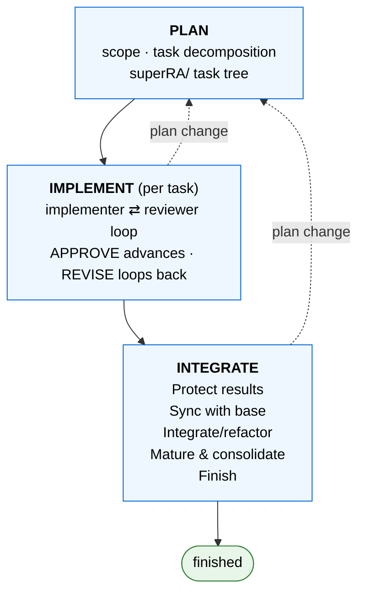

# superRA

> ⚠️ **Breaking change (0.2.0):** the three workflow phase skills were renamed — `planning-workflow` → `superplan`, `implementation-workflow` → `superimplement`, `integration-workflow` → `superintegrate` — to avoid colliding with Claude Code's Workflow tool / `/workflows`. Update any saved `Skill(superRA:planning-workflow|implementation-workflow|integration-workflow)` calls to the new ids, and refresh globally-installed Codex agents by rerunning `codex-superra-setup`. See [RELEASE-NOTES](RELEASE-NOTES.md) for the migration note.

**[📖 Read the documentation →](http://fuzhiyu.me/superRA/)** — start with the [Quickstart](http://fuzhiyu.me/superRA/#/02-quickstart) (one analysis end to end in ~20 min), then the [Domain Skills](http://fuzhiyu.me/superRA/#/03-domain-skills) and [Utility Skills](http://fuzhiyu.me/superRA/#/04-utility-skills) pages, the [Workflows](http://fuzhiyu.me/superRA/#/05-workflows) section, and a live task-tree [Showcase](http://fuzhiyu.me/superRA/#/07-showcase).

superRA turns an AI coding agent into a disciplined research assistant. It runs on Claude Code and Codex, and ships:

1. A **task-tree dashboard** — a live task tree of your project that keeps every important piece of state committed in your repo rather than trapped in an agent's context, so you can monitor progress in real time and hand any unfinished task to a fresh agent without losing the thread. The [Showcase](http://fuzhiyu.me/superRA/#/07-showcase) links a live export of a real one.
2. An adaptive **plan-implement-integrate workflow** that enforces reviewer sign-off at every step and keeps results reproducible long-term.
3. **Domain skills** that teach agents the right discipline for the research at hand and enforce it as they go — currently data analysis, theory modeling, academic writing, and slide design, with literature review on the roadmap.
4. **Utility skills** that teach agents practical mechanics — loading papers from Zotero, writing results in well-formed Markdown, syncing data across worktrees, and more.


## Why superRA?

AI agents are fast but undisciplined. They generate more code than anyone will carefully review. They drift as the context window fills, and starting fresh loses the thread of what was done and why. They drop half the sample before a regression runs, then report "everything looks good." superRA brings discipline at every step: no result ships without adversarial review, the domain skill enforces the right protocol as the work goes, and the integration phase folds each task into your codebase so what lands is coherent, not a pile of single-shot outputs.

Social-science research needs a different rhythm than software engineering: it is fluid and exploratory, ex-ante unit tests are often impossible to write, and the outputs need human judgement to evaluate. superRA adapts an agentic-coding workflow spine to that rhythm and keeps the human firmly in the loop.

## How it works

A superRA project moves through three phases — **PLAN → IMPLEMENT → INTEGRATE**. In **PLAN**, the agent scopes your request and decomposes it into a *task tree* — a directory of small `task.md` files, each holding one unit of work — that you approve before any code is written. In **IMPLEMENT**, an implementer agent executes one task and a separate reviewer agent inspects it adversarially; work advances only on `APPROVE`. In **INTEGRATE**, the finished work is protected against future drift, synced with your base branch intent-first (never a blind merge), refactored to fit your codebase, documented, and shipped.



Research is rarely this linear: an unanticipated issue mid-implementation, or a scope change after integration, routes back to planning and resumes at the right point, leaving unrelated finished work untouched. Run `./superRA/superra dashboard` from a project terminal to watch and steer any of it through the tree, DAG, and kanban views. The [Quickstart](http://fuzhiyu.me/superRA/#/02-quickstart) walks a full cycle end to end, covering re-entry, the autonomy-with-human-in-the-loop model, and the dashboard's live serve and branch-snapshot sharing.

## Installation

### Claude Code

Claude Code (v2.1+) can install plugins directly from a GitHub repo. Add superRA as a marketplace and install the plugin:

```bash
claude plugin marketplace add FuZhiyu/superRA
claude plugin install superRA@superRA
```

That's it — restart Claude Code (or start a new session) and the skills, agents, and hooks are available.

To update later:

```bash
claude plugin marketplace update superRA
claude plugin update superRA
```

For Codex setup and a local-clone install (to track or modify superRA itself), see [`docs/README.codex.md`](docs/README.codex.md). Any other harness that supports skills and subagents installs the same plugin sources.

### Upgrading

This release replaces the legacy `PLAN.md` / `RESULTS.md` files with the `superRA/` task tree. Existing projects keep working: superRA detects a legacy `PLAN.md` at session start and offers to migrate it (`superra task migrate from-plan`). See the [superRA docs](http://fuzhiyu.me/superRA/) for details.

To stay on the previous version instead, pin the install to the frozen `v0.1.2` tag:

```bash
claude plugin marketplace add FuZhiyu/superRA@v0.1.2
claude plugin install superRA@superRA
```

## Contributing

Design principles, DRY / composability rules, skill-design patterns, and the extension path for adding a new domain vertical live in [`CLAUDE.md`](./CLAUDE.md). Read it before modifying skills, hooks, or agent files.

## Upstream

superRA started as a fork of [Superpowers](https://github.com/obra/superpowers) by [Jesse Vincent](https://blog.fsck.com). The upstream project provides the plugin infrastructure, skill system, and several general-purpose skills that superRA inherits and extends. Superpowers and similar agentic-coding frameworks are built for software engineering, where tasks are verifiable against unit tests or objective metrics; superRA adapts the same workflow spine to scientific research instead — exploratory, iterative, and fluid.

## License

MIT License — see the `LICENSE` file for details.
