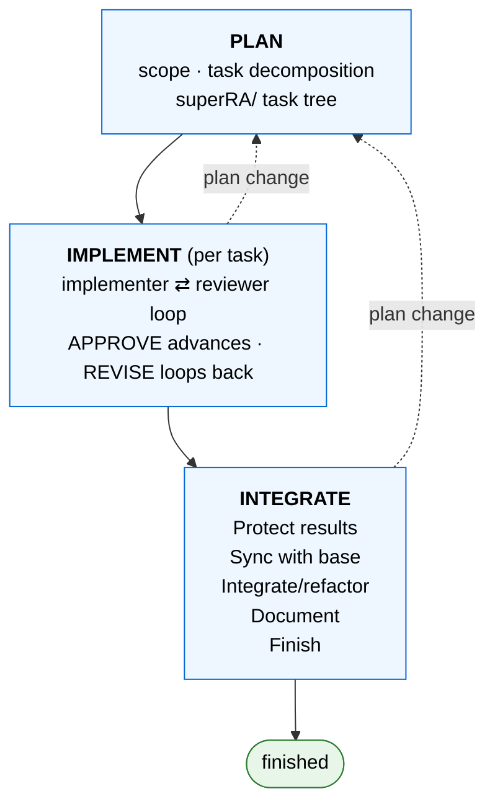

# superRA

> ⚠️ **Breaking change (0.2.0):** the three workflow phase skills were renamed — `planning-workflow` → `superplan`, `implementation-workflow` → `superimplement`, `integration-workflow` → `superintegrate` — to avoid colliding with Claude Code's Workflow tool / `/workflows`. Update any saved `Skill(superRA:planning-workflow|implementation-workflow|integration-workflow)` calls to the new ids, and refresh globally-installed Codex agents by rerunning `codex-superra-setup`. See [RELEASE-NOTES](RELEASE-NOTES.md) for the migration note.

**[📖 Read the documentation →](http://fuzhiyu.me/superRA/)** — start with the [Quickstart](http://fuzhiyu.me/superRA/#/02-quickstart) (one analysis end to end in ~20 min), then the [How-To guides](http://fuzhiyu.me/superRA/#/04-how-to), [Concepts](http://fuzhiyu.me/superRA/#/03-concepts), [Reference](http://fuzhiyu.me/superRA/#/05-reference), and a live task-tree [Showcase](http://fuzhiyu.me/superRA/#/06-showcase).

superRA turns AI coding agents into disciplined research assistants. It ships:

1. A **task-tree dashboard** — a live tree, dependency DAG, and kanban view of your project that auto-updates as work progresses, so you watch and steer the work in flight. Because the whole project state lives in the tree it renders, the dashboard doubles as a handoff surface: you, or a fresh agent session a week later, can pick up exactly where work left off. This documentation site is itself a dashboard export — you are reading one.
2. An adaptive **plan-implement-integrate workflow** that enforces reviewer sign-off at every step and keeps results reproducible long-term.
3. **Domain skills** that teach agents how to do research work properly — currently data analysis, theory modeling, academic writing, and slide design; literature review and simulation remain on the roadmap.
4. **Utility skills** for technical reports in markdown, gated integration checklists, semantic branch merges, and data sync across git worktrees.

superRA is inspired by the [Superpowers](https://github.com/obra/superpowers) plugin, which centers on test-driven software development. superRA adapts the same spine to scientific research, which is exploratory, iterative, and fluid.

superRA is compatible with Claude Code, Codex, and any other harness that supports skills and subagents. See below for installation.

## Why superRA?

AI agents are fast but undisciplined:

- Agents generate far more code than anyone will carefully review, often inconsistent with the existing codebase.
- As the context window fills, agents become more error-prone — but starting fresh loses the thread of what was done and why.
- After several iterations, the results quietly drift from the original, and neither you nor the agent can reconstruct why.
- Half the sample is silently dropped before a regression runs, while the agent declares "everything looks good".

superRA brings discipline to the agent on three fronts. An **implementer–reviewer pair** sits at every step so no result ships without adversarial review. **Domain skills** teach the agent the right protocol for the work at hand — for data analysis, never transform data before describing it; for theory, define objects and assumptions before manipulating equations. And an explicit **integration phase** folds each task into the existing codebase and maturing documentation, so what lands on `main` is coherent rather than a pile of single-shot outputs.

## The Plan-Implement-Integrate Workflow

superRA organizes every project into three phases — **PLAN → IMPLEMENT → INTEGRATE**. The phases are domain-agnostic; the active domain skill supplies the discipline that applies inside each one. They form a cycle, not a pipeline: a discovery while implementing or a scope change after merge routes back to planning and resumes at the right re-entry point, leaving unrelated finished work untouched.



To start, just describe what you want — `make a plan on...`, `implement according to the plan`, `integrate it with the update on main` — or name a phase skill directly: `superplan`, `superimplement`, `superintegrate`. The [Concepts](http://fuzhiyu.me/superRA/#/03-concepts) section explains each phase, re-entry, and the autonomy-with-human-in-the-loop model.

The project's state lives in a task tree — a directory of small `task.md` files, each holding one unit of work — that you can read at any time. Run `./superRA/superra dashboard` to watch and steer it through the tree, DAG, and kanban views; the [dashboard guide](http://fuzhiyu.me/superRA/#/04-how-to/04-see-your-work) covers live serve and branch-snapshot sharing.


## Skills, Agents, and Hooks

superRA ships **domain skills** — currently data analysis, theory modeling, academic writing, and slide design, with literature review and simulation on the roadmap — that load on top of the workflow when a task touches their domain, plus **utility skills** for markdown reports, result-protecting drift tests, semantic branch merges, gated integration refactors, and worktree data sync. The [Skills & Agents concept page](http://fuzhiyu.me/superRA/#/03-concepts/04-skills-and-agents) explains the model, and the [reference](http://fuzhiyu.me/superRA/#/05-reference/04-skills-and-agents) lists every skill and the Stage → skill load map.

The agents that carry out the work are an [implementer and a reviewer](http://fuzhiyu.me/superRA/#/03-concepts/03-roles-and-review), and superRA installs [lifecycle hooks](http://fuzhiyu.me/superRA/#/05-reference/07-hooks) for Claude Code and Codex that nudge agents toward the right skill at the right moment.

## Installation

### Claude Code

Claude Code (v2.1+) can install plugins directly from a GitHub repo. Add superRA as a marketplace and install the plugin:

```bash
claude plugin marketplace add FuZhiyu/superRA
claude plugin install superRA@superRA
```

That's it — restart Claude Code (or start a new session) and the skills, agents, and hooks are available.

To update later:

```bash
claude plugin marketplace update superRA
claude plugin update superRA
```

For a local-clone install (to modify superRA itself), Codex setup, and other harnesses (Copilot CLI, Gemini CLI), see the [Install & Set Up guide](http://fuzhiyu.me/superRA/#/04-how-to/01-install-and-set-up).

## Contributing

Design principles, DRY / composability rules, skill-design patterns, and the extension path for adding a new domain vertical live in [`CLAUDE.md`](./CLAUDE.md). Read it before modifying skills, hooks, or agent files.

## Upstream

superRA started as a fork of [Superpowers](https://github.com/obra/superpowers) by [Jesse Vincent](https://blog.fsck.com). The upstream project provides the plugin infrastructure, skill system, and several general-purpose skills that superRA inherits and extends.

## License

MIT License — see the `LICENSE` file for details.
