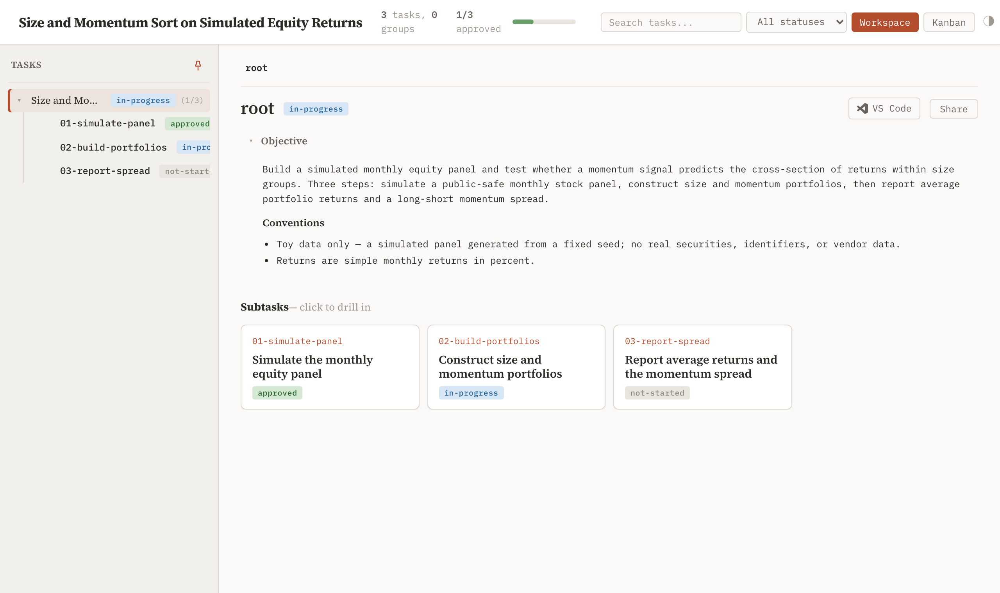
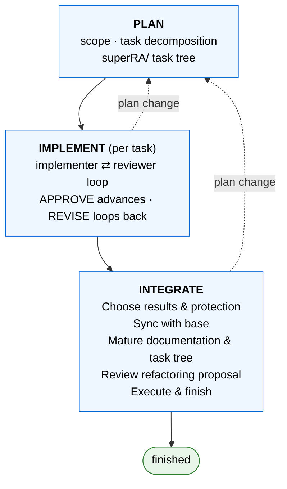

# superRA

> **0.5.0 is unreleased.** The reproduction upgrade combines file-derived and logical task dependencies. Existing reproduction graphs need a cycle audit before upgrading; see [Upgrading](#upgrading) and [release notes](RELEASE-NOTES.md#050---unreleased).

> ⚠️ **Beta testing stage.** superRA is under active development and updates land frequently. Bug reports are welcome — please [open an issue](https://github.com/FuZhiyu/superRA/issues).

**[📖 Read the documentation →](http://fuzhiyu.me/superRA/)** — start with the [Quickstart](http://fuzhiyu.me/superRA/#/02-quickstart) (one analysis end to end in ~20 min), then the [Domain Skills](http://fuzhiyu.me/superRA/#/03-domain-skills) and [Utility Skills](http://fuzhiyu.me/superRA/#/04-utility-skills) pages, the [Workflows](http://fuzhiyu.me/superRA/#/05-workflows) section, and a live task-tree [Showcase](http://fuzhiyu.me/superRA/#/07-showcase).

superRA turns an AI coding agent into a disciplined research assistant. It runs on Claude Code and Codex, and ships:

1. A **task-tree dashboard** — a live task tree of your project that keeps every important piece of state committed in your repo rather than trapped in an agent's context, so you can monitor progress in real time and hand any unfinished task to a fresh agent without losing the thread. The [Showcase](http://fuzhiyu.me/superRA/#/07-showcase) links a live export of a real one.
2. An adaptive **plan-implement-integrate workflow** with closely steered interactive execution by default, autonomous implementer–reviewer execution on request, and long-term reproducibility.
3. **Domain skills** that teach agents the right discipline for the research at hand and enforce it as they go — currently data analysis, theory modeling, academic writing, and slide design, with literature review on the roadmap.
4. **Utility skills** that teach agents practical mechanics — communicating dense results clearly, keeping every result rebuildable from a declared graph, loading papers from Zotero, syncing data across worktrees, and more.



## Why superRA?

AI agents are fast but undisciplined. They generate more code than anyone will carefully review. They drift as the context window fills, and starting fresh loses the thread of what was done and why. They drop half the sample before a regression runs, then report "everything looks good." superRA brings review discipline to every step, the domain skill enforces the right protocol as the work goes, and the integration phase folds each task into your codebase so what lands is coherent, not a pile of single-shot outputs.

Social-science research needs a different rhythm than software engineering: it is fluid and exploratory, ex-ante unit tests are often impossible to write, and the outputs need human judgement to evaluate. superRA adapts an agentic-coding workflow spine to that rhythm and keeps the human firmly in the loop.

## How it works

A superRA project moves through three phases — **PLAN → IMPLEMENT → INTEGRATE**. In **PLAN**, the agent scopes your request and decomposes it into a *task tree* — a directory of small `task.md` files, each holding one unit of work — that you approve before any code is written. In **IMPLEMENT**, the main agent co-edits and executes with you, always self-reviewing and asking whether to run independent review now, defer it, or skip it; on request, autonomous subagent mode runs implementer and reviewer seats instead. In **INTEGRATE**, you first choose which results belong in the permanent record, how that record should look, and whether documentation or additional drift tests should protect each result. The agent syncs with your base branch, writes the permanent record, proposes pruning and other refactoring in one temporary task, asks you to approve the finished record and proposal together, then executes and ships.


```mermaid
flowchart TB
    PLAN["<b>PLAN</b><br/>scope · task decomposition<br/>superRA/ task tree"]
    IMPLEMENT["<b>IMPLEMENT</b> (per task)<br/>implementer ⇄ reviewer loop<br/>APPROVE advances · REVISE loops back"]
    INTEGRATE["<b>INTEGRATE</b><br/>Choose results & protection<br/>Sync with base<br/>Mature documentation & task tree<br/>Review refactoring proposal<br/>Execute & finish"]
    FINISHED(["finished"])

    PLAN --> IMPLEMENT
    IMPLEMENT --> INTEGRATE
    INTEGRATE --> FINISHED

    IMPLEMENT -. "plan change" .-> PLAN
    INTEGRATE -. "plan change" .-> PLAN

    classDef phase fill:#eef7ff,stroke:#0366d6,color:#000
    classDef terminal fill:#e8f5e9,stroke:#2e7d32,color:#000
    class PLAN,IMPLEMENT,INTEGRATE phase
    class FINISHED terminal
```

Research is rarely this linear: an unanticipated issue mid-implementation, or a scope change after integration, routes back to planning and resumes at the right point, leaving unrelated finished work untouched. Run `./superRA/superra dashboard` from a project terminal to watch and steer any of it through the Tree and Graph views. The [Quickstart](http://fuzhiyu.me/superRA/#/02-quickstart) walks a full cycle end to end, covering re-entry, the autonomy-with-human-in-the-loop model, and the dashboard's live serve and branch-snapshot sharing.

## Installation

### Claude Code

Claude Code (v2.1+) can install plugins directly from a GitHub repo. Add superRA as a marketplace and install the plugin:

```bash
claude plugin marketplace add FuZhiyu/superRA
claude plugin install superRA@superRA
```

That's it — restart Claude Code (or start a new session) and the skills and hooks are available.

To update later:

```bash
claude plugin marketplace update superRA
claude plugin update superRA@superRA
```

For Codex setup and a local-clone install (to track or modify superRA itself), see [`docs/README.codex.md`](docs/README.codex.md). Any other harness that supports skills and subagents installs the same plugin sources.

### Upgrading

For the unreleased 0.5.0 upgrade, ask the agent to audit an isolated copy of your project with `superra task check` before resuming work. File-derived prerequisites and authored logical prerequisites form one graph; a cycle is rejected even when individual build steps are acyclic. Correct erroneous declarations or task boundaries while preserving real input dependencies. Projects without reproduction declarations retain their logical dependency behavior; adding a child to a task does not require moving its existing steps.

Use `repro impact` to inspect change scope. Reviewed acceptance can register results already produced interactively or keep reviewed results fresh without rerunning them; it records a reason and optional evidence separately from actual execution. Forced verification still runs its selected steps. The [reproducibility skill](skills/reproducibility/SKILL.md) owns that distinction. The dashboard upgrade uses Tree and Graph with shared search, task/status filters, selection, and one task reader; expanding tasks exposes their steps. UI and existing-project compatibility checks remain release prerequisites.

`repro build <task>` builds that task and its nested tasks using saved upstream inputs. Add `--upstream` to include producers and `--force` to rerun every step in that scope. Use `task#step` for one step. Build/status require a target (`.` for every registered step) and are scoped to it; completion checks explicitly verify upstream too. `build --dry-run` reports what would run and what each step last cost. See the [command reference](skills/task-tree/references/commands.md#reproduction).

0.4.0 retired the dedicated role agents in favor of role skills. A Codex session that finds the old globally installed named agents (`~/.codex/agents/superra_*.toml`) flags them as stale and deletes them with your confirmation — nothing replaces them; the skills bundle carries the roles. Projects still on the pre-0.3 `PLAN.md` / `RESULTS.md` model are detected at session start and offered migration (`superra task migrate from-plan`).

## Contributing

Design principles, DRY / composability rules, skill-design patterns, and the extension path for adding a new domain vertical live in [`CLAUDE.md`](./CLAUDE.md). Read it before modifying skills, hooks, or harness adapters.

## Upstream

superRA started as a fork of [Superpowers](https://github.com/obra/superpowers) by [Jesse Vincent](https://blog.fsck.com). The upstream project provides the plugin infrastructure, skill system, and several general-purpose skills that superRA inherits and extends. Superpowers and similar agentic-coding frameworks are built for software engineering, where tasks are verifiable against unit tests or objective metrics; superRA adapts the same workflow spine to scientific research instead — exploratory, iterative, and fluid.

## License

MIT License — see the `LICENSE` file for details.
