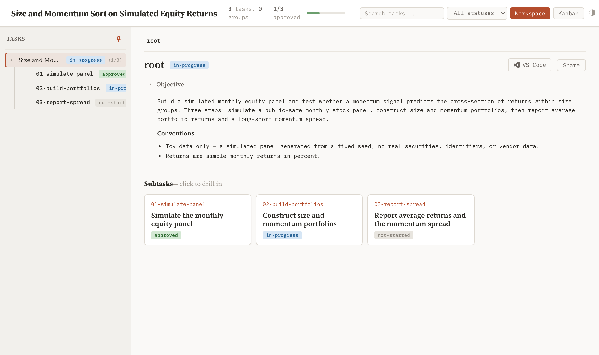
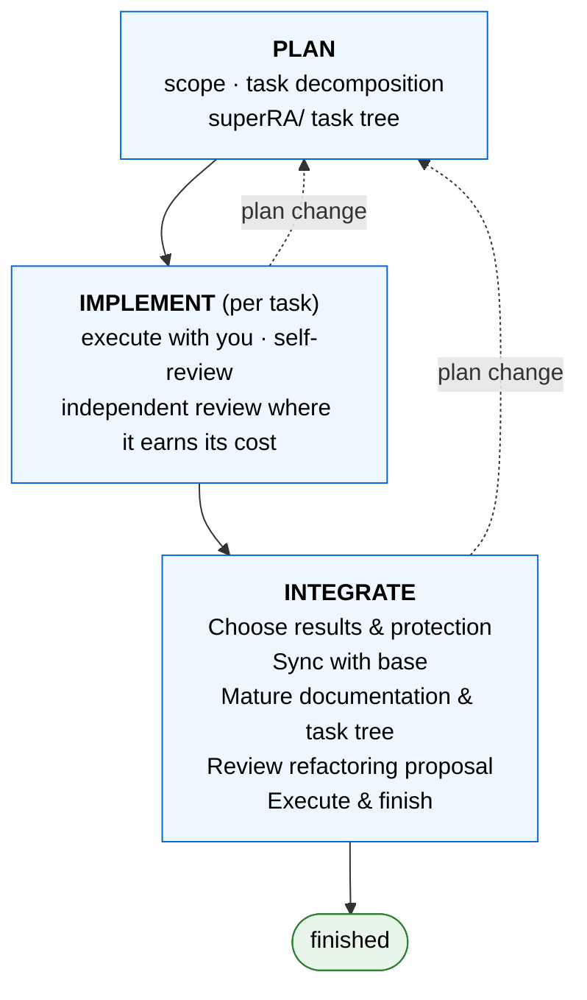

# superRA

> **0.5.0 is unreleased.** The reproduction upgrade: superRA runs task-declared build steps itself and reruns only what changed. Coauthors on a shared project upgrade together; see [Upgrading](#upgrading) and [release notes](RELEASE-NOTES.md#050---unreleased).

> ⚠️ **Beta testing stage.** superRA is under active development and updates land frequently. Bug reports are welcome — please [open an issue](https://github.com/FuZhiyu/superRA/issues).

**[📖 Read the documentation →](http://fuzhiyu.me/superRA/)** — start with the [Quickstart](http://fuzhiyu.me/superRA/#/02-quickstart), which runs one analysis end to end.

superRA turns an AI coding agent into a disciplined research assistant. It runs on Claude Code and Codex, and ships:

1. A **task-tree dashboard.** Every task's objective, status, and results are committed files in your repo, not an agent's memory, so you can watch progress live and hand any unfinished task to a fresh agent. The [Showcase](http://fuzhiyu.me/superRA/#/07-showcase) links a live export of a real one.
2. A **plan–implement–integrate [workflow](http://fuzhiyu.me/superRA/#/05-workflows)** — interactive by default, autonomous on request, with results kept reproducible.
3. **[Domain skills](http://fuzhiyu.me/superRA/#/03-domain-skills)** that enforce the right discipline as the agent works: data analysis, theory modeling, academic writing, and slide design, with literature review on the roadmap.
4. **[Utility skills](http://fuzhiyu.me/superRA/#/04-utility-skills)** for practical mechanics: keeping every result [rebuildable from a declared graph](http://fuzhiyu.me/superRA/#/04-utility-skills/09-reproducibility), merging branches by intent, loading papers from Zotero, syncing data across worktrees, and more.



## Why superRA?

AI agents are fast but undisciplined. They write more code than anyone reviews, drift as their context fills, and drop half the sample before a regression, then report "everything looks good."

Agentic-coding frameworks target software engineering, where unit tests verify the work. Research is exploratory, rarely testable in advance, and judged by people. superRA keeps the workflow spine and keeps you in the loop — review at every step, domain discipline as the work goes, and an integration phase that folds each task into a coherent codebase.

## How it works


```mermaid
flowchart TB
    PLAN["<b>PLAN</b><br/>scope · task decomposition<br/>superRA/ task tree"]
    IMPLEMENT["<b>IMPLEMENT</b> (per task)<br/>execute with you · self-review<br/>independent review where it earns its cost"]
    INTEGRATE["<b>INTEGRATE</b><br/>Choose results & protection<br/>Sync with base<br/>Mature documentation & task tree<br/>Review refactoring proposal<br/>Execute & finish"]
    FINISHED(["finished"])

    PLAN --> IMPLEMENT
    IMPLEMENT --> INTEGRATE
    INTEGRATE --> FINISHED

    IMPLEMENT -. "plan change" .-> PLAN
    INTEGRATE -. "plan change" .-> PLAN

    classDef phase fill:#eef7ff,stroke:#0366d6,color:#000
    classDef terminal fill:#e8f5e9,stroke:#2e7d32,color:#000
    class PLAN,IMPLEMENT,INTEGRATE phase
    class FINISHED terminal
```

- **PLAN** — the agent scopes your request into a *task tree*: a directory of small `task.md` files, one per unit of work, that you review before execution starts.
- **IMPLEMENT** — the agent works each task with you, self-reviews, and asks whether to run an independent review now, later, or not at all. On request, autonomous mode hands the tasks to implementer and reviewer subagents.
- **INTEGRATE** — you choose which results enter the permanent record and how they are protected. The agent syncs with your base branch, writes the record, and proposes one refactoring task; once you approve, it executes and ships.
- **Existing projects** — even without git — enter through the `onboarding` skill, which builds a task tree and reproduction graph for the work already done and changes nothing outside `superRA/` until you approve.

A surprise mid-implementation or a later scope change routes back to PLAN and resumes at the right point. Run `./superRA/superra dashboard` in a project to watch and steer the work; the [dashboard page](http://fuzhiyu.me/superRA/#/04-utility-skills/01-task-tree/04-dashboard) covers live serving and branch-snapshot sharing.

## Installation

### Claude Code

Claude Code (v2.1+) can install plugins directly from a GitHub repo. Add superRA as a marketplace and install the plugin:

```bash
claude plugin marketplace add FuZhiyu/superRA
claude plugin install superRA@superRA
```

That's it — restart Claude Code (or start a new session) and the skills and hooks are available.

To update later:

```bash
claude plugin marketplace update superRA
claude plugin update superRA@superRA
```

For Codex setup and a local-clone install (to track or modify superRA itself), see [`docs/README.codex.md`](docs/README.codex.md). Any other harness that supports skills and subagents installs the same plugin sources.

### Upgrading

**0.5.0 (unreleased):** every coauthor on a shared project upgrades superRA before anyone commits a 0.5 build or acceptance — an older superRA reads neither `repro-lock.json` nor `repro-acceptance/`, so its steps read stale or missing. Then follow the [upgrade steps](RELEASE-NOTES.md#upgrading-a-project-that-used-the-reproduction-pre-release).

**Older projects:**

- **0.4.0** retired the dedicated role agents for role skills. A Codex session that finds stale `~/.codex/agents/superra_*.toml` files deletes them with your confirmation.
- **Pre-0.3** `PLAN.md` / `RESULTS.md` projects are detected at session start and offered onboarding, which migrates them (`superra task migrate from-plan`).

## Contributing

Design principles, DRY / composability rules, skill-design patterns, and the extension path for adding a new domain vertical live in [`CLAUDE.md`](./CLAUDE.md). Read it before modifying skills, hooks, or harness adapters.

## Upstream

superRA started as a fork of [Superpowers](https://github.com/obra/superpowers) by [Jesse Vincent](https://blog.fsck.com). The upstream project provides the plugin infrastructure, skill system, and several general-purpose skills that superRA inherits and extends.

## License

MIT License — see the `LICENSE` file for details.
