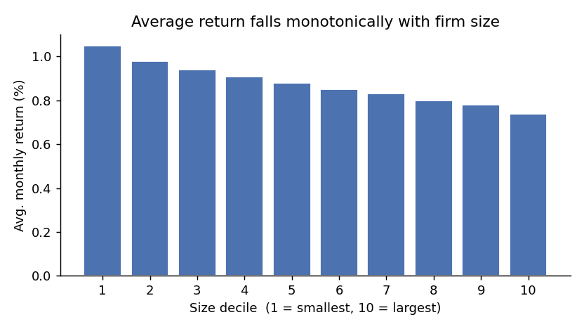

## Objective

Form value-weighted portfolios on the size deciles from `02-construct-factors`, compute each decile portfolio's monthly return series, and estimate the small-minus-large spread (decile 1 minus decile 10). Report the average monthly spread and a plot of average return against size decile. The planted size premium is positive, so the small-firm portfolio should out-earn the large-firm portfolio.

## Results

Average return falls monotonically from the smallest size decile to the largest, recovering the planted size premium.

The small-minus-large spread (decile 1 − decile 10) averages **0.31% per month** over the 228-month sample. The decile-1 portfolio averages 1.05% per month against 0.74% for decile 10, and the monotone decline across deciles in the figure above matches the sign and rough magnitude of the size tilt seeded in `01-simulate-data`.

| Portfolio | Avg. monthly return (%) |
|---|---:|
| Decile 1 (small) | 1.05 |
| Decile 10 (large) | 0.74 |
| Spread (1 − 10) | 0.31 |

The spread is regenerated by `analysis/size_sort.py`, and the figure by [make_figure.py](make_figure.py); both read `data/panel_factors.parquet` and write into this task's directory.
