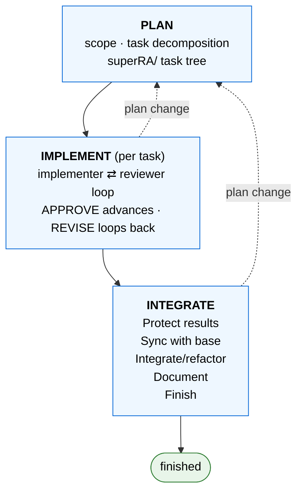

## Objective

superRA turns an AI coding agent into a disciplined research assistant. You bring a research question; superRA gives the agent a workflow that plans the work, implements it under adversarial review, and integrates the result into your codebase without letting the findings quietly drift. It runs on Claude Code, Codex, or any harness that supports skills and subagents.

It exists because agents are fast but undisciplined. They generate more code than anyone will read, drop half a sample before running a regression while reporting that "everything looks good", and lose the thread of what was done and why as the context window fills. After a few iterations the results have drifted from what you asked for, and neither you nor the agent can reconstruct the path back. superRA's answer is structure: a reviewer checks every step, the work lives in plain files you can read and edit, and an explicit integration phase folds each piece into your codebase rather than leaving a pile of one-shot outputs.

## How it works

superRA organizes every project into three phases — **PLAN → IMPLEMENT → INTEGRATE**.

In **PLAN**, the agent scopes your request and decomposes it into a *task tree* — a directory of small `task.md` files, each holding one unit of work. In **IMPLEMENT**, an implementer agent executes one task and a separate reviewer agent inspects it adversarially; work only advances on `APPROVE`. In **INTEGRATE**, the finished work is protected against future drift, synced with your base branch intent-aware (never a blind merge), refactored to fit the codebase, documented, and shipped. The phases form a cycle, not a pipeline: a discovery while implementing or a scope change after merge routes back to planning and resumes at the right point, leaving unrelated finished work untouched.

Three ideas carry most of the discipline. An **implementer–reviewer pair** sits at every step, so no result ships without an independent second look. **Domain skills** teach the agent the right protocol for the work at hand — for data analysis, never transform data before describing it; for theory, define objects and assumptions before manipulating equations. And the **task tree** keeps the project's state in committed files you can read at any time, so a fresh agent — or you, a week later — can open the repo and resume from the files and git history alone.

## Start here

- New to superRA and want to try it? The [Quickstart](#/02-quickstart) runs one tiny analysis end to end in about twenty minutes — you will meet the task tree, dispatch, review, and status by doing rather than reading.
- Want the model behind what you saw? The [Concepts](#/03-concepts) section explains the workflow, the task tree, the implementer–reviewer loop, how skills and agents fit together, and what the integration phase protects.
- Have a specific job in mind? The [How-To guides](#/04-how-to) cover named journeys — installing, planning a project, working with task files, watching progress on the dashboard, and integrating and shipping.
- Looking up a field, flag, status, or command? The [Reference](#/05-reference) section has the exact definitions, with links to the skill files that own them.
- Want proof it is real? The [Showcase](#/06-showcase) embeds an actual superRA task tree exported by the same dashboard that renders this site.

superRA is open source and built for researchers comfortable with git and an AI harness. Installation and contribution details live in the project [README](README.md).
