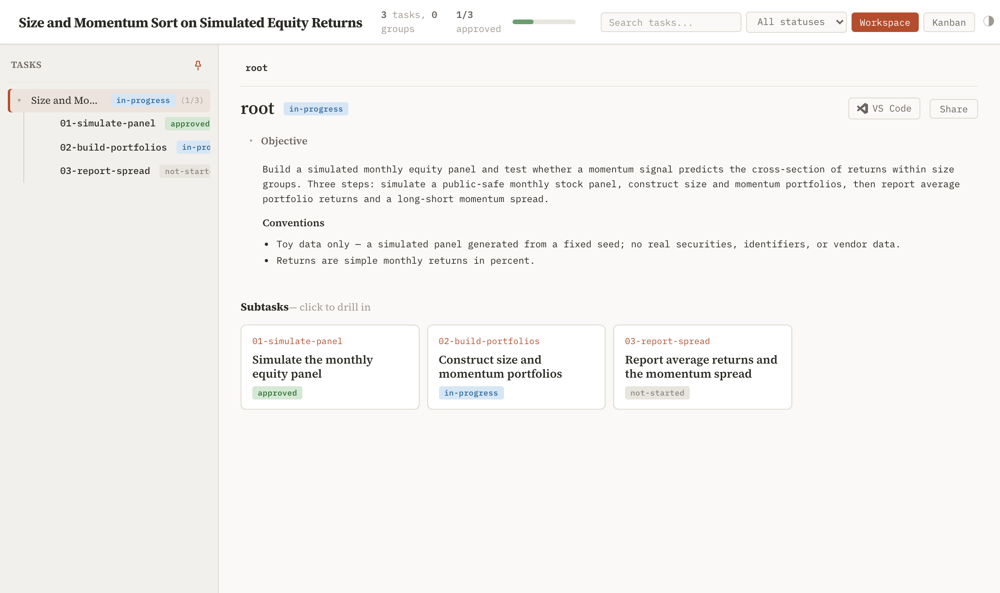
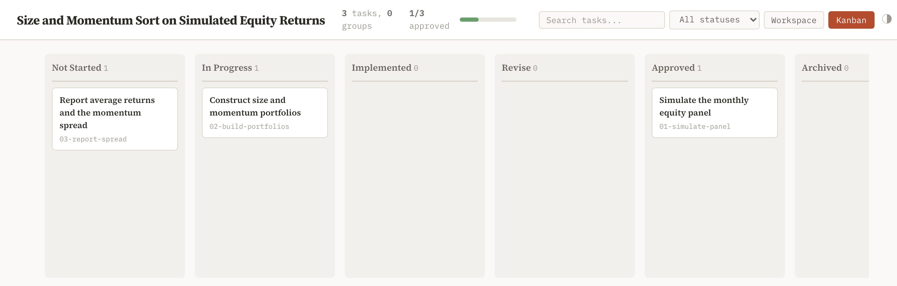
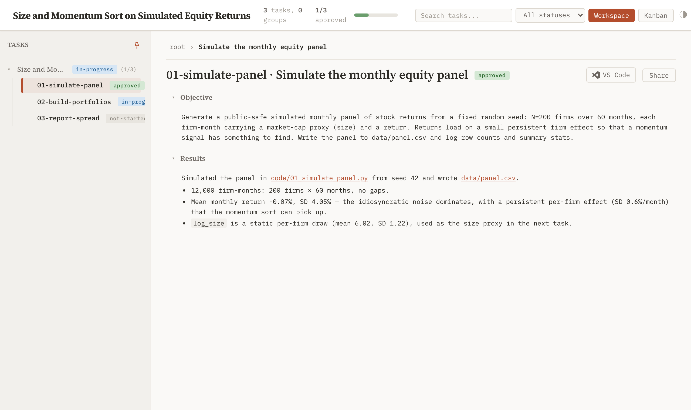

## Objective

Run this on day one. You install superRA, point it at a project, and push one piece of work through a full PLAN → IMPLEMENT → INTEGRATE cycle: plan a small task tree, run a task through its implementer–reviewer pair, watch progress and read results in the dashboard, integrate the result. Every core idea — the task tree, the dashboard, adversarial review, status, integration — arrives inline as you reach it. By the end you have used the mechanics rather than read definitions of them.

The running example is a toy size-and-momentum sort on *simulated* equity returns — a small, public-safe analysis, no real data. Every command on this page was run as shown; every screenshot is the dashboard rendering this exact project.

### Prerequisite

**git** is the one real prerequisite — as it is for any agentic coding workflow. The agent commits as it works, and you read and steer through the history. A branch-and-PR workflow is recommended but not required. To get the most out of superRA, `git worktree` lets you push on several fronts at once while an agent runs in the background; the [`worktree-data-sync`](#/04-utility-skills) skill keeps non-git-controlled data in sync across those isolated worktrees.

superRA runs on **[Claude Code](https://docs.claude.com/en/docs/claude-code) or [Codex](https://developers.openai.com/codex/cli)**. This walkthrough uses Claude Code; everything applies to Codex too — only the install step and the way you invoke agents differ (see the [Codex install notes](docs/README.codex.md)). You also need [`uv`](https://docs.astral.sh/uv/) to launch the dashboard.

### Install + set up a project

Install the plugin into Claude Code as a marketplace, then restart your session:

```bash
claude plugin marketplace add FuZhiyu/superRA
claude plugin install superRA@superRA
```

Codex needs a second step — the named agents — covered in the [Codex install notes](docs/README.codex.md). The full install reference (updating, the local-clone path for forking) lives in the project [README](README.md).

The quickest way to try superRA is to point it at work you already have. Take an existing project (commit everything first if you haven't), start Claude Code, and ask it something like:

```text
Use superRA and retroactively create task trees for [what I'm working on],
and show me the dashboard.
```

The trigger is the word **`superra`**: with it in the prompt, the agents follow the workflow instead of improvising. That word, or one of the phase words below, is all it takes.

### A typical workflow

The rest of this page walks one piece of work through all three phases. The example below starts a fresh toy analysis rather than adopting existing work, so you see planning from scratch.

#### Superplan

Tell Claude what you want to work on in plain language and ask it to plan. Skip your harness's plan mode; the word `superplan` puts it on the planning track:

```text
Using superRA, superplan a small toy analysis: simulate a monthly equity
panel, sort firms into size and momentum portfolios, and report the long-short
momentum spread. Keep it to a handful of tasks on simulated data.
```

Claude loads the `superplan` skill, explores the project, and proposes a small **task tree** — here, three tasks under one root. The task tree holds the project's state. Instead of keeping the plan in one agent's context window, superRA writes it as a committed tree of small `task.md` files — one directory per unit of work — that the agents read and write as they go. The state is plain files in git, so a fresh agent session, or you next week, can reopen the repo and see exactly what was planned, done, and left.

Planning is autonomous but stops at one gate: before any code is written, the planner shows you the proposed decomposition and waits. Read the objectives and approve. The planner commits the tree to `superRA/`, so the structure is in git before execution starts. How task trees get scoped and decomposed is in [superplan](skills/superplan/SKILL.md).

You read the tree on the **dashboard** — the human view of those same committed files. Ask the agent to show it, or launch it yourself from a project terminal:

```bash
./superRA/superra dashboard
```

A live, auto-updating dashboard opens in your browser, runs in the background, and exits once idle. The default **Workspace** view shows the tree with status pills and the parent rollup. Here is the toy project right after planning — three tasks under one root:



#### Superimplement

Now run a task. Ask Claude to `superimplement`:

```text
superimplement @superRA/01-simulate-panel.
```

Every task runs through an **implementer–reviewer pair** — superRA's central discipline. The implementer does the work — here, the panel simulation — records what it found in the task's `## Results` section, and hands off. A separate reviewer then inspects the committed result *independently* — the actual files and diff, not the implementer's summary — and returns one of two verdicts. **APPROVE** advances the task; **REVISE** sends numbered, specific findings back for a fix pass. Work never advances past a `REVISE`, however small the task looks. Review is not skippable.

The reviewer is adversarial by design. Its job is to find what the implementer missed, not to rubber-stamp. An agent reviewing its own work shares its own blind spots: drop half the sample, and it reports everything looks fine. A fresh reviewer with a different prompt and a mandate to find failure catches the silent bad merge, the wrong aggregation, the unreproducible output. Anything that advances through a superRA project has passed a second, independent read at every step. The full role behavior is in the [implementer](agents/implementer.md) and [reviewer](agents/reviewer.md) specs.

The implementer writes its findings straight into the task file, so the panel task's `## Results` reads like this:

```text
## Results

Simulated the panel in code/01_simulate_panel.py from seed 42 and wrote data/panel.csv.

- 12,000 firm-months: 200 firms × 60 months, no gaps.
- Mean monthly return -0.07%, SD 4.05% — the idiosyncratic noise dominates,
  with a persistent per-firm effect (SD 0.6%/month) that the momentum sort can pick up.
- log_size is a static per-firm draw (mean 6.02, SD 1.22), used as the size proxy in the next task.
```

#### Watch progress and read results

The dashboard auto-updates in real time as the agents work, so it is the default way to both watch the run and read what came out — you rarely need the chat or the files directly. As one task is approved, the next one becomes ready: the agent picks up the next task whose dependencies are satisfied, and you watch the order unfold on the dashboard. The **Kanban** view shows every task as a card in a column by status, giving an at-a-glance read of what is where across the whole tree:



Click any task to read its objective and results in place — the same `## Objective` the implementer worked to, and the `## Results` it wrote and the reviewer checked:



Because the results live in committed task files rather than the chat, they survive as a durable handoff even after the agent session that produced them ends. Each task is a plain markdown file (`superRA/01-simulate-panel/task.md`) you can open or edit directly, but the dashboard is the intended way to read it. The dashboard also renders a dependency DAG and lets you share a branch snapshot. The full field-by-field anatomy of a `task.md` is in [The Task File](#/04-utility-skills/01-task-tree/01-task-file).

#### Superintegrate

The tasks are done and approved, so the work is correct. A correct result still has to be landed safely. The INTEGRATE phase folds the work into your codebase so the results stay reproducible and coherent over the long term. Trigger it the same way: ask Claude to `superintegrate`.

It is a phase of its own, not a final `git commit`, because each stage guards against a different way good work goes wrong after it is done:

1. **Protect** — pin the key results with small automated checks, so a later refactor that moves a number you care about fails loudly instead of slipping through silently.
2. **Sync** — fold in your base branch by intent, reading what each incoming change means rather than resolving conflicts line by line — never a bare `git merge`.
3. **Refactor** — fit the work to your codebase with a minimal, reviewable diff instead of a pile of single-shot scripts.
4. **Document** — mature the task findings into documentation a future reader can follow.
5. **Finish** — ship by PR or merge.

The full phase is owned by [superintegrate](skills/superintegrate/SKILL.md).

#### Composable and iterative

Research is rarely linear, and superRA does not force it to be. The phases form a cycle, not a one-way pipeline: a discovery mid-implementation, or a scope change after integration, routes back to planning and resumes at the right point, leaving finished work untouched. You can revise a task's objective as your understanding shifts, add tasks to a tree that is already running, or point superRA at work you have already done and have it build the task tree retroactively — the adoption example above is exactly that. The tree is a living structure you steer, not a plan you lock in up front.

### Where to go next

You have run a full cycle. Two further pieces of discipline each have a page — the domain skill that enforces the right protocol for each kind of research, and the utility skills the workflow leans on:

- **[Domain Skills](#/03-domain-skills)** — what discipline superRA enforces for data analysis, theory, writing, and more, and how a domain skill loads on top of any phase.
- **[Utility Skills](#/04-utility-skills)** — the domain-neutral tools the workflow reaches for: result protection, semantic merge, the task-tree tooling, and others.

For more on the three phases — what each does for you and what you decide along the way — see the [Workflows](#/05-workflows) section. For lookups, the task-tree detail pages have the exact definitions: [task-file fields](#/04-utility-skills/01-task-tree/01-task-file), [CLI commands](#/04-utility-skills/01-task-tree/02-cli-commands), and the [status lifecycle](#/04-utility-skills/01-task-tree/03-status-and-frontier). To see a real, full-size project rather than this toy, open the [Showcase](#/07-showcase).
