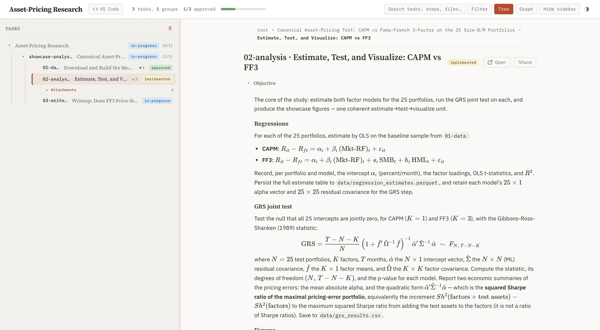

## Objective

This tutorial walks you through installing superRA, pointing it at a project, and pushing one piece of work through a full PLAN → IMPLEMENT → INTEGRATE cycle: plan a small task tree, run a task and review it, watch progress and read results in the dashboard, and integrate the result.

### Prerequisite

**git** is the one real prerequisite — as it is for any agentic coding workflow. Think of it as the rope in climbing: it lets you explore boldly, and it catches you when things go south. superRA is built around git, so use it.

A branch-and-PR workflow is recommended but not required. To get the most out of superRA, `git worktree` lets you push on several fronts at once while an agent runs in the background; the [`worktree-data-sync`](#/04-utility-skills/06-worktree-data-sync) skill keeps non-git-controlled data in sync across those isolated worktrees.

superRA runs on **[Claude Code](https://docs.claude.com/en/docs/claude-code) or [Codex](https://developers.openai.com/codex/cli)**. This walkthrough uses Claude Code; everything applies to Codex too — only the install step and the way you invoke agents differ (see the [Codex install notes](docs/README.codex.md)).

You also need [`uv`](https://docs.astral.sh/uv/) to launch the dashboard.

The dashboard doubles as a launcher into your own machine: a task's `Open` button and any file link in a task body open in whatever application you already use for that file type, and a header button opens the task's file in the VS Code window already holding that worktree. Opened from another device, such as a phone, the same links show the file inside the dashboard. Convenient, but not required.

### Install + set up a project

Install the plugin into Claude Code as a marketplace, then restart your session:

```bash
claude plugin marketplace add FuZhiyu/superRA
claude plugin install superRA@superRA
```

The quickest way to try superRA is to point it at work you already have. Start Claude Code in an existing project and ask:

```text
Use superRA to onboard this project and show me the dashboard.
```

The agent follows the [onboarding](skills/onboarding/SKILL.md) skill. It builds a task tree from the work already there and a reproduction graph of the scripts behind your results, then offers to set up git and to rerun the project in an isolated copy to confirm it reproduces. It stops after each stage for your approval, and it changes nothing outside `superRA/` until you agree.

The trigger is the word **`superra`**: with it in the prompt, the agents follow the workflow instead of improvising.

### A typical workflow

The rest of this page walks one piece of work through all three phases. The example below is a real empirical asset-pricing study: estimate CAPM and the Fama-French three-factor model on Ken French's 25 portfolios sorted by size and book-to-market, then run the Gibbons-Ross-Shanken (GRS) joint test to ask whether either model prices the cross-section.

#### Superplan

Tell Claude what you want to work on in plain language and ask it to `superplan`. (Don't use your harness's built-in `plan` mode; ask for `superplan` instead.)

```text
Using superRA, superplan an asset-pricing study on public Ken French data:
download the factors and the 25 size-B/M portfolios, estimate CAPM and the
Fama-French 3-factor model, and run the GRS joint test. Keep it to a handful
of tasks.
```

Claude loads the `superplan` skill, explores the project, and proposes a small **task tree** — here, three tasks under one root: build the panel, run the regressions and the GRS test, and write up the result. The task tree holds the project's state. Instead of keeping the plan in one agent's context window or a temporary plan file, superRA writes it as a committed tree of small `task.md` files — one directory per unit of work — that the agents read and write as they go. The state is plain files in git, so a fresh agent session, or you next week, can reopen the repo and see exactly what was planned, done, and left.

Decisions the planner cannot settle from the project come to you as rounds of questions, each with a recommended answer; before executing anything, it shows you the proposed tree. You read the task tree on the **dashboard** — ask the agent to show it, or launch it yourself from a project terminal:

```bash
./superRA/superra dashboard
```
A live, auto-updating dashboard opens in your browser. The default **Tree** view shows the tree, with a colored status pill on each task.

Here is this study right after planning — three tasks under one root, every one `not-started` (grey), so the root rolls up to `not-started` too. Open it and click a task to read the objective the planner wrote. Read the objectives; if anything is off, leave a comment on the dashboard and ask the agent to revise.

[Open the freshly-planned tree →](showcase-after-planning.html)

#### Implement

Now run a task. Ask Claude to work it:

```text
Work @superRA/showcase-analysis.
```

By default the main agent does the work itself, with you: it executes the task, records results in the task file, commits, and pauses often for your feedback. When a task lands it asks whether to run an independent review — now, deferred, or skipped — and recommends a depth and focus. For a broad, parallelizable, or context-heavy frontier, ask for `superimplement` (or accept the agent's recommendation of it) and the run goes **autonomous**: the main agent dispatches implementer and reviewer seats to subagents, which keeps its own context window clean so it stays sharp far longer.

Either way, the work — here, building the monthly panel from the Ken French data — is recorded in the task's `## Results` section, and an independent review is a *separate* agent reading the committed result.

That independence is the point. An agent reviewing its own work shares its own blind spots: drop half the sample, and it reports everything looks fine. A fresh reviewer reads the committed evidence — the files, the diff, the outputs — at a depth and focus named in the dispatch, and reports what it finds rather than filtering to what it judges serious. That is what catches the silent bad merge, the wrong aggregation, the unreproducible output. Review runs where it earns its cost: on a result you want a second read of, on work the planner flagged as high-stakes, or whenever the implementer comes back uncertain. The full role behavior is in the [implement-task](skills/implement-task/SKILL.md) and [review-task](skills/review-task/SKILL.md) skills.

The implementer writes its findings straight into the task file, so the panel task's `## Results` reads like this:

```text
## Results

Built the baseline monthly panel end-to-end from public Ken French data.
The registered step build-panel produces it from the committed raw CSVs
and is fresh in repro-lock.json.

- data/ff_panel.parquet: 758 months × 29 columns, indexed by month-end date
  over 1963-07 → 2026-08. Columns: Mkt-RF, SMB, HML, RF plus the 25 portfolio
  excess-return series.
- Merge: 1:1 inner join on the month index, 1202 → 1202 rows, 0 unmatched.
  No within-sample month gaps; no missing values over the baseline sample.
- Factor magnitudes match published scales — market premium 0.602%/mo,
  market volatility 4.46%/mo — so downstream regressions start from clean data.
```

During implementation, agents commit atomically by default, so every step is tracked in git. Because that produces many small commits, it is recommended to work on a separate branch rather than directly on your default branch.

The dashboard shows the loop in flight. Open this study mid-run — the panel task is `approved` (green), the regression-and-GRS task is `implemented` (yellow) with its approval decision still open, the writeup is still `not-started` (grey), and the parent has rolled up to `in-progress`. Click the implemented task to see the results already written:

[Open the study mid-implement →](showcase-mid-implement.html)

#### Watch progress and read results

The dashboard auto-updates in real time as the agents work, so it is the default way to both watch the run and read what came out. As each task lands, the next one becomes ready: the agent picks up the next task whose dependencies are satisfied, and you watch the order unfold on the dashboard. Once every task is approved, the whole tree is `approved` (green) — the state INTEGRATE picks up:



[Open the finished study →](showcase-analysis-tree.html)

This is the completed tree, every task green. Click any task to read its objective and results in place — the same `## Objective` the implementer worked to, and the `## Results` it wrote and the reviewer checked. The regression-and-GRS task opens straight to its objective math and the results the implementer wrote and the reviewer checked:

[Read the finished regression task →](showcase-analysis-tree.html#/02-analysis)

Because the results live in committed task files rather than the chat, they are the durable handoff: nothing of value sits in a context window waiting to be lost. Each task is a plain markdown file (`superRA/showcase-analysis/01-data/task.md`) you can open or edit directly, but the dashboard is the intended way to read it. The dashboard also lets you [share a branch snapshot](#/04-utility-skills/01-task-tree/04-dashboard). The full field-by-field anatomy of a `task.md` is in [The Task File](#/04-utility-skills/01-task-tree/01-task-file).

#### See which results are current

Each task that produces results also declares the scripts that produce them, and superRA records what each script read and wrote at its last successful run. Switch the finished study to the **Graph** view (the switch at the top of the page) to see this reproduction graph: one card per script, called a *step*, and an arrow wherever one step reads a file another step writes.


[Open the study's graph →](showcase-analysis-tree.html#/?repro=%7B%22expanded%22%3A%5B%2201-data%22%2C%2202-analysis%22%5D%2C%22layout%22%3A%22graph%22%7D)

`build-panel` turns the committed Ken French CSVs into the panel, `estimate-test-plot` runs the regressions and the GRS test and draws the figures, and `check-grs-headline` fails if the headline GRS result stops holding. Each card's mark says whether its outputs still match the code and data that produced them. An edit to `02_analysis.py`, even to a comment, turns `estimate-test-plot` stale and `check-grs-headline` stale through it, while `build-panel` stays fresh. In your own dashboard, hovering a stale card shows which file changed, and each task and step card has a **Build** button that reruns the steps that are not fresh. The published pages here are snapshots of the finished study: every step reads `fresh`, and there is no Build button.

Before an edit, ask the agent what it will touch:

```text
Which results does an edit to 02_analysis.py affect?
```

Here the answer is `estimate-test-plot` and `check-grs-headline`. Nothing reruns until you or the agent asks for a build. [Reproducibility](#/04-utility-skills/09-reproducibility) explains how freshness is decided, what a build runs, and when the agent accepts a result instead of rerunning it.

#### Superintegrate

The tasks are done and approved, but a correct result still has to be landed safely. The INTEGRATE phase folds the work into your codebase so the results stay reproducible and coherent over the long term. Trigger it the same way: ask Claude to `superintegrate`.

Superintegration consists of five stages, and each stage guards against a different way good work goes wrong after it is done:

1. **Protect** — review the agent’s proposed permanent documentation and task-tree consolidation, choose which provisional results to keep or drop, and decide whether documentation alone or an additional drift test should protect each kept result. The approved specification is committed for later agents and resumed sessions.
2. **Sync** — when the base branch has moved (a coauthor pushed while you worked, say), fold those changes in **semantically**: superRA reads the intent behind each incoming change and reconciles it, rather than resolving conflicts line by line — never a bare `git merge`.
3. **Mature & Consolidate** — one drafter creates the user-facing documentation and matures the task tree; one reviewer verifies that protected record and writes the temporary pruning-and-refactoring task.
4. **Integrate** — let you review that task with the finished record, then execute and verify it.
5. **Finish** — ship by PR or merge.

The full phase is owned by [superintegrate](skills/superintegrate/SKILL.md).

#### Composable and iterative

Research is rarely linear, and superRA does not force it to be. The phases form a cycle, not a one-way pipeline: a discovery mid-implementation, or a scope change after integration, routes back to planning and resumes at the right point, reopening only the tasks the change touches. The tree is a living structure you steer, not a plan you lock in up front.

In practice that means you can edit the tree at any time, in plain language. Add a task to a tree that is already running:

```text
Using superplan, add a task under showcase-analysis for a robustness check
on the post-2000 subsample, depending on the regression task.
```

Revise a task's objective as your understanding shifts:

```text
Using superplan, update the regression task to also report Newey-West
standard errors.
```

Or bring in work you have already done: the onboarding prompt at the top of this page builds its task tree and reproduction graph retroactively.

### Where to go next

You have run a full cycle. Two further pieces of discipline each have a page — the domain skill that enforces the right protocol for each kind of research, and the utility skills the workflow leans on:

- **[Domain Skills](#/03-domain-skills)** — what discipline superRA enforces for data analysis, theory, academic writing, and more, and how a domain skill loads on top of any phase.
- **[Utility Skills](#/04-utility-skills)** — the domain-neutral tools the workflow reaches for: result protection, semantic merge, the task-tree tooling, and others.

For more on the three phases — what each does for you and what you decide along the way — see the [Workflows](#/05-workflows) section. For lookups, the task-tree detail pages have the exact definitions: [task-file fields](#/04-utility-skills/01-task-tree/01-task-file), [CLI commands](#/04-utility-skills/01-task-tree/02-cli-commands), and the [status lifecycle](#/04-utility-skills/01-task-tree/03-status-and-frontier). To open and click through the finished study this page walked you through — the live task tree with its regression tables and figures — go to the [Showcase](#/07-showcase).
