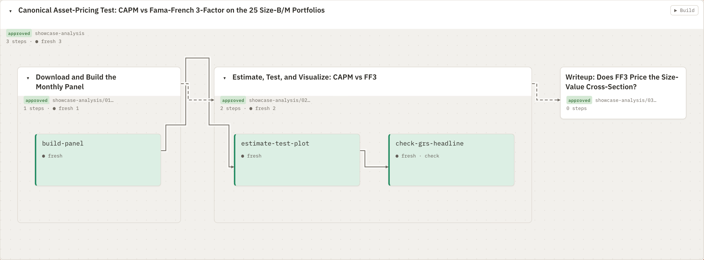

## Objective

Install superRA, then take one study through PLAN → IMPLEMENT → INTEGRATE. Each step shows what to tell the agent and what you see on the dashboard. The running example is a public asset-pricing study: CAPM and the Fama-French three-factor model on Ken French's 25 size–book-to-market portfolios, with the Gibbons-Ross-Shanken (GRS) joint test of whether either model prices the cross-section.

### Before you start

- **git.** superRA keeps all project state in your repo and commits as it works. Work on a branch: agents commit atomically, so a run produces many small commits.
  - Optional: `git worktree` lets you run several fronts in parallel; [`worktree-data-sync`](#/04-utility-skills/06-worktree-data-sync) keeps non-git data in step across worktrees.
- **[Claude Code](https://docs.claude.com/en/docs/claude-code) or [Codex](https://developers.openai.com/codex/cli).** This page uses Claude Code. On Codex only the install and the way you invoke agents differ; see the [Codex install notes](docs/README.codex.md).
- **[`uv`](https://docs.astral.sh/uv/)**, to launch the dashboard.

### Install, then onboard a project you already have

Install the plugin and restart your session:

```bash
claude plugin marketplace add FuZhiyu/superRA
claude plugin install superRA@superRA
```

The fastest first run uses existing work. Start Claude Code in a project and ask:

```text
Use superRA to onboard this project and show me the dashboard.
```

- The agent follows the [onboarding](skills/onboarding/SKILL.md) skill: it builds a task tree from the work already there and a reproduction graph of the scripts behind your results, then offers to set up git and to rerun the project in an isolated copy to confirm it reproduces.
- It stops after each stage for your approval and changes nothing outside `superRA/` until you agree.

Put the word **superRA** in a prompt to make the agent follow the workflow instead of improvising.

### Plan: review a task tree before any code

Describe the work in plain language and ask for `superplan`, not your harness's built-in plan mode:

```text
Using superRA, superplan an asset-pricing study on public Ken French data:
download the factors and the 25 size-B/M portfolios, estimate CAPM and the
Fama-French 3-factor model, and run the GRS joint test. Keep it to a handful
of tasks.
```

- The planner explores the project and proposes a **task tree**: here, three tasks under one root — build the panel, run the regressions and the GRS test, write up the result.
  - Each task is a committed `task.md` file, so a fresh session, or you next week, sees exactly what was planned, done, and left.
- Decisions it cannot settle from the project come to you as rounds of questions, each with a recommended answer.
- You read the proposed tree on the **dashboard**. Ask the agent to show it, or run from a project terminal:

  ```bash
  ./superRA/superra dashboard
  ```

  - A live dashboard opens in your browser. The **Tree** view shows each task with a colored status pill; click one to read its objective.
  - To change it, leave a comment on the dashboard and ask the agent to revise.
  - In a browser on the same machine, a task's `Open` button and file links open files in your default app, and the header `VS Code` button opens the task file in the window holding that worktree.

[Open the freshly planned tree →](showcase-after-planning.html) Every task is `not-started` (grey), so the root rolls up to `not-started`.

### Implement: work a task with the agent, review when it pays

Ask the agent to work the tree:

```text
Work @superRA/showcase-analysis.
```

- **Interactive, by default.** The main agent works the task with you: it executes, records results in the task file, commits, and pauses often for your feedback.
  - When a task lands, it asks whether to run an independent review now, defer it, or skip it, and recommends a depth and focus.
  - The review is a separate agent reading the committed files, diff, and outputs, so it does not share the implementer's blind spots.
- **Autonomous, on request.** Ask for `superimplement`, or accept the agent's recommendation of it for a broad, parallelizable, or context-heavy frontier. The main agent then dispatches implementer and reviewer subagents, which keeps its own context clean over a long run.
- [IMPLEMENT](#/05-workflows/02-implement) covers when review earns its cost; the role protocols are in [implement-task](skills/implement-task/SKILL.md) and [review-task](skills/review-task/SKILL.md).

Results land in the task's `## Results`. The panel task reads:

```text
## Results

Built the baseline monthly panel end-to-end from public Ken French data.
The registered step build-panel produces it from the committed raw CSVs
and is fresh in repro-lock.json.

- data/ff_panel.parquet: 758 months × 29 columns, indexed by month-end date
  over 1963-07 → 2026-08. Columns: Mkt-RF, SMB, HML, RF plus the 25 portfolio
  excess-return series.
- Merge: 1:1 inner join on the month index, 1202 → 1202 rows, 0 unmatched.
  No within-sample month gaps; no missing values over the baseline sample.
- Factor magnitudes match published scales — market premium 0.602%/mo,
  market volatility 4.46%/mo — so downstream regressions start from clean data.
```

[Open the study mid-implement →](showcase-mid-implement.html) The panel task is `approved` (green), the regression-and-GRS task is `implemented` (yellow) with its review decision open, the writeup is `not-started` (grey), and the root has rolled up to `in-progress`.

### Read results on the dashboard as they land

The dashboard updates as the agents work. When a task is approved, the agent picks up the next task whose dependencies are met; when every task is approved, the whole tree turns `approved` (green), ready for INTEGRATE.

- [Open the finished study →](showcase-analysis-tree.html) Click any task to read its objective and the results the reviewer checked.
- [Read the finished regression task →](showcase-analysis-tree.html#/02-analysis) It opens on its objective math and the results.

The results live in committed task files such as `superRA/showcase-analysis/01-data/task.md`, not in the chat, so no session can lose them. [The Task File](#/04-utility-skills/01-task-tree/01-task-file) gives a task's field-by-field anatomy; [the dashboard page](#/04-utility-skills/01-task-tree/04-dashboard) covers comments and shareable snapshots.

### See which results are current

Each task declares the scripts that produce its results, and superRA records what each script read and wrote at its last successful run. Switch the finished study to the **Graph** view (the switch at the top of the page) to see this reproduction graph: one card per script, called a *step*, with an arrow wherever one step reads a file another writes.



[Open the study's graph →](showcase-analysis-tree.html#/?repro=%7B%22expanded%22%3A%5B%2201-data%22%2C%2202-analysis%22%5D%2C%22layout%22%3A%22graph%22%7D)

- **All three steps read `fresh`:** their outputs still match the code and data that produced them.
  - `build-panel` turns the committed Ken French CSVs into the panel.
  - `estimate-test-plot` runs the regressions and the GRS test and draws the figures.
  - `check-grs-headline` fails if the headline GRS result stops holding.
- **An edit to `01_build_panel.py`, even to a comment, turns `build-panel` and both downstream steps `stale`.**
  - On your own dashboard, hover a stale card to see which file changed, and use a card's **Build** button to rerun the steps that are not fresh.
  - The published pages here are snapshots: they show the marks without the button.

Before an edit, ask the agent what it will touch:

```text
Which results does an edit to 01_build_panel.py affect?
```

Here the answer is all three steps. Nothing reruns until you or the agent asks for a build. [Reproducibility](#/04-utility-skills/09-reproducibility) explains how freshness is decided, what a build runs, and when the agent accepts a result instead of rerunning it.

### Integrate: land the result safely

Once the tasks are approved, ask the agent to `superintegrate`. INTEGRATE folds the work into your codebase so the results stay reproducible and coherent, in five stages:

| Stage | What the agent does | What you decide |
|---|---|---|
| **Protect** | Proposes permanent documentation and task-tree consolidation | Which results to keep, and whether documentation alone or also a drift test protects each |
| **Sync** | Folds in base-branch changes by their intent, never by a bare `git merge` | The target base, if not already recorded; any conflict that changes intent |
| **Mature & Consolidate** | Writes the permanent record, matures the task tree, and drafts one temporary refactoring task | — |
| **Integrate** | Executes and verifies the refactoring task | Approve the finished record and the refactoring task together |
| **Finish** | Runs a final freshness check, then ships by PR or merge | — |

[INTEGRATE](#/05-workflows/03-integrate) walks through each stage; the agent follows [superintegrate](skills/superintegrate/SKILL.md).

### Change the tree at any point

The phases form a cycle: a discovery mid-implementation, or a scope change after integration, routes back to planning and resumes at the right point, leaving finished work untouched. Edit the tree in plain language. Add a task to a running tree:

```text
Using superplan, add a task under showcase-analysis for a robustness check
on the post-2000 subsample, depending on the regression task.
```

Or revise a task's objective:

```text
Using superplan, update the regression task to also report Newey-West
standard errors.
```

### Where to go next

- **[Domain Skills](#/03-domain-skills)** — the discipline superRA enforces for data analysis, theory, academic writing, and slides, on top of any phase.
- **[Utility Skills](#/04-utility-skills)** — the domain-neutral tools the workflow uses: result protection, semantic merge, the task-tree tooling, and others.
- **[Workflows](#/05-workflows)** — each phase on its own: what it does for you and what you decide.
- **Task-tree lookups** — [task-file fields](#/04-utility-skills/01-task-tree/01-task-file), [CLI commands](#/04-utility-skills/01-task-tree/02-cli-commands), and the [status lifecycle](#/04-utility-skills/01-task-tree/03-status-and-frontier).
- **[Showcase](#/07-showcase)** — the finished study with its regression tables, figures, and full review history.
