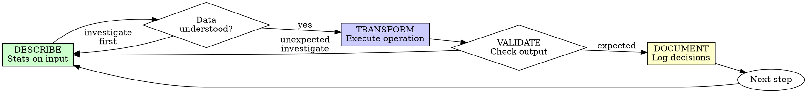

# Data-First Analysis

## Overview

Describe the data first. Transform it. Validate the result.

**Core principle:** If you didn't describe the data before transforming it, you don't know if the transformation is correct.

**Violating the letter of the rules is violating the spirit of the rules.**

## When to Use

**Always:**
- Loading new datasets
- Merges and joins
- Filtering or subsetting
- Variable construction
- Aggregations
- Reshaping

**Exceptions (ask your human partner):**
- Throwaway exploration in REPL
- Re-running previously validated code unchanged

Thinking "skip description just this once"? Stop. That's rationalization.

## The Iron Law

```
NO TRANSFORMATION WITHOUT PRIOR DESCRIPTION
```

Transformed data without describing it first? Undo the transformation. Start over.

**No exceptions:**
- Don't keep the merged result as "it looks fine"
- Don't "check it later at the end"
- Don't rely on a description from a previous session
- Undo means undo

Describe fresh from the current data state. Period.

## Describe-Transform-Validate-Document



### DESCRIBE — Understand the Input

Run descriptive statistics on the data you are about to transform.

**For the full description protocol**, invoke the `econ-data-analysis` skill — it contains the three principles and pitfall checklists. Key points:

**Panel structure** (if applicable):
- Panel ID and time ID, unique counts of each
- Date range, balancedness (periods per unit)
- Does panel ID × time uniquely identify rows?

**Variable diagnostics** (key variables only, not blanket `describe()`):
- Continuous: mean, median, std, p1, p5, p95, p99
- Categorical: value counts and shares
- Missing: count, share, systematic patterns

**Before a merge:** also describe the join keys in both tables — unique values, overlap.

**Requirements:**
- Diagnostics on input data, not just "I loaded it"
- Key variables examined, not all columns
- Output visible (printed or displayed in jupytext cell)

### TRANSFORM — Execute the Operation

Apply the data operation: merge, filter, construct variable, aggregate.

**One logical operation per step.** Don't chain merge + filter + construct in a single step.

**Requirements:**
- Operation matches what the plan specified
- Row count printed before and after (for sample-changing operations)

### VALIDATE — Check the Result

Compare before and after. Does the result make sense?

**Row counts:**
- Left join: row count should match left table (if right side is m:1)
- Inner join: expect fewer rows — how many dropped?
- Filter: how many rows removed? Is the drop rate reasonable?

**Distribution checks:**
- Re-run descriptive stats on affected variables
- Compare to pre-transformation values
- Flag anything unexpected

**Economic sense:**
- Magnitudes plausible? GDP growth of 300% is wrong.
- Signs correct? Correlations match known stylized facts?
- Spot-check a few observations by hand

**If something looks unexpected:** STOP. Investigate before proceeding. Do NOT use a variable downstream until its distribution is understood.

### DOCUMENT — Log Everything

In jupytext markdown cells:
- What you did and why
- Row count changes
- Any surprising findings
- Decision justifications (why this filter threshold, why this join type)

**Row count tracking is mandatory** for every sample-changing operation. No exceptions.

## Good Descriptions

| Quality | Good | Bad |
|---------|------|-----|
| **Targeted** | Key variables only, type-appropriate stats | `df.describe()` on all columns |
| **Diagnostic** | Tail percentiles (p1/p99) catch outliers | Only mean and std |
| **Panel-aware** | ID × time structure, balancedness | Treats panel as cross-section |
| **Actionable** | Leads to decision (keep/winsorize/investigate) | Stats printed but not examined |

## Why Order Matters

**"I'll validate at the end to verify it all works"**

Validation at the end catches nothing:
- Can't isolate which step introduced the problem
- May not notice silent issues (row inflation from bad merge)
- You never saw the data before each transformation
- "It looks reasonable" at the end ≠ "each step is correct"

Step-by-step validation forces you to understand data flow, catching issues where they originate.

**"I already know this data from last time"**

Data changes. Your memory of it doesn't reflect:
- Updated source files
- Different time periods or filters applied upstream
- Subtle changes from prior merges in this pipeline
- "I remember it" ≠ current state documented

Describe the current data. Every time.

**"The merge is simple, just a left join"**

Simple merges create the most insidious bugs:
- Many-to-many joins silently inflate row counts
- Unmatched observations silently get NaN
- Duplicate keys create unexpected multiplication
- "Simple" is where unexamined assumptions cause the most wrong results

Describe join keys in both tables before merging. Period.

**"Describing everything is slow and wastes time"**

Describing is faster than debugging wrong results:
- A describe step takes 30 seconds
- Finding a merge bug downstream takes hours
- Wrong results submitted for review waste everyone's time
- "Fast" analysis with wrong numbers is slower than careful analysis

## Common Rationalizations

| Excuse | Reality |
|--------|---------|
| "Data looks fine" | You haven't described it. You don't know. |
| "Just a simple merge" | Simple merges create the worst silent bugs. |
| "I'll validate at the end" | Can't isolate which step caused the problem. |
| "Already know this data" | Your memory ≠ current state. Describe it. |
| "It's the same as last session" | Files change. Upstream code changes. Describe fresh. |
| "Only filtering, not transforming" | Filters change your sample. Describe what you're losing. |
| "Quick exploration, not formal analysis" | If results inform decisions, they must be validated. |
| "Row counts match, so the merge is fine" | Row counts don't catch value corruption or key mismatches. |
| "I'll add descriptions when I write it up" | After-the-fact descriptions are biased by what you built. |
| "Describing is busywork" | 30 seconds of describing vs hours of debugging wrong results. |

## Red Flags - STOP and Start Over

- Transform before describe
- Merge without checking join keys in both tables
- No row count printed after sample-changing operation
- "Looks fine" without running diagnostics
- Descriptions added after the fact
- Skipping validation because "the numbers look right"
- Multiple transformations without intermediate validation
- Rationalizing "just this once"
- "I already checked this data in a previous session"
- "This is exploratory so it doesn't matter"

**All of these mean: Undo the transformation. Describe first. Start over from that step.**

## Verification Checklist

Before marking a step complete:

- [ ] Described input data before transformation
- [ ] Key variables examined with appropriate diagnostics
- [ ] Panel structure documented (if applicable)
- [ ] Transformation matches plan specification
- [ ] Row counts logged before and after (if sample-changing)
- [ ] Output validated against expectations
- [ ] Economic sense checked (magnitudes, signs, relationships)
- [ ] Decisions documented in markdown cells
- [ ] Unexpected findings investigated before proceeding

Can't check all boxes? You skipped data-first analysis. Start over from the describe step.

## When Stuck

| Problem | Solution |
|---------|----------|
| Don't know what to describe | Panel structure first. Then key variables. Then missing data. |
| Description reveals problems | Investigate before proceeding. Problems don't fix themselves downstream. |
| Merge produces unexpected rows | Check join key uniqueness in both tables. Log unmatched. |
| Variable has implausible values | Compare to published benchmarks. Check construction logic. |

## Integration with Workflow

This skill is the discipline enforced at **every step** during plan execution — it is not a separate phase. When executing an analysis plan:

1. Each step in the plan follows Describe → Transform → Validate → Document
2. Each completed step gets committed
3. The plan file is updated with results and any changes to upcoming steps
4. Reviewers check that this discipline was followed

**Related skills:**
- **econ-superpowers:econ-data-analysis** — Detailed three-principle framework and pitfall checklists. Invoke for the full reference.
- **econ-superpowers:verification-before-completion** — Evidence before claims, always.
- **econ-superpowers:analysis-planning** — Creates the plan this skill enforces during execution.

## Final Rule

```
Data described → transformation validated → documented
Otherwise → not data-first analysis
```

No exceptions without your human partner's permission.
