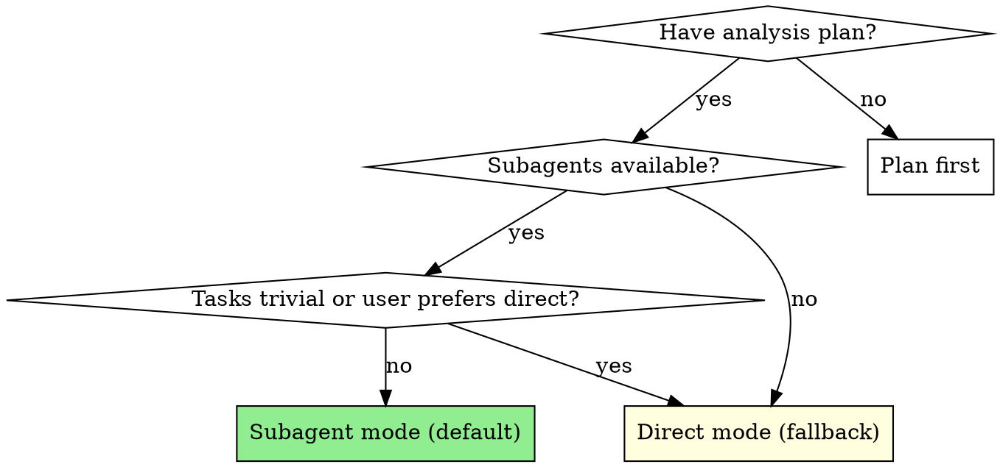
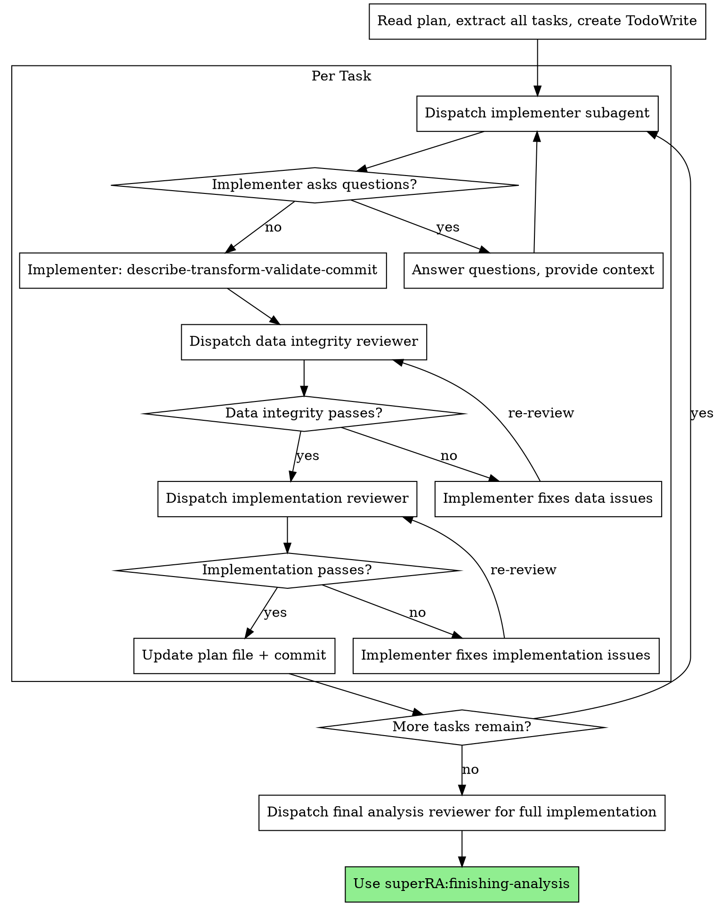

# Executing Analysis

Execute an analysis plan with data-first discipline. Default mode dispatches a fresh subagent per task with two-stage review (data integrity then implementation correctness). Falls back to direct execution when the user requests it or tasks are trivial.

**Core principle:** Fresh subagent per task + two-stage review = high quality, reproducible analysis. Review always happens regardless of execution mode.

**Announce at start:** "I'm using the executing-analysis skill to implement this analysis plan."

## Execution Modes



**Subagent mode (default):**
- Dispatch implementer subagent per task
- Two-stage review after each: data integrity → implementation correctness
- Fresh context per task (no pollution)
- Orchestrator preserves context for coordination

**Direct mode (fallback):**
- Main agent implements tasks directly
- Still dispatches reviewer subagents after each task (review is never skipped)
- Use when: user explicitly requests it, single trivial task, or platform lacks subagents

## The Process



### Step 1: Load and Review Plan

1. Read `PLAN.md` and `RESULTS_UPDATE.md`
2. Review PLAN.md critically — identify any questions or concerns:
   - Are data sources available and accessible?
   - Are the steps in the right order?
   - Is the pipeline file included (for multi-script analyses)?
3. Review RESULTS_UPDATE.md for context on any completed steps (if resuming)
4. If concerns: Raise them with your human partner before starting
5. If no concerns: Create TodoWrite with all steps and proceed

### Step 2: Execute Tasks

#### Per-Task Execution Steps

1. **Dispatch implementer** (subagent mode: `./implementer-prompt.md`; direct mode: implement yourself following econ-data-analysis discipline)
2. **If NEEDS_CONTEXT or BLOCKED:** provide context and re-dispatch (see Handling Implementer Status below)
3. **Once DONE or DONE_WITH_CONCERNS:**
   a. Dispatch data integrity reviewer (`./data-reviewer-prompt.md`)
   b. **If REVISE:** Re-dispatch the implementer with the reviewer's specific feedback items. Then re-dispatch the data integrity reviewer. Iterate until the data integrity reviewer returns APPROVE. Do NOT proceed to implementation review until data integrity is approved.
4. **Once data integrity APPROVE:**
   a. Dispatch implementation reviewer (`./implementation-reviewer-prompt.md`)
   b. **If REVISE:** Re-dispatch the implementer with the reviewer's specific feedback items. Then re-dispatch the implementation reviewer. Iterate until the implementation reviewer returns APPROVE.
5. **Once implementation reviewer APPROVE:**
   - Update PLAN.md and RESULTS_UPDATE.md (you, the orchestrator — not the implementer)
   - Commit plan + results update
   - Proceed to next task

**In direct mode:** Steps 1-2 are done by the main agent directly. Steps 3-5 are unchanged — still dispatch reviewer subagents.

#### When dispatching implementer subagents, provide:
- Full task text from PLAN.md
- Relevant prior results from RESULTS_UPDATE.md (so implementer has context)
- Expected results/hypotheses from PLAN.md header (if provided, so implementer knows what to expect)
- For sensitivity tasks: baseline results to compare against

### Step 3: Verify Pipeline

After all tasks complete:

1. If the analysis has multiple scripts, verify the pipeline file runs end-to-end:
   ```bash
   bash run_all.sh  # or: julia pipeline.jl
   ```
2. Check that all expected outputs exist (tables, figures, logs)
3. Verify outputs are generated from committed code (reproducibility gate)

### Step 4: Complete Analysis

After all tasks complete and pipeline verified:
- Dispatch a final analysis reviewer for the full implementation
- **REQUIRED SKILL:** Use superRA:finishing-analysis
- Follow that skill to generate report, present merge/PR options

## Responsibility Matrix

Who owns what — to prevent confusion and overlap:

| Responsibility | Owner |
|---|---|
| PLAN.md updates | Orchestrator |
| RESULTS_UPDATE.md updates | Orchestrator |
| Task sequencing and skill selection | Orchestrator |
| REVISE loop management (re-dispatch) | Orchestrator |
| User communication and escalation | Orchestrator |
| Code implementation and commits | Implementer (subagent or main agent in direct mode) |
| Self-review before reporting | Implementer |
| Status report with results summary | Implementer |
| Review verdict (APPROVE/REVISE) | Reviewer subagent |

**Subagents do NOT** update PLAN.md, RESULTS_UPDATE.md, or decide task order. These belong to the orchestrator.

## Plan File Updates

**After each task completes both reviews (orchestrator responsibility):**

1. Mark step `- [x]` in PLAN.md with brief result note
2. Update RESULTS_UPDATE.md with key findings, figures, row counts from this task
3. Save any figure attachments to `results_attachments/`
4. If findings change upcoming steps, update PLAN.md
5. Add discovery notes (e.g., "high unmatched rate in merge — investigate before regression")
6. Commit: `git add PLAN.md RESULTS_UPDATE.md results_attachments/ && git commit -m "update plan + results: Task N complete"`

PLAN.md and RESULTS_UPDATE.md are living documents. Together they form the handoff: PLAN.md = what to do, RESULTS_UPDATE.md = what was found. They must always reflect current understanding so the next agent (or session) can pick up where this one left off.

**Review scope at interim checkpoints:** Data integrity and implementation correctness only. Codebase integration review is deferred to the pre-merge gate (invoked during finishing-analysis when merging/PRing).

## Sensitivity Analysis Tasks

When executing sensitivity analysis tasks:

- Provide implementer with baseline results from RESULTS_UPDATE.md
- If sensitivity check shows divergence from baseline: assess **economic significance**, not just statistical
- If unsure whether a sensitivity failure is meaningful: **escalate to human partner** before proceeding
- Document the assessment in RESULTS_UPDATE.md
- Not all sensitivity failures are problems — use economic reasoning

## Model Selection

Use the least powerful model that can handle each role:

**Mechanical analysis tasks** (load data, run diagnostics, simple merges): fast, cheap model.

**Complex analysis tasks** (multi-source merges, variable construction with judgment): standard model.

**Review tasks**: most capable available model.

## Handling Implementer Status

**DONE:** Proceed to data integrity review.

**DONE_WITH_CONCERNS:** Read the concerns. If about data quality or unexpected findings, investigate before review. If about methodology choices, note and proceed to review.

**NEEDS_CONTEXT:** Provide missing data documentation, upstream results, or methodology details and re-dispatch.

**BLOCKED:** Assess the blocker:
1. Data not available → help locate or download
2. Data quality too poor → escalate to human partner
3. Task requires methodology decisions → escalate to human partner
4. Task too complex → break into smaller pieces or use more capable model

## When to Stop and Ask for Help

**STOP executing immediately when:**
- Data description reveals unexpected issues (wrong magnitudes, high missingness)
- Merge produces unexpected row count change
- Validation fails (results don't match economic intuition)
- Plan has critical gaps preventing next step
- Pipeline file is missing and analysis has multiple scripts

**Ask for clarification rather than guessing.**

## Prompt Templates

- `./implementer-prompt.md` — Dispatch analysis implementer
- `./data-reviewer-prompt.md` — Dispatch data integrity reviewer
- `./implementation-reviewer-prompt.md` — Dispatch implementation and code quality reviewer

## Agent Teams Mode

When Agent Teams are available (`CLAUDE_CODE_EXPERIMENTAL_AGENT_TEAMS`), the per-task implementation+review cycle can be orchestrated as a persistent team. This enables direct iteration between implementer and reviewers without the orchestrator relaying feedback.

**Invoke `superRA:using-agent-teams` for the Analysis Task Team recipe** — it has the full team composition (3 teammates), task graph with dependencies, iteration patterns, lead responsibilities, and session handoff protocol.

**Critical:** When all tasks complete, shut down teammates and clean up the team BEFORE invoking `superRA:finishing-analysis`. This frees the session's team slot for the pre-merge-gate team if the user chooses merge/PR.

## Red Flags

**Never:**
- Start analysis on main/master branch without explicit user consent
- Skip reviews (data integrity OR implementation) — even in direct mode
- Proceed with unfixed data integrity issues
- Dispatch multiple implementers in parallel on the same data (conflicts)
- Make subagent read plan file (provide full text instead)
- Skip plan file update after task completion
- Ignore implementer data quality concerns
- Accept "data looks fine" without verification
- **Start implementation review before data integrity is approved**
- Move to next task while either review has open issues

**If reviewer returns REVISE:**
- Re-dispatch the implementer with the reviewer's specific feedback items
- Re-dispatch the reviewer after implementer fixes
- Repeat until approved
- Do NOT skip the re-review
- Do NOT ask the user whether to fix — iterate automatically

## Integration

**Required workflow skills:**
- **superRA:using-analysis-worktrees** — REQUIRED: Set up isolated workspace before starting
- **superRA:analysis-planning** — Creates the plan this skill executes
- **superRA:econ-data-analysis** — REQUIRED: Data discipline all agents must follow
- **superRA:finishing-analysis** — Complete work after all tasks done
- **superRA:pre-merge-gate** — Code integration and drift tests before merge (invoked by finishing-analysis)
