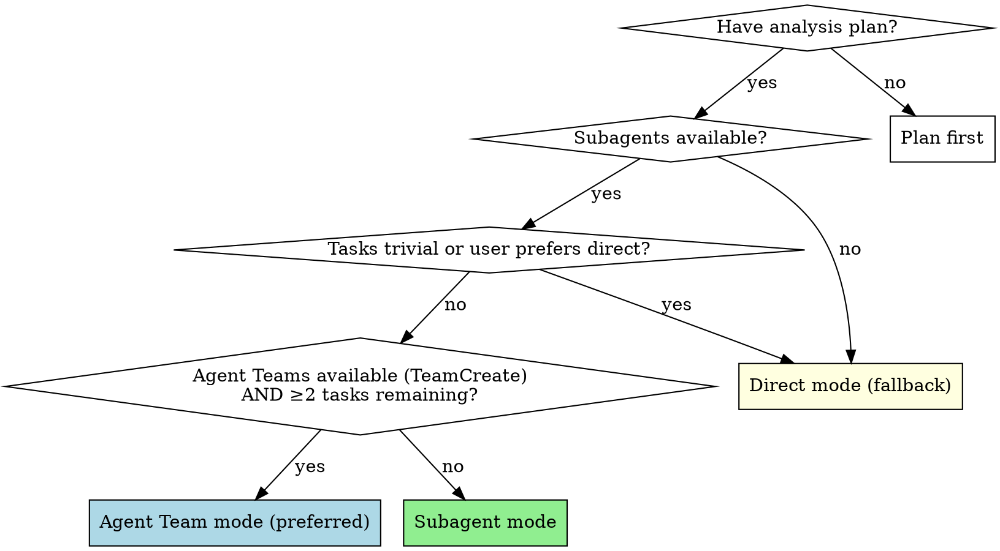
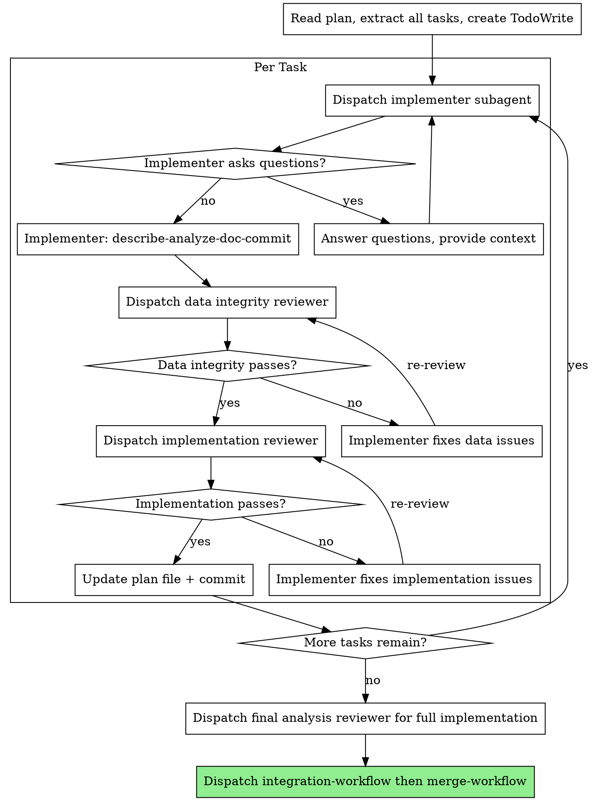

# Execution Workflow

Workflow skill for the **IMPLEMENT** and **VALIDATE** phases of the superRA workflow. Owns per-task dispatch, the two-stage review loop with orchestrator-discipline filtering, end-to-end reproducibility verification, and the 4-option completion menu. On merge/PR, dispatches `superRA:integration-workflow` then `superRA:merge-workflow` directly.

Default mode dispatches a fresh subagent per task with two-stage review (data integrity then implementation correctness). Falls back to direct execution when the user requests it or tasks are trivial.

**Core principle:** Fresh subagent per task + two-stage review = high quality, reproducible analysis. Review always happens regardless of execution mode.

**Announce at start:** "I'm using the execution-workflow skill to implement this analysis plan."

## Execution Modes



**Agent Team mode (preferred):**
- Use `TeamCreate` to set up a persistent team with implementer + reviewers
- Direct iteration between agents without orchestrator relay
- Load `superRA:agent-orchestration` for the Analysis Task Team recipe (team composition, task graph, lifecycle)
- Use when: `TeamCreate` tool is available AND ≥2 tasks remain

**Subagent mode:**
- Dispatch implementer subagent per task
- Two-stage review after each: data integrity → implementation correctness
- Fresh context per task (no pollution)
- Orchestrator preserves context for coordination

**Direct mode (fallback):**
- Main agent implements tasks directly
- Still dispatches reviewer subagents after each task (review is never skipped)
- Use when: user explicitly requests it, single trivial task, or platform lacks subagents

## The Process



### Step 0: Branch Check

Before any handoff-doc check, dispatch, or commit, check if on a default branch:

```bash
git branch --show-current
```

If on `main` or `master`:
```
You're on main. I recommend creating a feature branch for this analysis:
  git checkout -b analysis/<topic>
Want me to create one?
```

If the user declines, proceed — they've given explicit consent to work on the default branch.

### Step 0b: Handoff-Doc Existence Check

After the branch check, confirm `PLAN.md` and `RESULTS.md` exist, are tracked, **and** have no uncommitted modifications (neither unstaged nor staged):

```bash
[ -f PLAN.md ] && [ -f RESULTS.md ] \
  && git ls-files --error-unmatch PLAN.md RESULTS.md >/dev/null 2>&1 \
  && git diff --quiet -- PLAN.md RESULTS.md \
  && git diff --quiet --cached -- PLAN.md RESULTS.md
```

All four conjuncts must succeed. The first two confirm existence and tracking; the last two confirm the worktree copy matches the committed copy (neither a dirty edit nor a staged-but-uncommitted change). A silent pass on dirty state would let execution proceed against a handoff doc that does not actually match what is in git history — exactly the out-of-doc state Workflow Principle 2 forbids.

If the check fails (one or both missing, present but untracked, or present with uncommitted edits), the user probably entered this workflow without going through `planning-workflow` first — for example, they exited CLI plan-mode and jumped straight to execution, inherited an existing branch that never bootstrapped docs, or left in-flight edits uncommitted.

**Before any task dispatch:** load `superRA:planning-workflow` and `superRA:handoff-doc`, create or finish-editing `PLAN.md` and `RESULTS.md` from the current session state (plan-mode plan output, chat context, whatever is available — follow `planning-workflow`'s template), satisfy the domain-specific planning gate (for data analysis: the Data Inventory hard gate from `econ-data-analysis/references/planning.md`), and commit the docs. Treat this as Task 0 of the work.

Step 0 (branch check) must have already run and granted consent to commit on the current branch — Step 0b intentionally comes after Step 0 so Task 0 cannot silently land on `main` / `master`.

If the docs exist, are tracked, and the worktree is clean, proceed directly to Step 1.

### Step 1: Load and Review Plan

1. Read `PLAN.md` and `RESULTS.md`
2. Review PLAN.md critically — identify any questions or concerns:
   - Are data sources available and accessible?
   - Are the steps in the right order?
   - Is the pipeline file included (for multi-script analyses)?
3. Review RESULTS.md for context on any completed steps (if resuming)
4. If concerns: Raise them with your human partner before starting
5. If no concerns: Create TodoWrite with all steps and proceed

### Step 2: Execute Tasks

#### Per-Task Execution Steps

1. **Dispatch implementer.** Subagent mode: `Agent(subagent_type: "superRA:implementer")` — see template below. Direct mode: invoke `superRA:implementer-protocol`, then implement yourself.
2. **If NEEDS_CONTEXT or BLOCKED:** provide context and re-dispatch (see Handling Implementer Status below).
3. **Once DONE or DONE_WITH_CONCERNS:** the implementer has already committed code + PLAN.md (`IMPLEMENTED`) + RESULTS.md. Dispatch the **data integrity reviewer**. If REVISE: adjudicate the feedback in place inside the PLAN.md review-notes blockquote — append `→ orchestrator: rejected <reason>` or `→ orchestrator: <second opinion requested> <reason>` annotations to items you are rejecting or flagging, rewrite task steps in place for items you are accepting, commit, then re-dispatch the implementer. Leave the blockquote itself intact — the implementer will annotate items with `→ implemented: ...` markers on their pass, and the reviewer will delete confirmed-fixed items on re-review. See the "Handling Reviewer Feedback" section below and `agents/implementer.md` / `agents/reviewer.md` for the full annotation mechanics. Iterate until APPROVE. Do not proceed to implementation review until data integrity is approved.
4. **Once data integrity APPROVE:** dispatch the **implementation reviewer**. Same REVISE loop with adjudication.
5. **Once implementation reviewer APPROVE:** the reviewer has committed `APPROVED` to PLAN.md. Check whether the review report cites specific files and lines — a substantive APPROVE describes what was verified. A generic APPROVE with no file citations is a red flag: re-dispatch the reviewer with an instruction to cite the key code paths it examined. If findings change upcoming tasks, update future task descriptions in PLAN.md and commit. Proceed to next task.

**In direct mode:** Steps 1–2 are done by the main agent directly (invoke `superRA:implementer-protocol`). Steps 3–5 are unchanged — still dispatch reviewer subagents.

#### Dispatch Templates


**Stage implies skill defaults.** For every analysis-touching stage (analysis task, drift test creation, refactoring, merge proposer), the agent auto-loads `superRA:econ-data-analysis` and `superRA:script-to-notebook`. You only need a `Skills:` line if a task requires something unusual (e.g., a domain-specific helper skill).

**Implementer (analysis task):**
```
Agent(subagent_type: "superRA:implementer"):
  Stage: analysis task
  Task: Task N in PLAN.md
  Work from: [worktree path or "current directory"]
  Counterpart: reviewer  # Agent Teams only
```

The agent reads PLAN.md, Data Inventory, Conventions, and prior results from RESULTS.md directly.

**Data integrity reviewer:**
```
Agent(subagent_type: "superRA:reviewer"):
  Stage: data integrity
  Task: Task N in PLAN.md
  Git range: <BASE_SHA>..<HEAD_SHA>
  Counterpart: implementer  # Agent Teams only
```

**Implementation reviewer:**
```
Agent(subagent_type: "superRA:reviewer"):
  Stage: implementation
  Task: Task N in PLAN.md
  Git range: <BASE_SHA>..<HEAD_SHA>
  Counterpart: implementer  # Agent Teams only
```

If you need a non-default skill load, an extra domain reference, or an override of the standard handoff, add `Skills:` and `References:` lines as needed.

#### Handling Reviewer Feedback (Orchestrator Discipline)

The reviewer is adversarial by design — it flags aggressively, and some findings will be false positives. This is the intended dynamic (see CLAUDE.md P1). **You — the orchestrator — are the arbitrator.** You made the plan, you talk to the researcher, and you have big-picture context the reviewer lacks. Your job between REVISE and re-dispatch is to independently evaluate each issue against that context, not to forward findings mechanically or defer to the reviewer's judgment.

When a reviewer returns REVISE:

1. **Read the actual code at the cited file:line.** Do not trust the reviewer's summary. The reviewer is also a subagent and can be wrong.

2. **For each issue, classify it:**
   - **Real bug** (the code is incorrect or missing required discipline) → forward to implementer
   - **Pedantic but valid** (the issue is real but tiny — missing markdown cell on a trivial step, etc.) → decide whether the fix is worth the cycle. For minors, often yes; for cosmetic minors on a fast-iteration draft, often no
   - **Wrong** (the reviewer misread the code, missed context, or is suggesting a change that conflicts with the methodology you established with the human partner) → push back on the reviewer, do not forward to the implementer
   - **Methodology disagreement** (the reviewer is second-guessing a methodology decision rather than checking implementation) → reject. The reviewer's job is correctness against the plan, not redesigning the plan. Note in PLAN.md that the issue was raised and rejected, with reasoning.

3. **If you reject reviewer feedback, document why in place on the review item.** Append an `→ orchestrator: rejected <reason>` annotation directly under the item in the review-notes blockquote:
   ```markdown
   > **Review notes:**
   > 1. [MAJOR] Use log returns, not arithmetic. (`Code/03.py:42`)
   >    → orchestrator: rejected — methodology specifies arithmetic returns per plan header Section 2. Reviewer lacked methodology context.
   ```
   For items you are flagging for a second opinion, use `→ orchestrator: <second opinion requested> <reason>` instead. The implementer will see these annotations and leave those items alone; the reviewer will see them on re-review and either accept the override (by deleting the item) or escalate.

   This protects you in three ways: (a) the human partner can audit the override, (b) future sessions see why the reviewer's note was ignored, (c) it forces you to articulate the reasoning rather than wave it away.

4. **If you push back on the reviewer (rather than override them), re-dispatch the same reviewer with counter-evidence.** Cite the file:line that proves the reviewer wrong, the methodology section that overrides their suggestion, or the human partner conversation that established the convention. The reviewer should then either retract or escalate.

5. **If you genuinely cannot tell whether the reviewer is right, escalate via `AskUserQuestion`** (plain text if unavailable). Do not flip a coin and hope. Log the researcher's answer as a user decision in the relevant task's review-notes area per `handoff-doc` §User Decisions Log, and commit the doc edit in the same commit as the re-dispatched implementer's fix (or as the commit that records the override). The `ask-user-question-logger` hook will remind you.

**The orchestrator's authority:** You can override any reviewer issue with documented reasoning. You cannot silently ignore one. If you find yourself dismissing reviewer feedback without writing down why, stop — that's the slip that turns a critical filter into an excuse to skip reviews.

**The orchestrator's limits:**
- You cannot override CRITICAL severity without escalating via `AskUserQuestion` first (plain text if unavailable) and logging the researcher's decision per `handoff-doc` §User Decisions Log. CRITICAL means "will produce wrong results"; if the reviewer is wrong about that, it warrants a real discussion, not a unilateral override.
- You cannot override the same reviewer issue twice across re-dispatches. If the reviewer keeps raising the same point and you keep rejecting it, the disagreement is real — escalate via `AskUserQuestion` and let the researcher settle it, then log the answer per `handoff-doc` §User Decisions Log.

This discipline applies equally to integration-workflow (drift test review, integration review) and semantic-merge (merge review). The orchestrator owns the final call in every loop.

### Step 3: Verify Pipeline and Reproducibility

After every task is APPROVED, the analysis must be verified end-to-end before presenting completion options to the user. Run all five checks; do not proceed if any fails.

1. **All code committed?**
   ```bash
   git status
   ```
   If uncommitted changes exist: investigate (probably an agent missed an inline-edit), commit, or ask the user.

2. **Pipeline runs end-to-end?** (multi-script analyses only)
   ```bash
   bash run_all.sh  # or: julia pipeline.jl
   ```
   If no pipeline file exists and there are multiple scripts: create one before proceeding (this should have come from planning-workflow, but late additions happen).

3. **Outputs exist and were generated from committed code?** Check that key output files (tables, figures, logs) exist and match the current committed code, not ad-hoc REPL runs.

4. **PLAN.md up to date?** All tasks have `**Review status:** APPROVED`. All steps marked `- [x]` with result notes. No tasks stuck in `IMPLEMENTED` or `REVISE`. Discovery notes captured. Upcoming-task descriptions reflect current understanding.

5. **RESULTS.md up to date?** Has findings for all completed tasks. Figure attachments in `results_attachments/` committed.

6. **Deferred MINORs resolved?** Check PLAN.md review-notes blockquotes for any remaining MINOR items. If a MINOR was deferred across tasks and never addressed, resolve it now (dead code removal, missing documentation, format compliance) or document it as an accepted limitation in RESULTS.md.

If any check fails: fix it before proceeding. Do not present completion options for unreproducible work.

### Step 4: Determine Base Branch and Present Options

**Base branch:** resolve from git first; only stop and ask if git can't tell you.
```bash
git merge-base HEAD main 2>/dev/null || git merge-base HEAD master 2>/dev/null
```
If the branch point is ambiguous, ask via `AskUserQuestion` (question: "Which base branch did this analysis split from?", options: `main`, `master`, other). Plain-text fallback: "This branch split from `main` — is that correct?"

**Present the 4 completion options via `AskUserQuestion` when the tool is available.** This is a legitimate user-defined milestone — the agent has driven the analysis to an `APPROVED` + reproducible state on its own power, and the next step is the researcher's call. Frame the question as "Analysis complete and reproducible. What would you like to do with this branch?" with the four options below; each option also gets a short description so the researcher does not have to re-derive what each one means. When `AskUserQuestion` is unavailable, fall back to the plain-text form.

```
Analysis complete and reproducible. What would you like to do?

1. Merge back to <base-branch> locally
2. Push and create a Pull Request
3. Keep the branch as-is (I'll handle it later)
4. Discard this work
```

The researcher's answer is a user decision — the `ask-user-question-logger` PostToolUse hook will remind you to log it. Append it to the top-level `## Decisions` section in `PLAN.md` (one line: `> **User decision (YYYY-MM-DD):** chose Option N (<name>) at execution-workflow Step 4.`) before executing the choice, and include the PLAN.md edit in the first commit of whatever workflow the option dispatches to. See `handoff-doc` §User Decisions Log for the format.

**Execute the user's choice:**

- **Option 1 or 2 (Merge or PR):** Dispatch the two integration-phase workflow skills in sequence — do not run their steps yourself.
  1. Invoke `superRA:integration-workflow` for drift test creation, the refactor-review loop, documentation finalization (maturing `RESULTS.md` into its permanent form + project doc audit via a dedicated doc-writer + doc-reviewer pair), and PLAN.md disposition. Wait for it to return successfully.
  2. Invoke `superRA:merge-workflow` for the main update via semantic-merge, post-merge verification (drift tests AND fresh integration review), the refactor-review loop on post-merge failure, the actual local merge or PR push, and worktree cleanup.

  Both skills are required for Options 1 and 2. The merge-workflow assumes integration-workflow has already produced a merge-ready branch.
- **Option 3 (Keep as-is):** Report the branch name and worktree path back to the user, then stop. Do not clean up.
- **Option 4 (Discard):** Confirm with the user by typed input — they must type the word `discard` exactly. Then:
  ```bash
  git checkout <base-branch>
  git branch -D <analysis-branch>
  git worktree remove <worktree-path>  # only if running in a worktree
  ```
  Stop after the branch and worktree are removed. Report what was deleted.

## Review Status Reference

Implementer and reviewer agents own their commits and document updates — see `agents/implementer.md` and `agents/reviewer.md` for the full discipline (scope rule, inline-edit rule, stage-specific handoff). The orchestrator only needs to know how to **read** the resulting state from `PLAN.md`:

| Status line | Meaning | Orchestrator action |
|---|---|---|
| *(no line)* | Not started | Dispatch implementer |
| `IMPLEMENTED` | Code committed, awaiting review | Dispatch data integrity reviewer |
| `REVISE (data integrity)` | Data reviewer found issues | Adjudicate (see Handling Reviewer Feedback), then re-dispatch implementer |
| `REVISE (implementation)` | Impl reviewer found issues | Adjudicate, then re-dispatch implementer |
| `APPROVED` | Both reviews passed | Proceed to next task |

**A task is complete only when its status is `APPROVED`.** Do not proceed to the next task while any review has open issues that you have not adjudicated.

### Orchestrator-Only Responsibilities

These are the things the orchestrator does that no subagent does:

- **Task sequencing and dispatch.** Read PLAN.md, decide what to dispatch next.
- **Adjudicate reviewer feedback in place** in the PLAN.md review-notes blockquote before re-dispatching the implementer (see Handling Reviewer Feedback above). Append `→ orchestrator: rejected <reason>` annotations to items you are rejecting, `→ orchestrator: <second opinion requested> <reason>` to items you are flagging for the reviewer, and rewrite task steps in place for items you are accepting. **Do not clear the blockquote.** The implementer appends `→ implemented: ...` annotations on their pass; the reviewer deletes confirmed-fixed items on re-review. See `agents/implementer.md` §"How You Fix Review Items on a REVISE Round" and `agents/reviewer.md` §"How You Write a Review" for the full annotation mechanics. Commit the annotated PLAN.md.
- **Edit future tasks inline** when findings from a completed task change the upcoming plan — rewrite stale text, don't annotate it. Commit.
- **Escalate to the researcher via `AskUserQuestion`** (plain text if unavailable) when stuck: BLOCKED, methodology disagreement, CRITICAL issue you want to override, repeated reviewer disagreement. Log the answer in `PLAN.md` (task-scoped blockquote or `## Decisions` section per `handoff-doc` §User Decisions Log) **before** acting on it, and commit the doc edit atomically with whatever the decision unblocks. Do not resume work until the decision is in the doc.

**Review scope at interim checkpoints:** Data integrity and implementation correctness only. Codebase integration review is deferred to integration-workflow (dispatched by this skill at Step 4 when the user chooses merge or PR).

## Sensitivity Analysis Tasks

When executing sensitivity analysis tasks:

- Provide implementer with baseline results from RESULTS.md
- If sensitivity check shows divergence from baseline: assess **economic significance**, not just statistical
- If unsure whether a sensitivity failure is meaningful: escalate via `AskUserQuestion` (plain text if unavailable), log the answer per `handoff-doc` §User Decisions Log, and commit the log entry before acting on it
- Document the assessment in RESULTS.md
- Not all sensitivity failures are problems — use economic reasoning

## Model Selection

Use the least powerful model that can handle each role:

**Mechanical analysis tasks** (load data, run diagnostics, simple merges): fast, cheap model.

**Complex analysis tasks** (multi-source merges, variable construction with judgment): standard model.

**Review tasks**: most capable available model.

## Handling Implementer Status

**DONE:** Proceed to data integrity review.

**DONE_WITH_CONCERNS:** Read the concerns. If about data quality or unexpected findings, investigate before review. If about methodology choices, note and proceed to review.

**NEEDS_CONTEXT:** Provide missing data documentation, upstream results, or methodology details and re-dispatch.

**BLOCKED:** Assess the blocker:
1. Data not available → help locate or download
2. Data quality too poor → escalate via `AskUserQuestion`, log answer in PLAN.md before proceeding
3. Task requires methodology decisions → escalate via `AskUserQuestion`, log answer in PLAN.md before proceeding
4. Task too complex → break into smaller pieces or use more capable model

## Autonomy and Stop Points

This workflow is **autonomous by default** — see CLAUDE.md workflow principle #4. The orchestrator drives task-to-task sequencing on its own power. It does not ask permission to continue, does not re-confirm an approved plan, does not solicit reassurance between steps, and does not check in after each `APPROVED` task to ask "ready for the next one?". The only question the researcher should see between stop points is a question they have to answer.

### Proceed without asking

- Task just moved to `APPROVED` → immediately dispatch the implementer for the next not-started task (or the next `REVISE (...)` task you have already adjudicated).
- Reviewer feedback already adjudicated in the review-notes blockquote → re-dispatch the implementer; do not ask the researcher to confirm the adjudication.
- Pipeline verification at Step 3 passed → move to Step 4 without narrating "ready to show you the completion options?".
- Minor implementation choices that are fully inside the task's scope (variable naming, plot formatting, diagnostic printouts) → decide and proceed; commit with the work.
- Every step of the `Process` flowchart above that has no diamond labelled "ask user".

### Stop and ask via `AskUserQuestion` (plain text if unavailable)

Stop for exactly three classes of pause, all of which require logging the answer via `handoff-doc` §User Decisions Log **before** acting on it:

1. **Hard blocker the RA cannot resolve.** Data description reveals unexpected issues (wrong magnitudes, high missingness), merge produces an unexpected row count change, validation fails against economic intuition, plan has critical gaps that prevent the next step, pipeline file missing for a multi-script analysis, required data source unavailable.
2. **Decision beyond the RA's authority.** Methodology disagreement with a reviewer, CRITICAL severity issue you want to override, repeated reviewer disagreement across re-dispatches, sensitivity failure of unclear economic significance, sample/variable definition call with no obvious right answer, scope change that would affect tasks not yet reached.
3. **User-defined workflow milestone.** The 4-option completion menu at Step 4 above. These are baked into the workflow and the stop is intentional — not a check-in.

**Banned phrasings** when nothing has changed since the last approved state: "Should I proceed?", "Want me to continue?", "Ready for the next task?", "Does this look right before I move on?", "Shall I move to Step N?". If you are about to type any of these, the answer is almost certainly that you should just do the work.

**Ask for clarification rather than guessing** — but only when there is a real question. Fabricating a question to create a check-in violates this principle.

## Agent Types

- **`superRA:implementer`** — Dispatch with `superRA:econ-data-analysis` and `superRA:script-to-notebook` skills.
- **`superRA:reviewer`** — Dispatch with `superRA:econ-data-analysis` skill. Implementation reviewers also load `superRA:script-to-notebook`. Provide stage-specific handoff rules (data integrity vs implementation) in the dispatch prompt.

## Agent Teams Mode

When Agent Teams are available (`CLAUDE_CODE_EXPERIMENTAL_AGENT_TEAMS`), the per-task implementation+review cycle can be orchestrated as a persistent team. This enables direct iteration between implementer and reviewers without the orchestrator relaying feedback.

**Invoke `superRA:agent-orchestration` for the Analysis Task Team recipe** — it has the full team composition (3 teammates), task graph with dependencies, iteration patterns, lead responsibilities, and session handoff protocol.

**Critical:** When all tasks complete, shut down teammates and clean up the team BEFORE dispatching `superRA:integration-workflow`. This frees the session's team slot for the integration-workflow team and the subsequent merge-workflow team.

## Red Flags

**Never:**
- Start analysis on main/master branch without proposing a feature branch first (Step 0)
- Skip reviews (data integrity OR implementation) — even in direct mode
- Proceed with unfixed data integrity issues
- Dispatch multiple implementers in parallel on the same data (conflicts)
- Paraphrase the task prompt into the dispatch instead of pointing the subagent at `PLAN.md` (the pointer-based convention is mandatory — subagents read the file directly so the dispatch and PLAN.md cannot drift)
- Skip plan file update after task completion
- Ignore implementer data quality concerns
- Accept "data looks fine" without verification
- **Start implementation review before data integrity is approved**
- Move to next task while either review has open issues or status is not APPROVED

**If reviewer returns REVISE:**
- Re-dispatch the implementer with the reviewer's specific feedback items
- Re-dispatch the reviewer after implementer fixes
- Repeat until approved
- Do NOT skip the re-review
- Do NOT ask the user whether to fix — iterate automatically

## Integration

**Required workflow skills:**
- **superRA:using-analysis-worktrees** — RECOMMENDED: For complex or multi-session analyses, set up an isolated workspace before starting
- **superRA:worktree-data-sync** — Load this when copying managed data between existing worktrees (e.g., seeding a new analysis worktree from the main one); do not hand-roll data copy scripts
- **superRA:planning-workflow** — Creates the plan this skill executes
- **superRA:econ-data-analysis** — REQUIRED: Data discipline all agents must follow
- **superRA:script-to-notebook** — Script formatting and notebook rendering
- **superRA:integration-workflow** — Drift tests, refactor-review loop, report, dev doc handling (dispatched by this skill at Step 4 on merge/PR)
- **superRA:merge-workflow** — Main update, post-merge verification, local merge or PR push, worktree cleanup (dispatched by this skill at Step 4 on merge/PR after integration-workflow returns)
