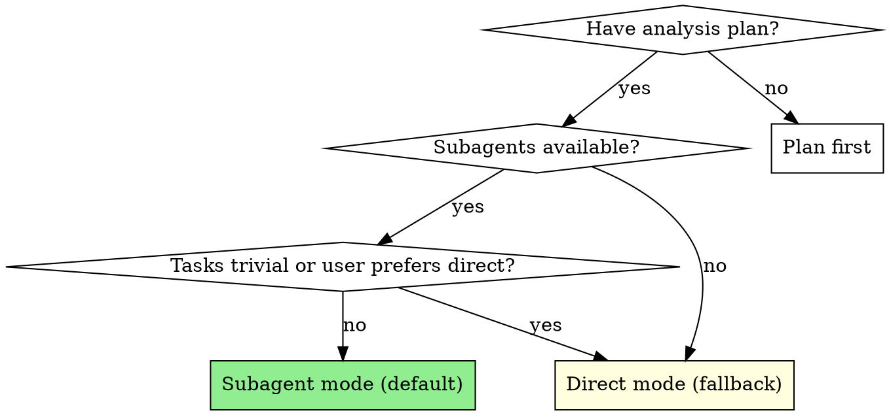
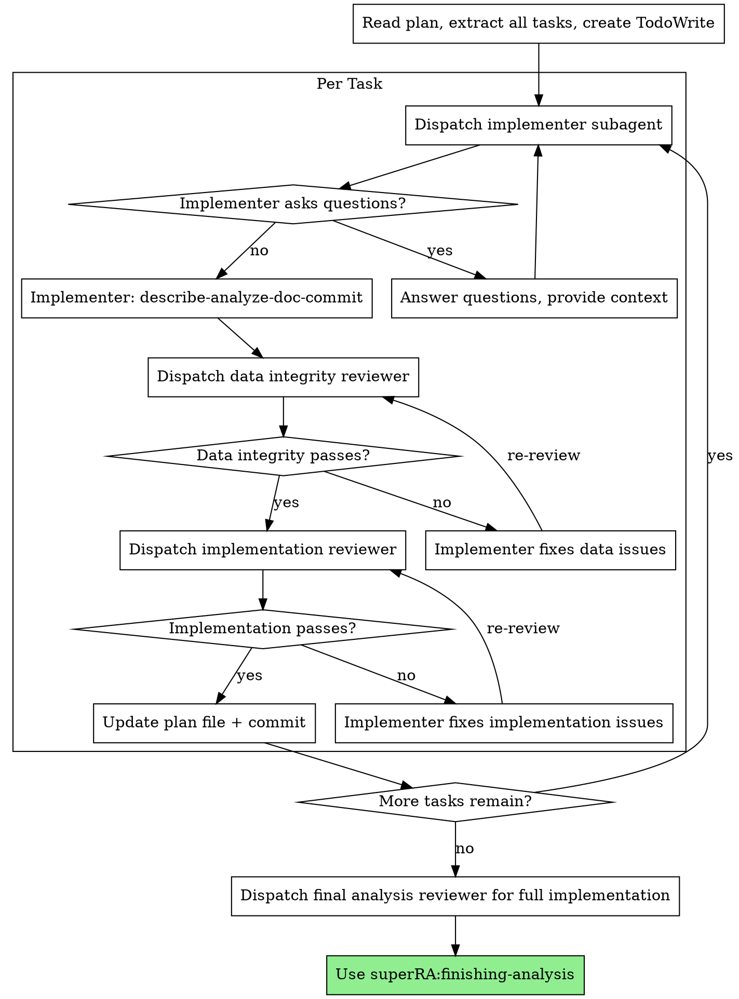

# Execution Workflow

Workflow skill for the **IMPLEMENT** and **VALIDATE** phases of the superRA workflow. Owns per-task dispatch, the two-stage review loop with orchestrator-discipline filtering, end-to-end reproducibility verification, and the 4-option completion menu. Hands merge/PR off to `superRA:finishing-analysis`.

Default mode dispatches a fresh subagent per task with two-stage review (data integrity then implementation correctness). Falls back to direct execution when the user requests it or tasks are trivial.

**Core principle:** Fresh subagent per task + two-stage review = high quality, reproducible analysis. Review always happens regardless of execution mode.

**Announce at start:** "I'm using the execution-workflow skill to implement this analysis plan."

## Execution Modes



**Subagent mode (default):**
- Dispatch implementer subagent per task
- Two-stage review after each: data integrity → implementation correctness
- Fresh context per task (no pollution)
- Orchestrator preserves context for coordination

**Direct mode (fallback):**
- Main agent implements tasks directly
- Still dispatches reviewer subagents after each task (review is never skipped)
- Use when: user explicitly requests it, single trivial task, or platform lacks subagents

## The Process



### Step 0: Branch Check

Before starting execution, check if on a default branch:

```bash
git branch --show-current
```

If on `main` or `master`:
```
You're on main. I recommend creating a feature branch for this analysis:
  git checkout -b analysis/<topic>
Want me to create one?
```

If the user declines, proceed — they've given explicit consent to work on the default branch.

### Step 1: Load and Review Plan

1. Read `PLAN.md` and `RESULTS_UPDATE.md`
2. Review PLAN.md critically — identify any questions or concerns:
   - Are data sources available and accessible?
   - Are the steps in the right order?
   - Is the pipeline file included (for multi-script analyses)?
3. Review RESULTS_UPDATE.md for context on any completed steps (if resuming)
4. If concerns: Raise them with your human partner before starting
5. If no concerns: Create TodoWrite with all steps and proceed

### Step 2: Execute Tasks

#### Per-Task Execution Steps

1. **Dispatch implementer.** Subagent mode: `Agent(subagent_type: "implementer")` — see template below. Direct mode: invoke `superRA:implementer-protocol`, then implement yourself.
2. **If NEEDS_CONTEXT or BLOCKED:** provide context and re-dispatch (see Handling Implementer Status below).
3. **Once DONE or DONE_WITH_CONCERNS:** the implementer has already committed code + PLAN.md (`IMPLEMENTED`) + RESULTS_UPDATE.md. Dispatch the **data integrity reviewer**. If REVISE: adjudicate the feedback (see Handling Reviewer Feedback below), clear the review notes from PLAN.md, re-dispatch the implementer with the accepted issues, then re-dispatch the data integrity reviewer. Iterate until APPROVE. Do not proceed to implementation review until data integrity is approved.
4. **Once data integrity APPROVE:** dispatch the **implementation reviewer**. Same REVISE loop with adjudication.
5. **Once implementation reviewer APPROVE:** the reviewer has committed `APPROVED` to PLAN.md. If findings change upcoming tasks, update future task descriptions in PLAN.md and commit. Proceed to next task.

**In direct mode:** Steps 1–2 are done by the main agent directly (invoke `superRA:implementer-protocol`). Steps 3–5 are unchanged — still dispatch reviewer subagents.

#### Dispatch Templates

The `implementer` and `reviewer` agent definitions own the report format, handoff protocol, document discipline, and per-stage default skill loads. **Dispatch prompts must not duplicate that content.** Pass only what the agent cannot derive on its own: the stage label, the task pointer, the git SHA range (for reviewers), and any deviations from defaults.

**Stage implies skill defaults.** For every analysis-touching stage (analysis task, drift test creation, refactoring, merge proposer), the agent auto-loads `superRA:econ-data-analysis` and `superRA:script-to-notebook`. You only need a `Skills:` line if a task requires something unusual (e.g., a domain-specific helper skill).

**Implementer (analysis task):**
```
Agent(subagent_type: "implementer"):
  Stage: analysis task
  Task: Task N in PLAN.md
  Work from: [worktree path or "current directory"]
  Counterpart: reviewer  # Agent Teams only
```

The agent reads PLAN.md, Data Inventory, Conventions, and prior results from RESULTS_UPDATE.md directly.

**Data integrity reviewer:**
```
Agent(subagent_type: "reviewer"):
  Stage: data integrity
  Task: Task N in PLAN.md
  Git range: <BASE_SHA>..<HEAD_SHA>
  Counterpart: implementer  # Agent Teams only
```

**Implementation reviewer:**
```
Agent(subagent_type: "reviewer"):
  Stage: implementation
  Task: Task N in PLAN.md
  Git range: <BASE_SHA>..<HEAD_SHA>
  Counterpart: implementer  # Agent Teams only
```

If you need a non-default skill load, an extra domain reference, or an override of the standard handoff, add a single explicit line — but do not pad the dispatch otherwise. Every extra line is a chance for the agent to follow stale guidance instead of its current definition.

#### Handling Reviewer Feedback (Orchestrator Discipline)

The reviewer is an advisor, not a gatekeeper. **You — the orchestrator — are the senior researcher.** You know the project, the methodology decisions, and the conversations with the human partner that the reviewer has no visibility into. Your job between REVISE and re-dispatch is to evaluate each issue, not forward it mechanically.

When a reviewer returns REVISE:

1. **Read the actual code at the cited file:line.** Do not trust the reviewer's summary. The reviewer is also a subagent and can be wrong.

2. **For each issue, classify it:**
   - **Real bug** (the code is incorrect or missing required discipline) → forward to implementer
   - **Pedantic but valid** (the issue is real but tiny — missing markdown cell on a trivial step, etc.) → decide whether the fix is worth the cycle. For minors, often yes; for cosmetic minors on a fast-iteration draft, often no
   - **Wrong** (the reviewer misread the code, missed context, or is suggesting a change that conflicts with the methodology you established with the human partner) → push back on the reviewer, do not forward to the implementer
   - **Methodology disagreement** (the reviewer is second-guessing a methodology decision rather than checking implementation) → reject. The reviewer's job is correctness against the plan, not redesigning the plan. Note in PLAN.md that the issue was raised and rejected, with reasoning.

3. **If you reject reviewer feedback, document why.** Add a one-line note under the task heading in PLAN.md before marking APPROVED:
   ```markdown
   **Reviewer feedback adjudication:** Rejected "use log returns" — methodology specifies arithmetic returns per Section 2 of plan. Reviewer lacked methodology context.
   ```
   This protects you in three ways: (a) the human partner can audit the override, (b) future sessions see why the reviewer's note was ignored, (c) it forces you to articulate the reasoning rather than wave it away.

4. **If you push back on the reviewer (rather than override them), re-dispatch the same reviewer with counter-evidence.** Cite the file:line that proves the reviewer wrong, the methodology section that overrides their suggestion, or the human partner conversation that established the convention. The reviewer should then either retract or escalate.

5. **If you genuinely cannot tell whether the reviewer is right, escalate to the human partner.** Do not flip a coin and hope.

**The orchestrator's authority:** You can override any reviewer issue with documented reasoning. You cannot silently ignore one. If you find yourself dismissing reviewer feedback without writing down why, stop — that's the slip that turns a critical filter into an excuse to skip reviews.

**The orchestrator's limits:**
- You cannot override CRITICAL severity without escalating to the human partner first. CRITICAL means "will produce wrong results"; if the reviewer is wrong about that, it warrants a real discussion, not a unilateral override.
- You cannot override the same reviewer issue twice across re-dispatches. If the reviewer keeps raising the same point and you keep rejecting it, the disagreement is real and the human partner needs to settle it.

This discipline applies equally to pre-merge-gate (drift test review, integration review) and semantic-merge (merge review). The orchestrator owns the final call in every loop.

### Step 3: Verify Pipeline and Reproducibility

After every task is APPROVED, the analysis must be verified end-to-end before presenting completion options to the user. Run all five checks; do not proceed if any fails.

1. **All code committed?**
   ```bash
   git status
   ```
   If uncommitted changes exist: investigate (probably an agent missed an inline-edit), commit, or ask the user.

2. **Pipeline runs end-to-end?** (multi-script analyses only)
   ```bash
   bash run_all.sh  # or: julia pipeline.jl
   ```
   If no pipeline file exists and there are multiple scripts: create one before proceeding (this should have come from planning-workflow, but late additions happen).

3. **Outputs exist and were generated from committed code?** Check that key output files (tables, figures, logs) exist and match the current committed code, not ad-hoc REPL runs.

4. **PLAN.md up to date?** All tasks have `**Review status:** APPROVED`. All steps marked `- [x]` with result notes. No tasks stuck in `IMPLEMENTED` or `REVISE`. Discovery notes captured. Upcoming-task descriptions reflect current understanding.

5. **RESULTS_UPDATE.md up to date?** Has findings for all completed tasks. Figure attachments in `results_attachments/` committed.

If any check fails: fix it before proceeding. Do not present completion options for unreproducible work.

### Step 4: Determine Base Branch and Present Options

**Base branch:**
```bash
git merge-base HEAD main 2>/dev/null || git merge-base HEAD master 2>/dev/null
```
Or ask: "This branch split from `main` — is that correct?"

**Present exactly these 4 options:**

```
Analysis complete and reproducible. What would you like to do?

1. Merge back to <base-branch> locally
2. Push and create a Pull Request
3. Keep the branch as-is (I'll handle it later)
4. Discard this work

Which option?
```

**Execute the user's choice:**

- **Option 1 or 2 (Merge or PR):** Invoke `superRA:finishing-analysis` to run the full pre-merge gate, generate the report, handle development documents, and execute the merge or PR. Do not run any of those steps yourself — finishing-analysis owns them.
- **Option 3 (Keep as-is):** Report the branch name and worktree path back to the user, then stop. Do not clean up.
- **Option 4 (Discard):** Confirm with the user by typed input — they must type the word `discard` exactly. Then:
  ```bash
  git checkout <base-branch>
  git branch -D <analysis-branch>
  git worktree remove <worktree-path>  # only if running in a worktree
  ```
  Stop after the branch and worktree are removed. Report what was deleted.

## Review Status Reference

Implementer and reviewer agents own their commits and document updates — see `agents/implementer.md` and `agents/reviewer.md` for the full discipline (scope rule, inline-edit rule, stage-specific handoff). The orchestrator only needs to know how to **read** the resulting state from `PLAN.md`:

| Status line | Meaning | Orchestrator action |
|---|---|---|
| *(no line)* | Not started | Dispatch implementer |
| `IMPLEMENTED` | Code committed, awaiting review | Dispatch data integrity reviewer |
| `REVISE (data integrity)` | Data reviewer found issues | Adjudicate (see Handling Reviewer Feedback), then re-dispatch implementer |
| `REVISE (implementation)` | Impl reviewer found issues | Adjudicate, then re-dispatch implementer |
| `APPROVED` | Both reviews passed | Proceed to next task |

**A task is complete only when its status is `APPROVED`.** Do not proceed to the next task while any review has open issues that you have not adjudicated.

### Orchestrator-Only Responsibilities

These are the things the orchestrator does that no subagent does:

- **Task sequencing and dispatch.** Read PLAN.md, decide what to dispatch next.
- **Adjudicate reviewer feedback** before forwarding to the implementer (see Handling Reviewer Feedback above).
- **Clear review notes** from the task block in PLAN.md before re-dispatching the implementer — the implementer should receive feedback through the dispatch prompt, not by reading stale review notes from the file. Commit the cleared PLAN.md.
- **Edit future tasks inline** when findings from a completed task change the upcoming plan — rewrite stale text, don't annotate it. Commit.
- **Escalate to the human partner** when stuck (BLOCKED, methodology disagreement, CRITICAL issue you want to override).

**Review scope at interim checkpoints:** Data integrity and implementation correctness only. Codebase integration review is deferred to the pre-merge gate (invoked during finishing-analysis when merging/PRing).

## Sensitivity Analysis Tasks

When executing sensitivity analysis tasks:

- Provide implementer with baseline results from RESULTS_UPDATE.md
- If sensitivity check shows divergence from baseline: assess **economic significance**, not just statistical
- If unsure whether a sensitivity failure is meaningful: **escalate to human partner** before proceeding
- Document the assessment in RESULTS_UPDATE.md
- Not all sensitivity failures are problems — use economic reasoning

## Model Selection

Use the least powerful model that can handle each role:

**Mechanical analysis tasks** (load data, run diagnostics, simple merges): fast, cheap model.

**Complex analysis tasks** (multi-source merges, variable construction with judgment): standard model.

**Review tasks**: most capable available model.

## Handling Implementer Status

**DONE:** Proceed to data integrity review.

**DONE_WITH_CONCERNS:** Read the concerns. If about data quality or unexpected findings, investigate before review. If about methodology choices, note and proceed to review.

**NEEDS_CONTEXT:** Provide missing data documentation, upstream results, or methodology details and re-dispatch.

**BLOCKED:** Assess the blocker:
1. Data not available → help locate or download
2. Data quality too poor → escalate to human partner
3. Task requires methodology decisions → escalate to human partner
4. Task too complex → break into smaller pieces or use more capable model

## When to Stop and Ask for Help

**STOP executing immediately when:**
- Data description reveals unexpected issues (wrong magnitudes, high missingness)
- Merge produces unexpected row count change
- Validation fails (results don't match economic intuition)
- Plan has critical gaps preventing next step
- Pipeline file is missing and analysis has multiple scripts

**Ask for clarification rather than guessing.**

## Agent Types

- **`implementer`** — Dispatch with `superRA:econ-data-analysis` and `superRA:script-to-notebook` skills.
- **`reviewer`** — Dispatch with `superRA:econ-data-analysis` skill. Implementation reviewers also load `superRA:script-to-notebook`. Provide stage-specific handoff rules (data integrity vs implementation) in the dispatch prompt.

## Agent Teams Mode

When Agent Teams are available (`CLAUDE_CODE_EXPERIMENTAL_AGENT_TEAMS`), the per-task implementation+review cycle can be orchestrated as a persistent team. This enables direct iteration between implementer and reviewers without the orchestrator relaying feedback.

**Invoke `superRA:agent-orchestration` for the Analysis Task Team recipe** — it has the full team composition (3 teammates), task graph with dependencies, iteration patterns, lead responsibilities, and session handoff protocol.

**Critical:** When all tasks complete, shut down teammates and clean up the team BEFORE invoking `superRA:finishing-analysis`. This frees the session's team slot for the pre-merge-gate team if the user chooses merge/PR.

## Red Flags

**Never:**
- Start analysis on main/master branch without proposing a feature branch first (Step 0)
- Skip reviews (data integrity OR implementation) — even in direct mode
- Proceed with unfixed data integrity issues
- Dispatch multiple implementers in parallel on the same data (conflicts)
- Make subagent read plan file (provide full text instead)
- Skip plan file update after task completion
- Ignore implementer data quality concerns
- Accept "data looks fine" without verification
- **Start implementation review before data integrity is approved**
- Move to next task while either review has open issues or status is not APPROVED

**If reviewer returns REVISE:**
- Re-dispatch the implementer with the reviewer's specific feedback items
- Re-dispatch the reviewer after implementer fixes
- Repeat until approved
- Do NOT skip the re-review
- Do NOT ask the user whether to fix — iterate automatically

## Integration

**Required workflow skills:**
- **superRA:using-analysis-worktrees** — RECOMMENDED: For complex or multi-session analyses, consider an isolated workspace
- **superRA:planning-workflow** — Creates the plan this skill executes
- **superRA:econ-data-analysis** — REQUIRED: Data discipline all agents must follow
- **superRA:script-to-notebook** — Script formatting and notebook rendering
- **superRA:finishing-analysis** — Complete work after all tasks done
- **superRA:pre-merge-gate** — Code integration and drift tests before merge (invoked by finishing-analysis)
