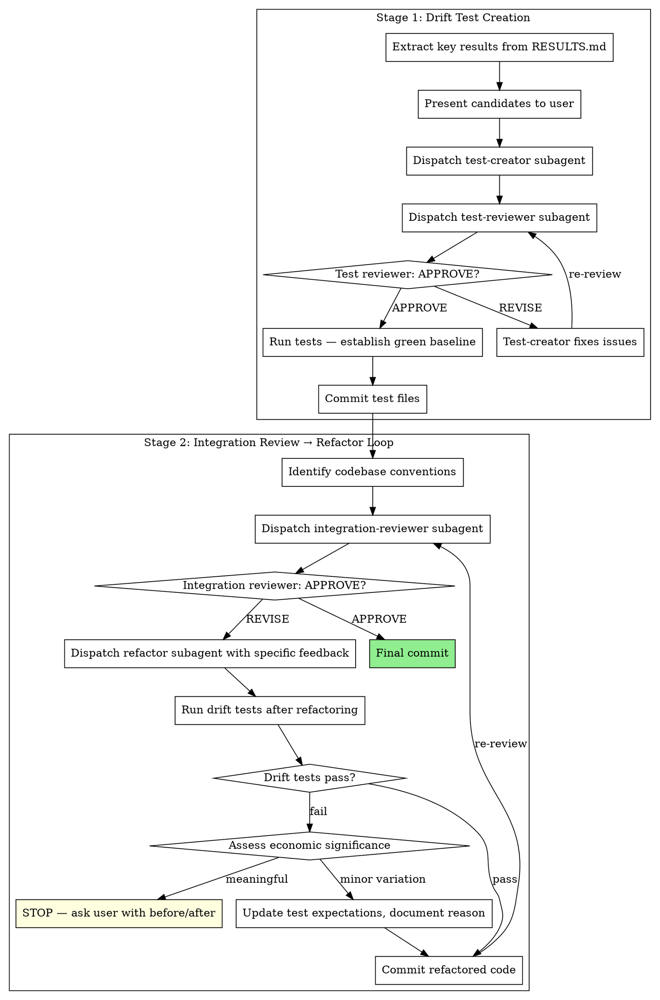

# Integration Workflow

Workflow skill for the **INTEGRATE** phase of the superRA workflow. Owns the four steps that prepare an analysis branch for merging into main: protect results with drift tests, refactor code for codebase integration, mature the Stage 1 RESULTS.md into its permanent Stage 2 form, and dispose of PLAN.md. Hands off the actual merge/PR mechanics to `superRA:merge-workflow`.

Assumes execution-workflow has already verified reproducibility and the user has chosen Option 1 (merge locally) or Option 2 (push + PR). If you find yourself running reproducibility checks or presenting the 4-option menu, something is wrong: that work belongs in execution-workflow.

**Core principle:** Tests guard results. Integration review identifies what needs changing. Refactoring addresses specific issues. RESULTS.md graduates from a worktree-local dev log to a permanent, fact-checked, co-located record before merge. Nothing hands off to merge-workflow without integration reviewer approval on both the refactored code and the matured RESULTS.md, and PLAN.md disposed of.

**Announce at start:** "I'm using the integration-workflow skill to prepare this work for integration."

**Autonomy:** this workflow has exactly four legitimate stop points — drift-test candidate confirmation (Stage 1 Step 2), meaningful drift escalation after refactoring (Stage 2 / "Handling Drift Test Failures"), Stage 2 RESULTS.md relocation target if project guidance does not specify one (Step 3), and PLAN.md disposition (Step 4). Between those, run on your own power: do not check in after each stage, do not ask "ready to move to the next step?", do not re-confirm a reviewer's APPROVE. See CLAUDE.md workflow principle #4 for the full autonomy rule and `handoff-doc` §User Decisions Log for how the answer at each stop point must be recorded in PLAN.md before the workflow acts on it.

## The Process



## Dispatch Convention

Every dispatch in this skill uses the pointer-based template — pass only the stage label, the domain reference path, and any task-specific pointers (key results, code under review, prior reviewer findings). The `implementer` and `reviewer` agent definitions own the report format, handoff protocol, and skill-load defaults; do not duplicate that content into the dispatch prompt. Both agents auto-load `superRA:econ-data-analysis` and `superRA:script-to-notebook` for analysis-touching stages.

When a reviewer returns REVISE in either stage, **adjudicate the feedback before forwarding it.** See "Handling Reviewer Feedback (Orchestrator Discipline)" in `superRA:execution-workflow` for the protocol — the same discipline applies here. You are the senior researcher; the reviewer is an advisor. Read the cited code, classify each issue, override with documented reasoning if the reviewer is wrong, push back with counter-evidence if the reviewer misread the code.

## Stage 1: Drift Test Creation

Drift tests guard key results from unintended changes during refactoring or future modifications. They are the safety net that makes refactoring safe.

### Steps

1. **Extract key results from RESULTS.md.** Read the results document and use economic reasoning to identify KEY results -- main findings that define the analysis conclusions, not every intermediate number.

2. **Present candidates to user via `AskUserQuestion`** (plain text if unavailable). This is a legitimate stop point — drift-test coverage is a researcher-owned decision because it encodes what counts as a "key result" worth protecting. Show the candidates with their values and let the researcher confirm, add, or remove:
   ```
   These results seem like the key findings to protect with drift tests:
   - [result 1: description and value]
   - [result 2: description and value]
   - ...

   Which of these should be protected? Any to add or remove?
   ```
   The answer is a user decision — log it in the top-level `## Decisions` section of `PLAN.md` (or inside the task block whose results are being protected, if the list is task-scoped) per `handoff-doc` §User Decisions Log, and commit the PLAN.md edit **before** dispatching the test-creator. The `ask-user-question-logger` hook will remind you.

3. **Dispatch test-creator:**
   ```
   Agent(subagent_type: "implementer"):
     Stage: drift test creation
     Skills: superRA:refactor-and-integrate
     Domain reference: drift-test-quality.md
     Key results to protect: [user-confirmed list with values]
     Test conventions: [project test framework, test directory]
   ```

4. **Dispatch test-reviewer:**
   ```
   Agent(subagent_type: "reviewer"):
     Stage: drift test
     Skills: superRA:refactor-and-integrate
     Domain reference: drift-test-quality.md
     Tests under review: [paths to created test files]
     Key results they should protect: [list]
   ```

5. **If REVISE:** adjudicate the reviewer's issues per the orchestrator discipline above. For accepted issues, re-dispatch the test-creator with the specific feedback. Re-dispatch the test-reviewer. Iterate until APPROVE.

6. **Run tests to establish green baseline.** All drift tests must pass on the current code before proceeding. If tests fail on the existing code, the tests are wrong -- fix them.

7. **Commit test files.**
   ```bash
   git add tests/
   git commit -m "add drift tests for key analysis results"
   ```

## Stage 2: Integration Review → Refactor Loop

The integration reviewer is the gatekeeper. Review first to identify what needs changing, then refactor to address specific issues. Nothing moves forward without integration reviewer approval.

### Steps

1. **Identify existing codebase conventions.** Read:
   - CLAUDE.md, AGENTS.md, or project configuration for coding standards
   - Existing code in the repository for naming patterns, file organization, utility functions
   - Available utility functions that the new code should adopt

2. **Dispatch integration-reviewer:**
   ```
   Agent(subagent_type: "reviewer"):
     Stage: integration
     Skills: superRA:refactor-and-integrate
     Domain reference: codebase-integration.md
     Code under review: [paths]
     Codebase conventions: [where they're documented — CLAUDE.md, AGENTS.md, etc.]
     Drift tests: [paths]
     Diff: <BASE_SHA>..<HEAD_SHA>
   ```

3. **If APPROVE:** No refactoring needed. Proceed to final commit.

4. **If REVISE:** Adjudicate the reviewer's feedback per the orchestrator discipline above. For accepted issues, refactor:

   a. **Dispatch refactorer:**
      ```
      Agent(subagent_type: "implementer"):
        Stage: refactoring
        Skills: superRA:refactor-and-integrate
        Domain reference: codebase-integration.md
        Reviewer issues to address: [accepted items, file:line, what to fix]
        Codebase conventions: [pointers]
        Drift tests: [paths — must keep passing]
        Code to refactor: [paths]
      ```

   b. **After refactoring: run drift tests.**
      - **Pass:** Commit and re-submit for review.
      - **Fail:** Assess economic significance of the drift.
        - **Meaningful drift** (results change substantively): STOP. Show the user before/after values and ask how to proceed. Do not silently accept changed results.
        - **Minor variation** (rounding, floating-point, inconsequential magnitude change): Update test expectations with the new values, document the reason in a comment, and proceed.

   c. **Commit refactored code.**
      ```bash
      git add -A
      git commit -m "refactor analysis code for codebase integration"
      ```

   d. **Re-dispatch integration-reviewer.** Loop back to step 2. Iterate until APPROVE.

5. **Final commit** after integration reviewer APPROVE.
   ```bash
   git add -A
   git commit -m "address integration review feedback"
   ```

## Step 3: Mature RESULTS.md into Its Permanent Form

After integration review APPROVES the refactored code, mature `RESULTS.md` from its Stage 1 dev-log form into its Stage 2 permanent form. **Same file, same identity** — the consolidation rewrites it in place before relocating it. There is no separate work-journal entry to generate; the matured `RESULTS.md` **is** the permanent record.

The format discipline for this step lives entirely in `superRA:report-in-markdown`. This step orchestrates; it does not duplicate the rules.

### Load report-in-markdown (full mode)

Before touching `RESULTS.md`, load the skill and all three references — this is the "full mode" caller per the skill's load-map table:

- `superRA:report-in-markdown` (the lean SKILL.md body)
- `references/baseline-io.md` — frontmatter, filename, output-path resolution, git metadata
- `references/rich-content.md` — figures (PDF→PNG, attachments dir), LaTeX math, tables, file references
- `references/final-form.md` — the consolidation discipline: fact-check checklist, reader-facing restructure, prohibited language, materialization, relocation

If you find yourself writing frontmatter from memory or hand-rolling a fact-check checklist, stop and load the references. They are the source of truth.

### Resolve the relocation target

The matured `RESULTS.md` lands in the analysis's permanent code folder, **per project guidance**. Read `CLAUDE.md`, `AGENTS.md`, or the project README for the convention. If none exists, this is a legitimate stop point — ask the researcher via `AskUserQuestion` (plain text if unavailable):

```
Stage 2 RESULTS.md needs a permanent location in this project. The matured
file will be co-located with the analysis code so it travels with it.
Where should it land?

Suggested: <best guess from the analysis code's location, e.g. analyses/<name>/>
```

The answer is a user decision — log it in the top-level `## Decisions` section of `PLAN.md` per `handoff-doc` §User Decisions Log **before** moving the file. If a project convention exists in the project's guidance files, use it directly without asking.

Define `RESULTS_DIR` = the resolved permanent folder. Define `RESULTS_ATTACHMENTS_DIR` = `${RESULTS_DIR}/attachments` (the destination for materialized figures, distinct from the worktree-root `results_attachments/` that the analysis script writes to).

### Mature the file in place

Drive the consolidation from `final-form.md`. The pass typically does:

1. Restructure from task-indexed to reader-facing — by objective, data source, or result type, whichever flows best for someone reading cold. Task numbering disappears.
2. Merge related findings split across tasks.
3. Strip resolved reviewer caveats; surface unresolved limitations into a "Limitations" section.
4. Add frontmatter per `baseline-io.md`. The file name stays `RESULTS.md` (not date-stamped — `RESULTS.md` is the identity of the artifact across stages).
5. Materialize figures from `results_attachments/` into `${RESULTS_ATTACHMENTS_DIR}` per `rich-content.md`. Update embed paths.
6. Run the fact-check checklist from `final-form.md`. Open every cited file and confirm the claim matches. Strip speculation and subjective language. Remove prohibited sections (Recommendations, Conclusions, Implications) unless the researcher explicitly requested them.
7. Relocate: `git mv RESULTS.md ${RESULTS_DIR}/RESULTS.md` and `git mv` (or copy + remove) the materialized attachments folder into place. Stage everything.

Do not commit yet — the integration reviewer runs first.

### Dispatch the integration reviewer (final-form pass)

```
Agent(subagent_type: "reviewer"):
  Stage: matured RESULTS.md (Stage 2 consolidation review)
  Skills: superRA:report-in-markdown
  Domain reference: final-form.md
  Document under review: <RESULTS_DIR>/RESULTS.md
  Source dev log (for comparison): RESULTS.md at the previous SHA
  Code files cited: [paths]
  Output files cited: [paths]
  Objective of the analysis: [from PLAN.md header]
```

The reviewer loads `superRA:report-in-markdown` SKILL.md + `final-form.md` (and only those — not `baseline-io.md` or `rich-content.md`, per the skill's load-map for the integration-reviewer role). They run the fact-check checklist line by line and return APPROVE or REVISE with severity-classified findings.

If REVISE: adjudicate per the orchestrator discipline above. For accepted issues, fix them in place in `RESULTS.md` and re-dispatch. Iterate until APPROVE.

### Commit

```bash
git add ${RESULTS_DIR}/RESULTS.md ${RESULTS_DIR}/attachments/
git commit -m "mature RESULTS.md into permanent form at ${RESULTS_DIR}"
```

The matured `RESULTS.md` is now part of the integration commit chain. PLAN.md is still at the worktree root and gets handled in Step 4.

## Step 4: Dispose of PLAN.md

By this point `RESULTS.md` has graduated to its permanent location (Step 3). `PLAN.md` is the only Stage 1 scaffold left at the worktree root, along with the working `results_attachments/` folder that the analysis script wrote to. Both need final disposition before merge — PLAN.md is the prescriptive plan, not the record of findings, and `results_attachments/` is the working output directory whose content has already been materialized into the matured RESULTS.md's attachments.

**Ask the user via `AskUserQuestion`** (plain text if unavailable) — this is a legitimate stop point because the disposition call is the researcher's, not the RA's. The default suggestion is "Option 1: move alongside the matured RESULTS.md" because that keeps the prescriptive history travelling with the analysis code.

```
PLAN.md is still at the worktree root and needs disposition. RESULTS.md
has already been matured and committed at <RESULTS_DIR>. Options:

1. Move PLAN.md (and results_attachments/) alongside the matured
   RESULTS.md at <RESULTS_DIR> — keeps the prescriptive history with
   the analysis code (recommended).
2. Consolidate any plan context into existing project documentation,
   then delete PLAN.md and results_attachments/.
3. Delete PLAN.md and results_attachments/ — git history preserves
   them on this branch.

Which option?
```

Log the researcher's choice in the `## Decisions` section of `PLAN.md` **before** executing the disposition (per `handoff-doc` §User Decisions Log). Include the log entry in the same commit that moves or removes the files — the last state of `PLAN.md` records what was done with it.

**Option 1 (Move alongside matured RESULTS.md):**
```bash
git mv PLAN.md ${RESULTS_DIR}/
git mv results_attachments/ ${RESULTS_DIR}/source_attachments/ 2>/dev/null
git commit -m "move analysis plan to ${RESULTS_DIR}"
```
The `results_attachments/` folder is renamed `source_attachments/` at the destination so it does not collide with the matured RESULTS.md's `attachments/` folder (which holds the materialized copies). Skip the rename if there are no figures.

**Option 2 (Consolidate):**
- Identify which existing project documentation should pick up plan context (data inventory, methodology rationale).
- Merge into existing docs (the researcher guides which docs).
- Remove the originals:
```bash
git rm PLAN.md
rm -rf results_attachments/
git add -A results_attachments/ 2>/dev/null
git commit -m "consolidate analysis plan context into project docs"
```

**Option 3 (Delete):**
```bash
git rm PLAN.md
rm -rf results_attachments/
git add -A results_attachments/ 2>/dev/null
git commit -m "remove analysis plan (preserved in branch history)"
```

## Hand-Off to merge-workflow

After Steps 1–4 are complete (drift tests committed, refactoring approved, RESULTS.md matured and committed at its permanent location, PLAN.md disposed of), invoke `superRA:merge-workflow` to update with main, run post-merge verification (drift tests + fresh integration review), and execute the local merge or PR push. Do not attempt the merge mechanics yourself — merge-workflow owns them.

## When to Lighten

**Standalone analysis (no existing codebase to integrate with):**
- Stage 1 (drift tests): Always run. Tests protect results regardless of codebase context.
- Stage 2 (integration review → refactor): Lighter pass -- focus on code quality and clarity rather than codebase convention alignment. Integration reviewer may APPROVE with no refactoring needed.

**Small changes (single-file analysis, few results):**
- Stage 1: Still run, but fewer tests needed.
- Stage 2: Integration reviewer may APPROVE immediately if code is clean.

## Handling Drift Test Failures After Refactoring

This is the critical judgment call in the process. When drift tests fail after refactoring:

1. **Identify what changed.** Compare the before/after values.
2. **Assess economic significance.** Is this a meaningful change in results, or a trivial numerical difference?
   - Point estimates shifting by more than the tolerance you set: investigate.
   - Sign changes or significance changes: always meaningful.
   - Standard errors changing modestly: usually minor (sensitive to implementation details).
3. **If meaningful:** Do not proceed. Show the user exactly what changed — before/after values side by side — and ask via `AskUserQuestion` (plain text if unavailable) whether to (a) accept the new result and update the drift test baseline with a documented reason, (b) roll back the refactoring, or (c) investigate the discrepancy further before deciding. Log the researcher's answer per `handoff-doc` §User Decisions Log before taking any action.
4. **If minor:** Update the test expectation, add a comment explaining why (e.g., "tolerance updated: refactored merge order produces equivalent result within floating-point precision"), and proceed.

## Agent Types and Domain References

Dispatched agents load a parent skill via the `Skills:` line and read a named domain reference by basename (the runtime announces the skill's base directory on load; the agent reads `<base_dir>/references/<basename>`).

| Stage | Agent | Parent skill | Domain reference |
|---|---|---|---|
| Stage 1 test creation | `implementer` | `superRA:refactor-and-integrate` | `drift-test-quality.md` |
| Stage 1 test review | `reviewer` | `superRA:refactor-and-integrate` | `drift-test-quality.md` |
| Stage 2 refactoring | `implementer` | `superRA:refactor-and-integrate` | `codebase-integration.md` |
| Stage 2 integration review (code) | `reviewer` | `superRA:refactor-and-integrate` | `codebase-integration.md` |
| Step 3 RESULTS.md final-form review | `reviewer` | `superRA:report-in-markdown` | `final-form.md` |

The Step 3 consolidation itself (maturing RESULTS.md in place) is performed by the orchestrator/main agent, not a dispatched implementer — RESULTS.md is an in-place transformation of an existing artifact, not a from-scratch task. The reviewer dispatch is the gate that protects the final form.

All analysis-touching agents also auto-load `superRA:econ-data-analysis` and `superRA:script-to-notebook` via the agent definition (see `agents/implementer.md` and `agents/reviewer.md`).

## Agent Teams Mode

When Agent Teams are available (`CLAUDE_CODE_EXPERIMENTAL_AGENT_TEAMS`), Stages 1 and 2 can be orchestrated as a team instead of sequential subagent dispatches. This enables direct iteration between creator/reviewer and integration-reviewer/refactorer without the orchestrator relaying messages.

**Invoke `superRA:agent-orchestration` for the Integration Team recipe** — it has the full team composition (4 teammates: test-creator, test-reviewer, refactorer, integration-reviewer), task graph with dependencies, iteration patterns, lead responsibilities, and session handoff protocol.

Step 3 (matured RESULTS.md) stays outside the team: the consolidation is performed by the lead (in-place transformation of an existing artifact) and the final-form reviewer is dispatched as a one-shot subagent after the consolidation pass. Step 4 (PLAN.md disposition) also stays with the lead — both involve user-facing decisions that do not benefit from team iteration.

The lead handles user-facing decisions throughout (drift test candidates, meaningful drift escalation, RESULTS.md relocation target, PLAN.md disposition), commits at stage boundaries, and team cleanup after final APPROVE.

## Red Flags

**Never:**
- Skip Stage 1 (drift tests) — they are the safety net for everything that follows
- Refactor before integration reviewer has identified issues — review first, then fix
- Remove data diagnostics, row counts, or validation steps during refactoring
- Judge the researcher's methodology choice — focus on implementation correctness (see the foundational RA framing in `CLAUDE.md`)
- Refactor before drift tests are committed and green
- Hand off to merge-workflow without integration reviewer APPROVE on the refactored code (Stage 2) AND on the matured RESULTS.md (Step 3)
- Skip Step 3 because "RESULTS.md is already a markdown file" — the dev-log form has not been fact-checked, restructured, or relocated, and shipping it as-is bypasses the discipline gate
- Inline the Step 3 fact-check checklist or frontmatter spec in this skill — it lives in `superRA:report-in-markdown`'s `final-form.md` and `baseline-io.md`, and there should be exactly one source of truth

**Always:**
- Confirm key-result coverage with the researcher (via `AskUserQuestion`, logged per `handoff-doc` §User Decisions Log) before creating tests
- Run integration review before any refactoring
- Run drift tests after every refactoring change
- Re-submit to integration reviewer after every refactoring round
- Keep and re-validate all data discipline artifacts (describe steps, row counts, validation checks) through refactoring
- Load `superRA:report-in-markdown` + all three references at Step 3 before touching RESULTS.md; dispatch the final-form reviewer afterward and iterate to APPROVE
- Commit at each stage boundary

**Drift-test integrity is governed by the cross-cutting rules in `refactor-and-integrate` reference `drift-test-quality.md` ("Drift Test Integrity — Cross-Cutting Red Flags") — failing tests must be adjudicated, not silently re-expected; tolerance bumps require justification; and test removal during refactoring is forbidden. Load the reference before creating, reviewing, or running drift tests.**

## Integration

**Called by:**
- **superRA:execution-workflow** Step 4 -- When the user chooses Option 1 (merge) or Option 2 (PR) after execution-workflow has verified reproducibility

**Hands off to:**
- **superRA:merge-workflow** -- For main update + post-merge verification + actual merge/PR

**Requires:**
- **RESULTS.md** (Stage 1 dev log) -- Source of key results for drift tests; matured into Stage 2 form at Step 3
- **Committed analysis code** -- Must be committed before drift tests are created
- **Reproducibility already verified** by execution-workflow Step 3

**Subagents should use:**
- **superRA:econ-data-analysis** -- Data discipline principles for all subagents
