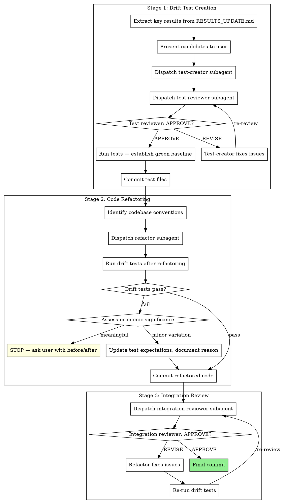

# Pre-Merge Gate

Before merging analysis work, protect results with drift tests, refactor code for codebase integration, and verify integration quality. Only invoked from finishing-analysis when the user chooses merge or PR.

**Core principle:** Tests guard results. Refactoring integrates code. Review verifies both.

**Announce at start:** "I'm using the pre-merge-gate skill to prepare this work for integration."

## The Process



## Stage 1: Drift Test Creation

Drift tests guard key results from unintended changes during refactoring or future modifications. They are the safety net that makes refactoring safe.

### Steps

1. **Extract key results from RESULTS_UPDATE.md.** Read the results document and use economic reasoning to identify KEY results -- main findings that define the analysis conclusions, not every intermediate number.

2. **Present candidates to user.** Show the user which results you consider key and ask for confirmation:
   ```
   These results seem like the key findings to protect with drift tests:
   - [result 1: description and value]
   - [result 2: description and value]
   - ...

   Which of these should be protected? Any to add or remove?
   ```

3. **Dispatch test-creator subagent** using `./test-creator-prompt.md`. Provide: analysis objective, methodology context, data sources, the user-confirmed list of key results, and project test conventions.

4. **Dispatch test-reviewer subagent** using `./test-reviewer-prompt.md`. Provide: the created tests and the key results they should protect.

5. **If REVISE:** test-creator fixes the issues raised by the reviewer, then test-reviewer re-reviews. Iterate until APPROVE.

6. **Run tests to establish green baseline.** All drift tests must pass on the current code before proceeding. If tests fail on the existing code, the tests are wrong -- fix them.

7. **Commit test files.**
   ```bash
   git add tests/
   git commit -m "add drift tests for key analysis results"
   ```

## Stage 2: Code Refactoring

Refactor analysis code to integrate cleanly with the existing codebase. The drift tests from Stage 1 ensure refactoring doesn't change results.

### Steps

1. **Identify existing codebase conventions.** Read:
   - CLAUDE.md, AGENTS.md, or project configuration for coding standards
   - Existing code in the repository for naming patterns, file organization, utility functions
   - Available utility functions that the new code should adopt

2. **Dispatch refactor subagent** using `./refactor-prompt.md`. Provide: codebase conventions discovered above, available utility functions, drift test file locations, and the analysis code to refactor.

3. **After refactoring: run drift tests.**
   - **Pass:** Proceed to commit.
   - **Fail:** Assess economic significance of the drift.
     - **Meaningful drift** (results change substantively): STOP. Show the user before/after values and ask how to proceed. Do not silently accept changed results.
     - **Minor variation** (rounding, floating-point, inconsequential magnitude change): Update test expectations with the new values, document the reason in a comment, and proceed.

4. **Commit refactored code.**
   ```bash
   git add -A
   git commit -m "refactor analysis code for codebase integration"
   ```

## Stage 3: Integration Review

Verify the refactored code integrates cleanly and meets quality standards for merging.

### Steps

1. **Dispatch integration-reviewer subagent** using `./integration-reviewer-prompt.md`. Provide: the refactored code, codebase conventions, drift test results, and the diff against the pre-refactor state.

2. **If REVISE:** refactor subagent fixes the issues, then:
   - Re-run drift tests (refactoring fixes must not break results)
   - Re-dispatch integration-reviewer
   - Iterate until APPROVE

3. **Final commit** with all integration review fixes.
   ```bash
   git add -A
   git commit -m "address integration review feedback"
   ```

## When to Lighten

**Standalone analysis (no existing codebase to integrate with):**
- Stage 1 (drift tests): Always run. Tests protect results regardless of codebase context.
- Stage 2 (refactoring): Lighter pass -- focus on code quality and clarity rather than codebase convention alignment.
- Stage 3 (integration review): Lighter pass -- focus on PR quality and self-containedness rather than cross-codebase consistency.

**Small changes (single-file analysis, few results):**
- Stage 1: Still run, but fewer tests needed.
- Stages 2-3: May combine into a single review pass.

## Handling Drift Test Failures After Refactoring

This is the critical judgment call in the process. When drift tests fail after refactoring:

1. **Identify what changed.** Compare the before/after values.
2. **Assess economic significance.** Is this a meaningful change in results, or a trivial numerical difference?
   - Point estimates shifting by more than the tolerance you set: investigate.
   - Sign changes or significance changes: always meaningful.
   - Standard errors changing modestly: usually minor (sensitive to implementation details).
3. **If meaningful:** Do not proceed. Show the user exactly what changed and let them decide.
4. **If minor:** Update the test expectation, add a comment explaining why (e.g., "tolerance updated: refactored merge order produces equivalent result within floating-point precision"), and proceed.

## Prompt Templates

- `./test-creator-prompt.md` -- Dispatch drift test creator subagent
- `./test-reviewer-prompt.md` -- Dispatch drift test reviewer subagent
- `./refactor-prompt.md` -- Dispatch code refactoring subagent
- `./integration-reviewer-prompt.md` -- Dispatch integration review subagent

## Red Flags

**Never:**
- Skip Stage 1 (drift tests) -- they are the safety net for everything that follows
- Proceed past failing drift tests without assessment
- Silently update test expectations for meaningful result changes
- Remove data diagnostics, row counts, or validation steps during refactoring
- Judge the researcher's methodology choice -- focus on implementation correctness
- Refactor before drift tests are committed and green

**Always:**
- Ask the user which results to protect before creating tests
- Run drift tests after every refactoring change
- Stop and ask the user when drift indicates meaningful result changes
- Preserve all data discipline artifacts (describe steps, row counts, validation)
- Commit at each stage boundary

## Integration

**Called by:**
- **superRA:finishing-analysis** -- When user chooses Option 1 (merge) or Option 2 (PR)

**Requires:**
- **RESULTS_UPDATE.md** -- Source of key results for drift tests
- **Committed analysis code** -- Must be committed before drift tests are created

**Subagents should use:**
- **superRA:econ-data-analysis** -- Data discipline principles for all subagents
