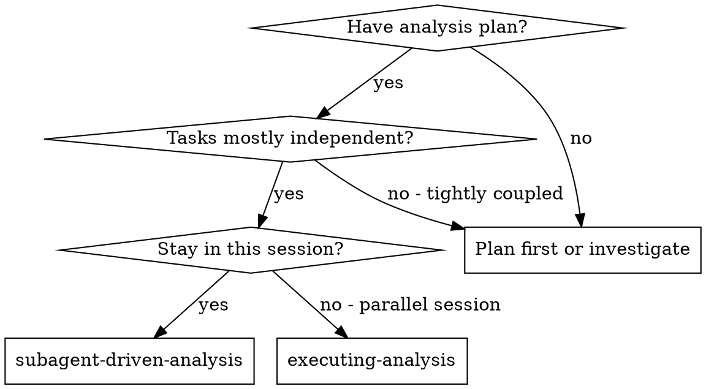
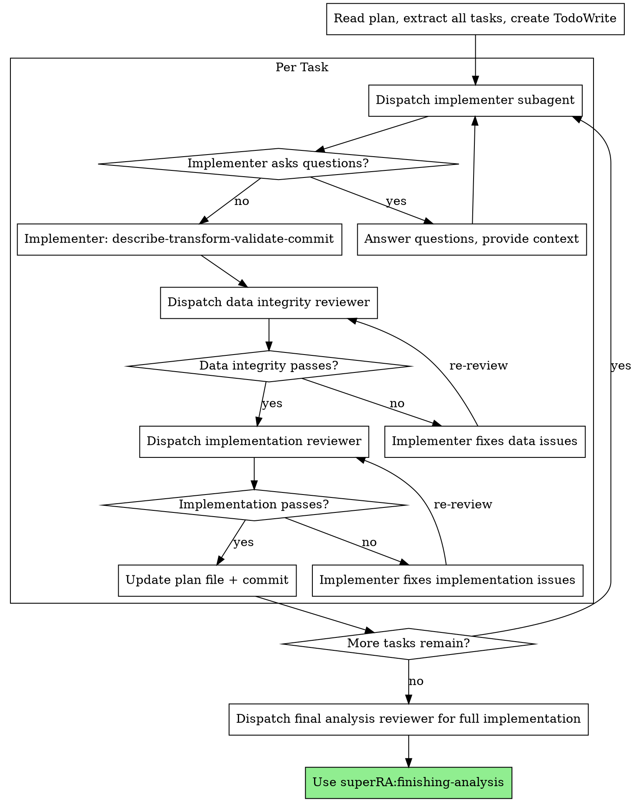

# Subagent-Driven Analysis

Execute analysis plan by dispatching a fresh subagent per task, with two-stage review after each: data integrity review first, then implementation correctness and code quality review.

**Why subagents:** You delegate tasks to specialized agents with isolated context. By precisely crafting their instructions and context, you ensure they stay focused and succeed. They should never inherit your session's context — you construct exactly what they need. This also preserves your own context for coordination work.

**Core principle:** Fresh subagent per task + two-stage review (data integrity then implementation correctness) = high quality, reproducible analysis.

## When to Use

**Best for:** Independent tasks (parallel robustness checks, separate data source processing).
**Use executing-analysis instead for:** Sequential pipelines where context carries across steps.

## The Process

## Plan File Updates

**After each task completes both reviews:**

1. Mark step `- [x]` in PLAN.md with brief result note
2. Update RESULTS_UPDATE.md with key findings, figures, row counts from this task
3. Save any figure attachments to `results_attachments/`
4. If findings change upcoming steps, update PLAN.md
5. Add discovery notes (e.g., "high unmatched rate in merge — investigate before regression")
6. Commit: `git add PLAN.md RESULTS_UPDATE.md results_attachments/ && git commit -m "update plan + results: Task N complete"`

**Review scope at interim checkpoints:** Data integrity and implementation correctness only. Codebase integration review is deferred to the pre-merge gate (invoked during finishing-analysis when merging/PRing).

PLAN.md and RESULTS_UPDATE.md are living documents. Together they form the handoff: PLAN.md = what to do, RESULTS_UPDATE.md = what was found. They must always reflect current understanding so the next agent (or session) can pick up where this one left off.

**When dispatching implementer subagents, provide:**
- Full task text from PLAN.md
- Relevant prior results from RESULTS_UPDATE.md (so implementer has context)
- Expected results/hypotheses from PLAN.md header (if provided, so implementer knows what to expect)
- For sensitivity tasks: baseline results to compare against

## Sensitivity Analysis Tasks

When executing sensitivity analysis tasks:

- Provide implementer with baseline results from RESULTS_UPDATE.md
- If sensitivity check shows divergence from baseline: assess **economic significance**, not just statistical
- If unsure whether a sensitivity failure is meaningful: **escalate to human partner** before proceeding
- Document the assessment in RESULTS_UPDATE.md
- Not all sensitivity failures are problems — use economic reasoning

## Model Selection

Use the least powerful model that can handle each role:

**Mechanical analysis tasks** (load data, run diagnostics, simple merges): fast, cheap model.

**Complex analysis tasks** (multi-source merges, variable construction with judgment): standard model.

**Review tasks**: most capable available model.

## Handling Implementer Status

**DONE:** Proceed to data integrity review.

**DONE_WITH_CONCERNS:** Read the concerns. If about data quality or unexpected findings, investigate before review. If about methodology choices, note and proceed to review.

**NEEDS_CONTEXT:** Provide missing data documentation, upstream results, or methodology details and re-dispatch.

**BLOCKED:** Assess the blocker:
1. Data not available → help locate or download
2. Data quality too poor → escalate to human partner
3. Task requires methodology decisions → escalate to human partner
4. Task too complex → break into smaller pieces or use more capable model

## Prompt Templates

- `./implementer-prompt.md` — Dispatch analysis implementer
- `./data-reviewer-prompt.md` — Dispatch data integrity reviewer
- `./implementation-reviewer-prompt.md` — Dispatch implementation and code quality reviewer

## Red Flags

**Never:**
- Start analysis on main/master branch without explicit user consent
- Skip reviews (data integrity OR implementation)
- Proceed with unfixed data integrity issues
- Dispatch multiple implementers in parallel on the same data (conflicts)
- Make subagent read plan file (provide full text instead)
- Skip plan file update after task completion
- Ignore implementer data quality concerns
- Accept "data looks fine" without verification
- **Start implementation review before data integrity is ✅**
- Move to next task while either review has open issues

**If implementer reports data concerns:**
- Investigate before proceeding
- Don't dismiss data quality issues
- Update the plan if findings change the approach

**If reviewer finds issues:**
- Implementer (same subagent) fixes them
- Reviewer reviews again
- Repeat until approved
- Don't skip the re-review

## Integration

**Required workflow skills:**
- **superRA:using-analysis-worktrees** — REQUIRED: Set up isolated workspace before starting
- **superRA:analysis-planning** — Creates the plan this skill executes
- **superRA:data-first-analysis** — REQUIRED: Discipline subagents must follow
- **superRA:finishing-analysis** — Complete work after all tasks done

**Subagents should use:**
- **superRA:data-first-analysis** — Describe-transform-validate at every step
- **superRA:econ-data-analysis** — Detailed principles and pitfall checklists

**Alternative workflow:**
- **superRA:executing-analysis** — Use for sequential pipelines instead of subagent dispatch
- **superRA:pre-merge-gate** — Code integration and drift tests before merge (invoked by finishing-analysis)
