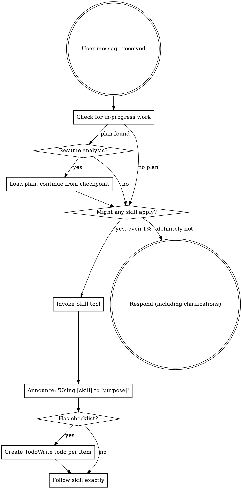

<SUBAGENT-STOP>
If you were dispatched as a subagent to execute a specific task, skip this skill.
</SUBAGENT-STOP>

<EXTREMELY-IMPORTANT>
If you think there is even a 1% chance a skill might apply to what you are doing, you ABSOLUTELY MUST invoke the skill.

IF A SKILL APPLIES TO YOUR TASK, YOU DO NOT HAVE A CHOICE. YOU MUST USE IT.

This is not negotiable. This is not optional. You cannot rationalize your way out of this.
</EXTREMELY-IMPORTANT>

## Instruction Priority

SuperRA skills override default system prompt behavior, but **user instructions always take precedence**:

1. **User's explicit instructions** (CLAUDE.md, GEMINI.md, AGENTS.md, direct requests) — highest priority
2. **SuperRA skills** — override default system behavior where they conflict
3. **Default system prompt** — lowest priority

If CLAUDE.md says "skip data description for this dataset" and a skill says "always describe first," follow the user's instructions. The user is in control.

## Cross-Session Detection

**At session start, check for in-progress work:**

```bash
# Check if currently in a worktree
git rev-parse --is-inside-work-tree 2>/dev/null && git worktree list 2>/dev/null

# Check for PLAN.md at project root
[ -f "PLAN.md" ] && grep -c "\- \[ \]" PLAN.md 2>/dev/null

# Check for RESULTS_UPDATE.md for context
[ -f "RESULTS_UPDATE.md" ] && echo "Results document found"

# Fallback: check docs/ for archived or legacy plans
find docs/ -name "PLAN.md" -o -name "*.md" -path "*/analysis-plans/*" 2>/dev/null | head -5
```

**If an incomplete plan is found** (PLAN.md with unchecked `- [ ]` steps):
- Summarize: "Found in-progress analysis: `PLAN.md` (N/M steps done). RESULTS_UPDATE.md has findings through Task K. Resume?"
- If user confirms: load PLAN.md and RESULTS_UPDATE.md, check git log for latest state, continue from next unchecked step
- If user declines: proceed normally

**If in a worktree with no plan file:**
- Note: "You're in worktree `<path>` on branch `<branch>`. Continue working here?"

## How to Access Skills

**In Claude Code:** Use the `Skill` tool. When you invoke a skill, its content is loaded and presented to you—follow it directly. Never use the Read tool on skill files.

**In Copilot CLI:** Use the `skill` tool. Skills are auto-discovered from installed plugins.

**In Gemini CLI:** Skills activate via the `activate_skill` tool.

**In other environments:** Check your platform's documentation for how skills are loaded.

## Platform Adaptation

Skills use Claude Code tool names. Non-CC platforms: see `references/copilot-tools.md` (Copilot CLI), `references/codex-tools.md` (Codex) for tool equivalents. Gemini CLI users get the tool mapping loaded automatically via GEMINI.md.

# Using Skills

## The Rule

**Invoke relevant or requested skills BEFORE any response or action.** Even a 1% chance a skill might apply means that you should invoke the skill to check. If an invoked skill turns out to be wrong for the situation, you don't need to use it.



## Red Flags

These thoughts mean STOP—you're rationalizing:

| Thought | Reality |
|---------|---------|
| "This is just a simple question" | Questions are tasks. Check for skills. |
| "I need more context first" | Skill check comes BEFORE clarifying questions. |
| "Let me explore the data first" | Skills tell you HOW to explore. Check first. |
| "Let me load the data quickly" | Data loading requires description discipline. Check for skills. |
| "This doesn't need a formal skill" | If a skill exists, use it. |
| "I remember this skill" | Skills evolve. Read current version. |
| "This doesn't count as a task" | Action = task. Check for skills. |
| "The skill is overkill" | Simple things become complex. Use it. |
| "I'll just run this one merge first" | Check BEFORE doing anything. |
| "This feels productive" | Undisciplined action wastes time. Skills prevent this. |
| "I know what that means" | Knowing the concept ≠ using the skill. Invoke it. |

## Skill Priority

When multiple skills could apply, use this order:

1. **Process skills first** (data-exploration, econ-data-analysis) - these determine HOW to approach the task
2. **Execution skills second** (executing-analysis) - these guide execution

"Let's analyze X" → data-exploration first, then analysis-planning.
"Something looks wrong in the data" → investigate using econ-data-analysis describe step.

## Skill Types

**Rigid** (econ-data-analysis, verification-before-completion): Follow exactly. Don't adapt away discipline.

**Flexible** (data-exploration): Adapt principles to context.

The skill itself tells you which.

## Semantic Merge

When merging, rebasing, or cherry-picking branches, superRA uses intent-based conflict resolution rather than mechanical ours/theirs. Research-meaningful conflicts are always escalated to the user. See `superRA:semantic-merge` for the full process. A PreToolUse hook automatically reminds you to use this skill when a bare `git merge/rebase/cherry-pick` is detected.

## Agent Teams

When `CLAUDE_CODE_EXPERIMENTAL_AGENT_TEAMS` is enabled, superRA uses Agent Teams for workflows with iteration loops (pre-merge-gate, executing-analysis, semantic-merge). This is automatic — the orchestration skills detect availability and use teams when appropriate. See `superRA:using-agent-teams` for details on team compositions, lifecycle, and session handoff.

## User Instructions

Instructions say WHAT, not HOW. "Analyze X" or "Merge these datasets" doesn't mean skip econ-data-analysis discipline.
