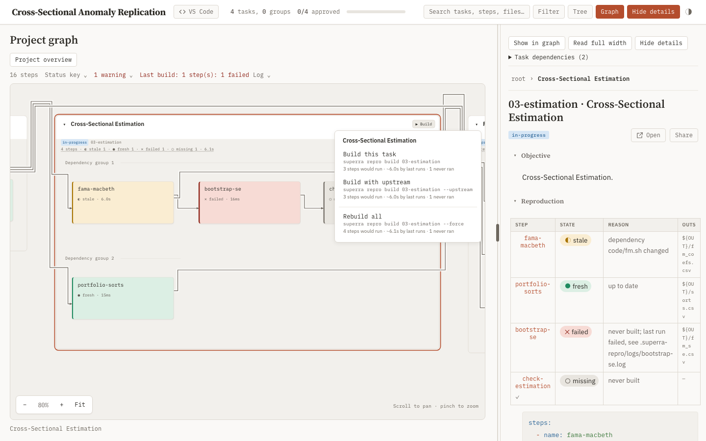

## Objective

From any task or step card in the Reproduction view, the researcher can build it, see what the build will cost, and see why a step is stale, without an agent or the CLI.

- **A Build menu on every card.** Each task card and step card carries a `▶ Build` chip, shown on card hover, keyboard focus, or selection, that opens an `rp-menu` on click. Each item shows the exact command it runs and its estimate:
  - "Build this task" / "Build this step" — `superra repro build <target>`
  - "Build with upstream" — `superra repro build <target> --upstream`
  - below a divider, "Rebuild all" — `superra repro build <target> --force`
  - The target is the task path, `task#step`, or `.` for the project-root card.
  - The estimate reads "N steps would run · ~Xs by last runs", or "Nothing stale".
- **Timings on cards.** A step card shows its last duration beside its state. A task card shows the summed last duration of its steps.
- **Explain as a hover card.** Hovering or focusing a non-fresh step's state, or a task card's freshness summary, shows the `superra repro explain` causes: each changed node, its cause, and its evidence. Clicking pins the card open and adds the diffs.
- **Build lifecycle.**
  - While a build runs, its card reads "Building…" and its executing steps read "building", never `failed`.
  - A Stop control ends the build; the runner records the stopped steps as failed.
  - On completion, one status line shows the runner's summary or its error verbatim.
  - One build per worktree. A second build, from the page or from the CLI, shows the runner's lock refusal verbatim.
  - The build runs in the worktree the page selects (`?wt=`) and keeps running if the dashboard server stops.
  - The build runs with the researcher's login-shell environment, not the dashboard process's.
- **Out of scope:** `accept`, `revoke`, and `-j` stay CLI actions.

### Constraints

- **The build route executes declared commands, so it accepts only a same-origin request:** JSON content type and `Sec-Fetch-Site` as [`/api/open`](../../../../skills/task-tree/scripts/plan_dashboard.py#L1627) checks, plus a `Host` check that defeats DNS rebinding.
- **The client sends a target, never command text.** The server accepts only a task path or step present in the current graph, and passes it as an argv element after `--`, never through a shell string.
- **An off-loopback `--host` bind keeps the Build controls**, under the same checks: the researcher opts into that bind. Standalone export and doc mode render no Build or explain controls.
- **Timing, estimate, and explain stay read-only:** on a never-built tree they create no `.superra-repro/` and write nothing to the project, like the existing repro routes.
- **The state glyph-and-word accessibility and both themes hold** for every new control, per [the parent task's palette results](../task.md#the-state-palette-is-a-status-scale-not-a-series-palette).

### Validation

- Dashboard tests cover the build route's refusals (cross-site, rebinding `Host`, wrong content type, unknown target, flag-like target), the build lifecycle (start, `running` state, lock refusal, stop, completion summary), and the read-only invariant of the estimate and explain routes.
- A browser pass on the parent's 16-step fixture (retired at Protect; recover it with `git show 27b7e181^:superRA/reproducibility/04-dashboard-view/attachments/repro_fixture.py`) exercises: build a step, build with upstream, rebuild all, stop mid-build, a lock refusal from a concurrent CLI build, the hover card (hover, keyboard focus, pinned), and the timings. Record it with screenshots in both themes and at 430px in `attachments/`.

## Details

- **Wording.** The CLI verb is *build* ("Execute every stale step in the target scope"); *run* names one step's execution ("Last run", "Run log"). Menu labels and status lines follow the runner's own strings.
- **Review.** The build route turns the page into a command runner. Worth a thorough independent review focused on the route's refusals and argv handling.
- **Status impact.** This child reopens its ancestors through normal rollup. It changes no reproduction schema, so sibling approvals stand.

## Results

Every card in the Reproduction view can now build, cost, and explain itself. 1,061 tests pass (1,047 before, plus 14 new), and a browser pass on the 16-step fixture exercised each path.

### What the researcher sees

- **A Build chip on every task and step card**, shown on hover, keyboard focus, or selection. It opens a menu of three builds, each with its command and estimate ([build-menu-light.png](attachments/build-menu-light.png), [build-menu-430.png](attachments/build-menu-430.png)).
  - The estimate counts the non-fresh steps in the selection and sums their last durations, e.g. "3 steps would run · ~34ms by last runs · 1 never ran". Steps waiting on an external input are named, not counted.
  - Arrow keys move through the items; Escape closes the menu and returns focus to the chip.
- **Timings on cards.** A step reads "● fresh · 6.0s"; a task summary ends with its steps' summed duration.
- **A live build shows on the card and in the summary bar** ([build-running-light.png](attachments/build-running-light.png)).
  - Executing steps read "◐ stale · building 3.0s" and pulse (a dashed outline under reduced motion); the task chip reads "Building…".
  - The summary bar reads "▶ Building `superra repro build '03-estimation#fama-macbeth'` · 1 running" with a Stop button.
  - On completion it reads "Last build: 1 step(s): 1 executed" and links the build log. A stopped build reads "Last build: Interrupted: running steps were stopped and recorded as failed."
  - A build started from the CLI reads "▶ Building from outside the dashboard", and every menu item is disabled ([cli-build-light.png](attachments/cli-build-light.png)).
- **The explain hover card** opens on a non-fresh step or a task's freshness summary after 350ms ([explain-task-light.png](attachments/explain-task-light.png)). It shows the status reason at once, then the explain groups: each changed file, its cause, and its evidence. Clicking pins it and adds the diffs ([explain-pinned-dark.png](attachments/explain-pinned-dark.png)).

### How the build route stays safe

- **Same-origin JSON only.** [`_same_origin_json`](../../../../skills/task-tree/scripts/plan_dashboard.py#L1590) now carries the content-type and `Sec-Fetch-Site` gate `/api/open` already used.
- **The `Host` must name this machine** ([`_is_trusted_authority`](../../../../skills/task-tree/scripts/plan_dashboard.py#L1744)): loopback, an IP literal, the machine's own names, or a name listed in `SUPERRA_DASHBOARD_HOSTS` (e.g. a Tailscale MagicDNS name). A rebinding page sends its own domain, so an off-loopback bind keeps its protection.
- **Graph targets only.** [`_validate_build_target`](../../../../skills/task-tree/scripts/plan_dashboard.py#L1763) rejects control characters, padding, and a leading `-`, then requires `select_steps` to resolve the target. The target reaches the runner as one argv element after `--`.
- **Project pages get an opaque origin.** `/files` serves HTML, SVG, and XML with `Content-Security-Policy: sandbox allow-scripts …`, so a page in the project cannot pass the gate of the build, comment, or open routes. Its scripts still run; it loses same-origin storage.
- **Off where there is no server to trust.** Doc mode and the standalone export render no controls (`window.REPRO_ACTIONS`). The `--host` help now says the server runs the tree's builds.

### How the hard parts were handled

- **Executing steps read `failed` before this change.** `compute_status` treated an in-flight run record as an interrupted run. The mutation lock now records its holder's pid, which [`lock_holder`](../../../../skills/task-tree/scripts/_repro_acceptance.py#L75) reads without creating state, and the runner stamps its pid on in-flight records. A record carrying the holder's pid keeps its lock-compared state with reason `building now` ([_repro_state.py:891](../../../../skills/task-tree/scripts/_repro_state.py#L891)); any other in-flight record is still an interrupted run. `status`, `explain`, and `task read` report the same, and the build's own decisions keep the interrupted-run rule.
- **The build outlives the server.** [`_start_build_sync`](../../../../skills/task-tree/scripts/plan_dashboard.py#L1836) spawns the runner in its own process group and records the job in `.superra-repro/dashboard-build.json`. [`_build_state_sync`](../../../../skills/task-tree/scripts/plan_dashboard.py#L1883) reads "running" from the lock, not from server memory. Stop sends SIGTERM to that group, and only while the lock holder belongs to it ([`_job_alive`](../../../../skills/task-tree/scripts/plan_dashboard.py#L1836)), so a recycled pid is never signalled.
- **Login-shell environment.** [`_login_env`](../../../../skills/task-tree/scripts/plan_dashboard.py#L1777) captures `$SHELL -l -i -c 'env -0'` (0.47s here) and passes it to the runner directly, so no command string is ever assembled. It falls back to the server's environment.
- **A step node is a `<button>`,** so its chip is a sibling button placed at the node's corner and revealed with `.repro-node:hover + .rp-build-chip-step`. Node markup, ids, and selection are unchanged.
- **Polling never re-lays out the graph.** The page polls `GET /api/repro/build` every 1.5s while a build runs, and [`reproPaintBuild`](../../../../skills/task-tree/scripts/templates/dashboard.js#L2236) repaints nodes, chips, and the status line in place. The existing lock watcher refreshes states as each step completes.
- **The estimate is computed in the browser** ([`reproBuildEstimate`](../../../../skills/task-tree/scripts/templates/dashboard.js#L2108)), because `build --dry-run` takes the mutation lock and would fail during a build.
- **Explain is costed like status:** 1.3–2.1s on a 112-step project. The card fetches once per target and caches until the next refresh. The task view re-fetches with `diff=1` only when pinned.

### Validation

- [TestReproBuildRoutes](../../../../skills/task-tree/scripts/test_dashboard.py#L6623) (12 tests): the flag in live, off-loopback, doc-mode, and export pages; the refusals (wrong content type, cross-site, rebinding `Host`, eight malformed or unknown targets, doc mode); the `Host` predicate; argv shape; a real build to `fresh`; a slow build reading `running` and refusing a second build, then stopping to `failed`; a CLI-held lock refusing the page while a crashed build's step still reads interrupted; Stop refusing a recycled pid; `/files` sandboxing project pages; explain answering a task and a step while writing nothing; and the client estimate and command quoting under node.
- [test_status_reads_only_the_lock_holders_steps_as_building](../../../../skills/task-tree/scripts/test_repro_runner.py#L604) pins the CLI side.
- [test_build_menu_and_explain_card](../../../../skills/task-tree/scripts/tests/test_dag_workspace_browser.py#L98) drives the chip reveal, menu, Escape, and both hover cards in Chromium.
- **Browser pass on the fixture**, recorded in `attachments/`: build a step, stop a forced rebuild, a concurrent CLI build, both hover cards, keyboard entry into the menu at 430px, light and dark. The only console error is an htmx SSE `[object Event]` on page reload, which an unmodified page also raises.

### Limits

- **Status probing takes a shared lock for microseconds.** A CLI build starting in that window is refused with the usual "another reproduction build" message and can simply be rerun.
- **A build whose server restarted mid-run** shows no "Last build" line, because no process recorded its exit code. Its states still refresh from the lock.
- **On a narrow screen** the Build menu can extend below the short graph stage.

## Review Notes

Tier: thorough. Focus: security, correctness. Suite at `59993056`: 1,059 passed, 9 skipped.

1. **[BLOCKING] Any holder of the mutation lock turns every interrupted step into "building now", and `status` then reports it `fresh`.**
   - **Problem.** `live_build` is one flag for the whole worktree. [_repro_state.py:890-894](../../../../skills/task-tree/scripts/_repro_state.py#L890-L894) treats every run record whose outcome is `running` or `pending` as executing, so a step left interrupted by an earlier crashed or killed build loses its `failed` verdict whenever another build, `accept`, or `revoke` holds the lock. It keeps its lock-compared state instead.
     - Reproduced on the `repro_plan` fixture: build `fetch-crsp` to fresh, write its run record as `{"outcome": "running", "started_at": 1.0}`, then hold `mutation.lock` as an unrelated build would. `/api/repro/status` moves from `failed · previous execution was interrupted; rerun required` to `fresh · building now · running: true`. `GET /api/repro/build` lists the step under `steps`, so the card pulses "building" with an elapsed time measured from that old start.
     - The CLI shares the fault through [repro_run.py:757-759](../../../../skills/task-tree/scripts/repro_run.py#L757-L759): an agent that checks `superra repro status` during a concurrent build sees a step that still needs a rerun as `fresh`.
     - [commands.md](../../../../skills/task-tree/references/commands.md) says only "a step it is executing" reads `building now`. The code does not match that claim.
     - The build's own decisions stay intact. `_decide` ([repro_run.py:117](../../../../skills/task-tree/scripts/repro_run.py#L117)) and the forced set in `run_build` ([repro_run.py:382](../../../../skills/task-tree/scripts/repro_run.py#L382)) do not pass `live_build`.
   - **Fix.** Tie each in-flight record to the build that owns it. For example, have the runner write its pid, or a build id kept beside the lock, into the `running` record at [repro_run.py:175](../../../../skills/task-tree/scripts/repro_run.py#L175), and treat a record as live only when that owner still holds the lock. Apply the same test in `_build_state_sync`'s `steps` list. Add a test that holds the lock with a stale `running` record present and asserts `failed`.
   → implemented: [mutation_lock](../../../../skills/task-tree/scripts/_repro_acceptance.py#L54) writes the holder's pid into the lock file and [lock_holder](../../../../skills/task-tree/scripts/_repro_acceptance.py#L75) returns it; the runner stamps its pid on `running`/`pending` records ([repro_run.py:176](../../../../skills/task-tree/scripts/repro_run.py#L176)), and only a record carrying the holder's pid reads `building now` ([_repro_state.py:891](../../../../skills/task-tree/scripts/_repro_state.py#L891)) or lists under `steps`. Pinned by [test_status_reads_only_the_lock_holders_steps_as_building](../../../../skills/task-tree/scripts/test_repro_runner.py#L604) and [test_a_build_outside_the_dashboard_refuses_the_page](../../../../skills/task-tree/scripts/test_dashboard.py#L6730).

2. **[ADVISORY] Stop can signal an unrelated process group after pid reuse.** [`_stop_build_sync`](../../../../skills/task-tree/scripts/plan_dashboard.py#L1908-L1916) calls `killpg` on the job file's pid whenever that pid is alive and the job has no `returncode`. A job whose runner exited while the server was down never gets a `returncode`, so a recycled pid passes the check. The UI shows Stop only when `job.alive`, which also requires the lock ([plan_dashboard.py:1891](../../../../skills/task-tree/scripts/plan_dashboard.py#L1891)), but a CLI build holding the lock satisfies that requirement too. Fix: in the route, require the same `alive` test, and check that the pid is still the runner, for example `os.getpgid(pid) == pid` together with a start time recorded in the job.
   → implemented: [_job_alive](../../../../skills/task-tree/scripts/plan_dashboard.py#L1836) requires the lock holder's process group to be the job's pid (or the startup grace with no holder); Stop and the UI both use it. Pinned by [test_stop_refuses_a_job_whose_pid_is_not_the_build](../../../../skills/task-tree/scripts/test_dashboard.py#L6746).

3. **[ADVISORY] A same-origin page is not necessarily a page the dashboard wrote.** `/files/{path}` serves any project file with its inferred type ([plan_dashboard.py:1545](../../../../skills/task-tree/scripts/plan_dashboard.py#L1545)). An HTML file in the project, such as a rendered report or a downloaded page, therefore runs on the dashboard origin and passes `_same_origin_json`. It can then start `--force` rebuilds of any declared step. It cannot run commands of its own choosing. The comment routes and `/api/open` already carry this exposure; the build route raises the stakes. Fix: serve `/files` responses with `Content-Security-Policy: sandbox`, which gives HTML an opaque origin.
   → implemented: `/files` serves `.html`, `.htm`, `.xhtml`, `.svg`, `.xml` with `Content-Security-Policy: sandbox allow-scripts …` and no `allow-same-origin` ([plan_dashboard.py:1531](../../../../skills/task-tree/scripts/plan_dashboard.py#L1531)); images and PDFs are untouched. Pinned by [test_project_pages_are_served_sandboxed](../../../../skills/task-tree/scripts/test_dashboard.py#L6757).

4. **[ADVISORY] Three status readers still report an executing step as interrupted.** CLI `explain` ([repro_run.py:624](../../../../skills/task-tree/scripts/repro_run.py#L624)), `status`'s `behind` list ([repro_run.py:610](../../../../skills/task-tree/scripts/repro_run.py#L610)), and `task read`'s step states ([_task_snapshot.py:66](../../../../skills/task-tree/scripts/_task_snapshot.py#L66)) do not pass `live_build`. During a build they print `failed · previous execution was interrupted` while the dashboard and `status` print `building now`. Fix: pass the same flag once finding 1 makes it per-record.
   → implemented: `explain`, `behind`, and `task read` pass `lock_holder` ([repro_run.py:613](../../../../skills/task-tree/scripts/repro_run.py#L613), [repro_run.py:629](../../../../skills/task-tree/scripts/repro_run.py#L629), [_task_snapshot.py:68](../../../../skills/task-tree/scripts/_task_snapshot.py#L68)).
