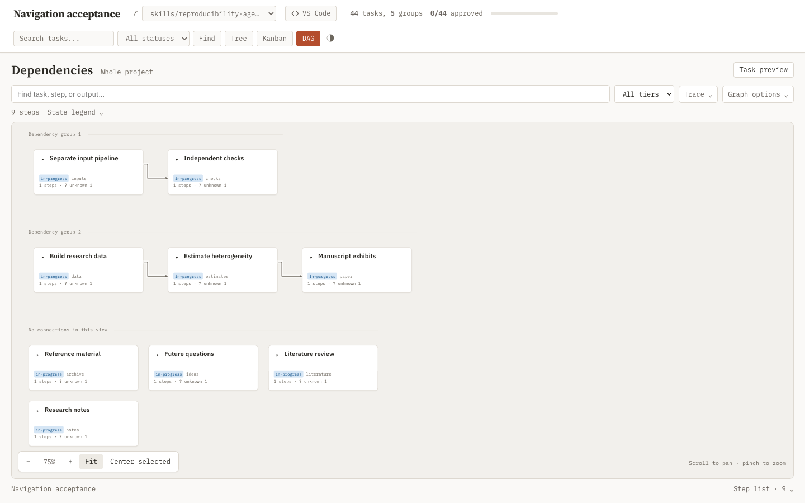
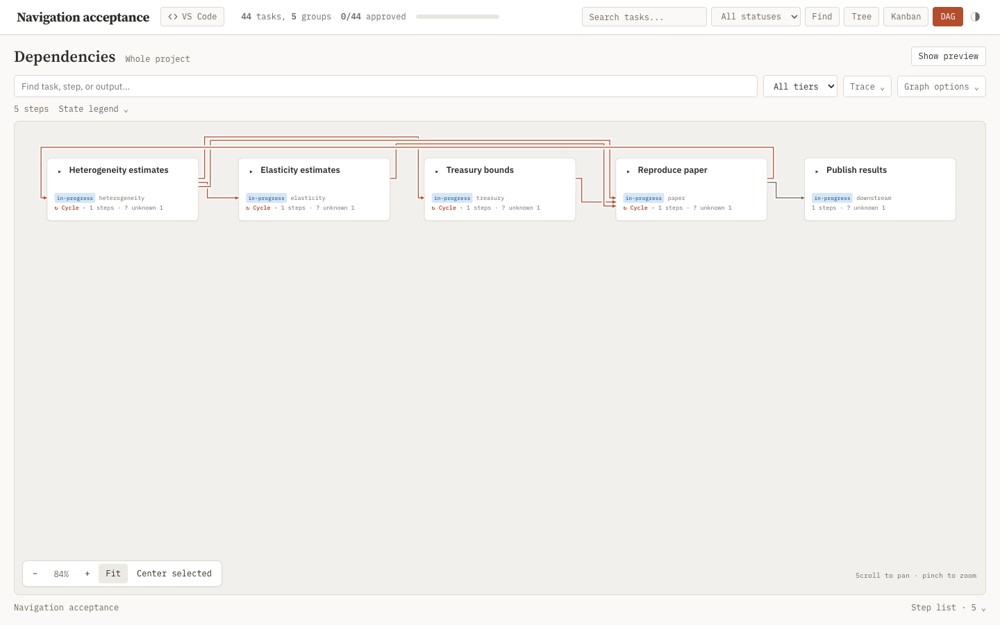
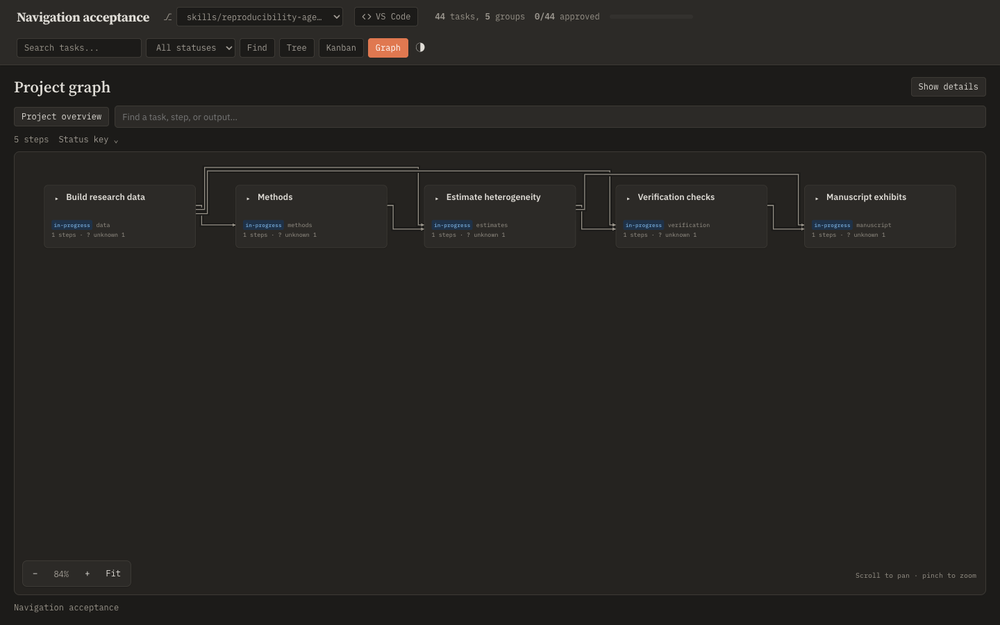
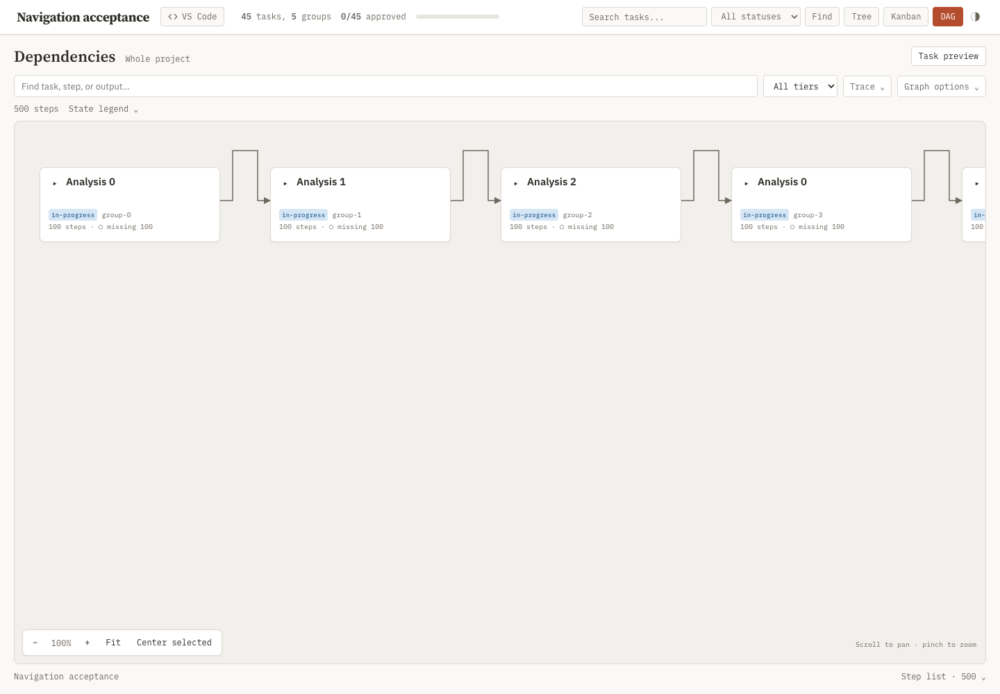

## Objective

Remake the DAG workspace into a clean, intuitive interface consistent with the rest of the dashboard, verified on the [Treasury dashboard](http://localhost:8996/?wt=v05-compatibility#/04-treasury-market-bound?repro=%7B%22roots%22%3A%5B%5D%2C%22view%22%3A%22graph%22%7D).

- Give the graph most of the viewport. Use the dashboard's existing typography, warm neutral surfaces, borders, spacing, and accent palette; keep controls compact and clearly grouped, with secondary options and diagnostic details progressively disclosed.
- Hide the task preview on initial DAG entry, including existing deep links. Provide an obvious toggle and close action; selection, expansion, and graph navigation must work while it is hidden, and opening it must show the selected task without losing graph position.
- Support two-finger touchpad scrolling in both axes to pan and pinch to zoom around the pointer, including Safari gestures and Chromium control-wheel events. Keep drag panning, accessible zoom buttons, fit, and keyboard recovery; prevent unintended page zoom or scroll while handling canvas gestures.
- Offer task-specific expansion to 1, 2, 3, or all levels, starting at two levels and showing the projected card count before applying. Keep the chevron's one-level behavior; bound previously expanded descendants to the chosen depth, leave other branches and scope unchanged, and make large expansions explicit. Verify the counts and behavior on the Treasury and heterogeneity branches and nested synthetic fixtures.
- Make each dependency arrow independently traceable. Avoid shared line segments that imply a common bus, false connection, or enclosing box; provide distinct routes and readable arrowheads, with source/destination highlighting on hover and keyboard focus. Verify collapsed top-level tasks and the expanded heterogeneity branch without changing dependency semantics.
- Identify cyclic dependencies with the dashboard's existing muted rust accent and a compact accessible cycle label, keeping card surfaces neutral. Distinguish a cycle in collapsed task groups from an executable-step cycle; do not imply that aggregation alone makes execution impossible. Keep acyclic edges neutral and preserve cycle visibility during edge inspection. Use existing theme tokens rather than a competing error-red palette.
- Clearly separate disconnected dependency groups in the visible graph, and place cards without visible connections in a labeled area away from routed arrows. Derive groups from connectivity in either direction, respecting task containers and the current projection; cycles remain within their connected group. Preserve all nodes, edges, filtering, expansion, selection, and inspection. Verify multiple components, isolated tasks, filtering, nested expansion, and the research overview shown by the user.
- Preserve graph semantics, task/step inspection, filtering, URL navigation, diagnostics visibility, comments, dark mode, and standalone export. Do not alter research data or resolve the fixture's dependency declarations.
- Verify visual hierarchy and ordinary journeys in Safari through computer control at desktop and narrow widths. Add behavioral regression checks for viewport gestures and preview state; record limitations honestly where physical gestures cannot be synthesized.

## Details

- The existing navigation task owns the functional model. This temporary child owns the substantial visual and interaction redesign on that same runtime surface; the general dashboard task does not own DAG-specific presentation.
- Initial Safari review at roughly 1030 × 768 showed controls wrapping to several rows, expanded diagnostic prose above the graph, and a reader consuming about one third of the workspace. The graph starts near the bottom edge. Chrome at 1372 × 768 has the same hierarchy problem.
- Suggested design: a compact heading/scope row and search/filter toolbar; graph canvas filling remaining height; grouped viewport controls on the canvas; a concise error/warning summary with collapsed details; task cards with readable titles and subdued metadata. Preserve persistent selection while making reading an explicit choice.
- Runtime owners: [dashboard.js](../../../../../skills/task-tree/scripts/templates/dashboard.js), [dashboard.css](../../../../../skills/task-tree/scripts/templates/dashboard.css), and [base.html](../../../../../skills/task-tree/scripts/templates/base.html). The reviewed navigation branch was merged into the local superra-dev checkout at 14fcd6f6; make this revision there. Port 8996 still serves the temporary navigation checkout, while the research dashboard on port 8653 loads installed plugin assets.
- Execution: Astra implementer; main agent performs thorough correctness, scope-fidelity, and visual usability review. No generated runtime assets are planned.
- Branch-expansion exploration: Treasury contains 15 active task cards and 7 steps; one/two/three/all levels show 8/16/22/22 cards. Heterogeneity contains 31 task cards and 54 steps; the same depths show 8/32/74/85 cards. Suggested control: Graph options → Expand selected branch, with depth and projected counts computed from the existing graph projection before Apply. An out-of-scope selection needs an explicit focus action; expansion must not silently widen scope. Replace the unqualified global Expand all steps action with this task-scoped control.
- Routing review: coincident horizontal and vertical tracks falsely suggest Methods → Verification and a box enclosing the four top-level research tasks. The declared top-level Treasury flow is Heterogeneity → Treasury → Reproduce manuscript exhibits. Use separate lanes and endpoint ports, minimize crossings and detours, and keep routes outside unrelated cards. Inspect cycles or aggregation-induced cycles before changing rank placement; preserve all real edges and their evidence. Dense graphs may cross, but crossings must not look like joins.
- Disconnected-group design: the research overview currently places unconnected tasks in the first rank beside the Stock-Market Construction Inputs routes, visually implying they feed downstream. Lay out connected components independently, with connected groups first and a compact isolated-card area afterward. Prefer understated headings, whitespace, and separators using existing theme tokens; avoid enclosing outlines that resemble dependency routes. Qualify isolated cards as “No connections in this view,” since filters and collapsed containers affect visible connectivity. Use component-local routing so arrows cannot pass beside an unrelated group. Keep ordering deterministic and retain viewport anchoring during expansion.

## Reproduction

```yaml
tier: on-demand
steps:
  - name: dashboard-dag-design-browser
    cmd: uv run --with playwright --with pyyaml --with fastapi --with jinja2 --with 'uvicorn[standard]' --with watchfiles --with httpx python skills/task-tree/scripts/tests/navigation_browser.py --evidence superRA/reproducibility/04-dashboard-view/scalable-navigation/dag-design/attachments/browser
    deps:
      - skills/task-tree/scripts/tests/navigation_browser.py
      - skills/task-tree/scripts/plan_dashboard.py
      - skills/task-tree/scripts/templates
      - skills/task-tree/scripts/vendor
      - skills/task-tree/scripts/_artifacts.py
      - skills/task-tree/scripts/_comments.py
      - skills/task-tree/scripts/_repro.py
      - skills/task-tree/scripts/_repro_state.py
      - skills/task-tree/scripts/_repro_acceptance.py
      - skills/task-tree/scripts/_task_io.py
      - skills/task-tree/scripts/_task_dependencies.py
      - skills/task-tree/scripts/_task_snapshot.py
      - skills/task-tree/scripts/_task_validate.py
      - skills/task-tree/scripts/_worktree_discovery.py
      - skills/task-tree/scripts/cli.py
      - skills/task-tree/scripts/task_comment.py
    outs:
      - superRA/reproducibility/04-dashboard-view/scalable-navigation/dag-design/attachments/browser
  - name: dashboard-dag-design-interaction-check
    kind: check
    cmd: uv run --with pytest --with playwright --with pyyaml --with fastapi --with jinja2 --with 'uvicorn[standard]' --with watchfiles --with httpx python -m pytest skills/task-tree/scripts/tests/test_dag_workspace_browser.py skills/task-tree/scripts/tests/test_navigation_projection.py -q
    deps:
      - skills/task-tree/scripts/tests/test_dag_workspace_browser.py
      - skills/task-tree/scripts/tests/test_navigation_projection.py
      - skills/task-tree/scripts/test_dashboard.py
      - skills/task-tree/scripts/tests/navigation_browser.py
      - skills/task-tree/scripts/plan_dashboard.py
      - skills/task-tree/scripts/templates
      - skills/task-tree/scripts/vendor
      - skills/task-tree/scripts/_artifacts.py
      - skills/task-tree/scripts/_comments.py
      - skills/task-tree/scripts/_repro.py
      - skills/task-tree/scripts/_repro_state.py
      - skills/task-tree/scripts/_repro_acceptance.py
      - skills/task-tree/scripts/_task_io.py
      - skills/task-tree/scripts/_task_dependencies.py
      - skills/task-tree/scripts/_task_snapshot.py
      - skills/task-tree/scripts/_task_validate.py
      - skills/task-tree/scripts/_worktree_discovery.py
      - skills/task-tree/scripts/cli.py
      - skills/task-tree/scripts/task_comment.py
```

## Results

The DAG separates independent dependency groups into labeled bands, with cards lacking visible connections in a compact area below the routes. It fills the available viewport, with a default-hidden task preview and compact search, tier, tracing, and graph controls. Diagnostics, state legend, step list, scope management, and dependency evidence remain accessible through menus. Task cards show two-line titles and bounded metadata; the shared preview gives its title a full row and keeps its exit controls visible while reading long declarations. See [dashboard.js](../../../../../skills/task-tree/scripts/templates/dashboard.js), [dashboard.css](../../../../../skills/task-tree/scripts/templates/dashboard.css), and [base.html](../../../../../skills/task-tree/scripts/templates/base.html).

- **Selection preserves preview visibility and graph position.** Task preview toggles the shared reader; Close preview restores the graph even from full-width reading. Initial task and legacy step links keep the preview hidden. Focus selected task uses the current selection.
- **Branch expansion is bounded and previewed.** Graph options → Expand selected branch offers 1, 2 (default), 3, or All levels, with projected task/step card counts before Apply. A shallower choice folds deeper descendants while preserving peers, scope, preview state, and the branch header’s canvas position. Hidden or out-of-scope selections require an explicit focus action. Browser history restores expansion; Escape, Cancel, and Apply restore keyboard focus.
- **Independent graphs stay separate.** Weak connectivity is computed between projected siblings, including descendant connections. Each connected group has its own layout and routing tracks; containment adds no dependency. An expanded container with internal edges remains a dependency group. Cards whose visible subtrees have no edges appear under “No connections in this view,” in rows of up to three. Nested headings are omitted when a container has only one connected group. Expansion preserves the selected header’s position, including native canvas scroll offsets.
- **Connections remain individually traceable.** Strongly connected components retain distinct rank columns; downstream tasks keep their own ranks. Adjacent connections use short routes; longer connections use separate hierarchy tracks, column gutters, and endpoint ports. Crossing lines have a background casing. Arrowheads stay 6 px high during inspection, with at least 7 px between ports; high-degree cards reserve the needed height. All declared edges and evidence remain intact.
- **Connection inspection names both endpoints.** Hover or keyboard focus highlights the route and its source/destination cards, with a human-readable source → destination label. Enter/Space opens the evidence. Focus and cycle metadata survive unchanged-topology redraws. Cycles use the existing muted rust accent and a compact accessible label on neutral cards; labels distinguish task-group cycles from step cycles without changing validation or execution status.
- **Canvas input covers both platforms.** Two-axis wheel events pan; Chromium control-wheel and Safari gesture events zoom around the pointer. Handled events cancel native scrolling/zooming. Drag, zoom buttons, Fit, Center selected, arrow keys, `+`/`−`, `0` (fit), and `C` (center) remain available. Physical trackpad pinch cannot be synthesized by the available computer-control surface; the [browser regression](../../../../../skills/task-tree/scripts/tests/test_dag_workspace_browser.py) dispatches platform events into the production listeners and checks anchoring, cancellation, and duplicate-event suppression.
- **Verification:** the dashboard suite passed **385 tests, with 4 skipped**; the scoped interaction check passed **29 tests** (11 browser journeys and 18 projection checks). These cover independent graph bands, isolated cards, internal DAG containers, nested escaping edges, component changes under tier/scope filters, node/edge conservation, branch anchoring, cycle ranking and downstream placement, noncoincident nested routes, dense fan-in port spacing, ancestor/descendant logical edges, endpoint focus/hover, cached cycle badges, diagnostic popup bounds, desktop-resized previews at phone width, nested branch depths/counts, unrelated expansion, trace/filter semantics, live redraws, and keyboard recovery. The four pre-existing browser checks require a bundled Playwright Chromium unavailable in this environment; the new checks used installed Chrome at 1372 × 768, 1030 × 768, and 390 × 844. JavaScript syntax and git whitespace checks passed.
- **Scale and compatibility:** the [500-step browser journey](../../../../../skills/task-tree/scripts/tests/navigation_browser.py) passed with 51 task records and 1,494 edges, including comments through CLI round-trip, history, live status refresh, worktree isolation, legacy/removal recovery, offline export, keyboard reading, resizing, and touch panning. [Recorded results](attachments/browser/browser-results.json) identify Chrome 153.0.8010.48 on macOS arm64: repeated search, filter, and full-expansion timings remain below the navigation budgets. Research fixtures were read-only; data and declarations were unchanged.

The main agent’s Safari computer-control pass at approximately 1064 px and 1543 px window widths covered hidden preview on reload, task selection, vertical canvas panning, preview toggling, selected-task focus, subtree expansion, step evidence, full-width declaration, and light/dark themes. Treasury expansion applied two levels (16 cards), All (22), then one level (8), confirming deeper descendants fold. Heterogeneity’s previews showed 32/74/85 cards at two/three/All levels; All was previewed rather than applied there. Native horizontal scroll calls did not produce a visible pan, and physical pinch was unavailable; those Safari gestures remain physically unverified.

Routing verification also used the real research fixture read-only: collapsed roots, one-level Heterogeneity, fully expanded Heterogeneity, fully expanded Treasury, and the fully expanded project (342 cards, 215 displayed edges). The current research overview contains one eight-task connected group and four isolated tasks. Geometry probes found no coincident positive-length segments and no crossings through unrelated cards in any of these views. Native Safari confirmed the initial routing and edge-evidence interaction. The corrected palette, card metadata, arrowheads, and light/dark controls were reviewed in the retained Chromium artifacts while the researcher was using Safari; these final visual details are not claimed as a separate native Safari pass.



The [dark component view](attachments/browser/dag-routing-components-dark.png) uses the same nine-card, three-edge fixture. Projection checks also cover internal graphs within containers, filtering, and edges that leave a lower nested band without crossing an earlier independent graph.





The producer also retains [dark cycle](attachments/browser/dag-routing-cycle-dark.png) and [light fan](attachments/browser/dag-routing-fan.png) views. The small cycle fixture preserves the six root-cycle connections plus one acyclic downstream edge; the fan fixture has seven acyclic connections.



The on-demand reproduction steps above generate the retained [Chromium evidence folder](attachments/browser/) directly from the synthetic scale and routing fixtures and verify interaction behavior. No research input is consumed. Scoped build succeeded for `dashboard-dag-design-browser` and `dashboard-dag-design-interaction-check`; matching status reports both **fresh**. The updated [pytask.lock](../../../../../pytask.lock) records these runs.

Regression command:

```bash
uv run --with pytest --with playwright --with pyyaml --with fastapi --with jinja2 \
  --with 'uvicorn[standard]' --with watchfiles --with httpx python -m pytest \
  skills/task-tree/scripts/test_dashboard.py \
  skills/task-tree/scripts/tests/test_navigation_projection.py \
  skills/task-tree/scripts/tests/test_dag_workspace_browser.py -q
```
