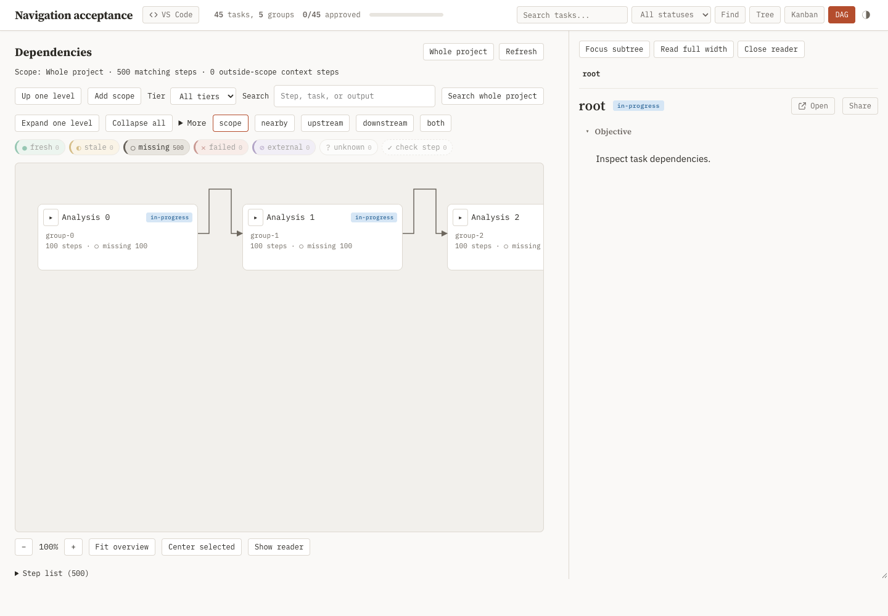
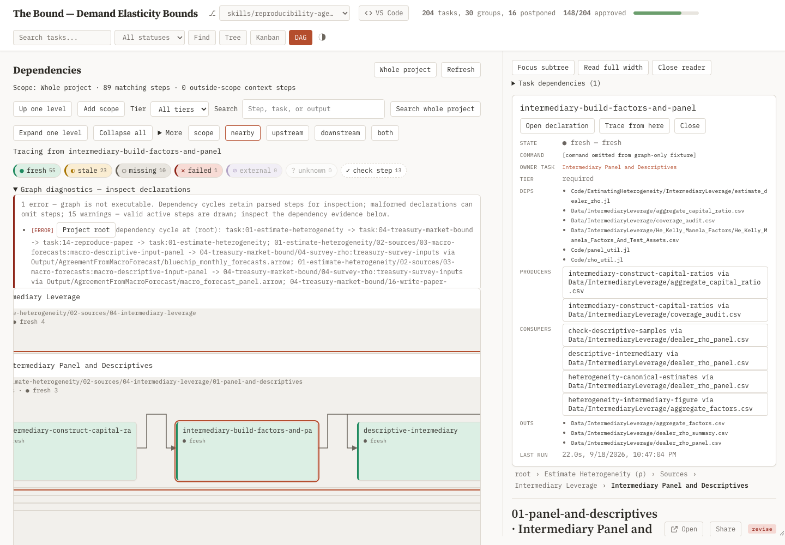

## Objective

Integrate task reading and dependency inspection into one workspace, with Tree and DAG as alternative navigators sharing selection and task content, and flexible task/step expansion in projects with 500 steps across 50 owner tasks.

- Implement the [interaction contract and acceptance checks](attachments/design.md): Tree/DAG navigation, shared task reader and comments, independent selection/expansion/focus actions, combined subtree/tier filtering, persistent inspection, and navigation recovery. Remove the duplicate reproduction overview and subtree picker; make existing task-page dependency entry points use the same graph.
- Group step cards by owner task with collapsible summaries, readable initial zoom, routed directional edges, and selection that remains visible beside the inspector. Validate against the heterogeneity graph as well as synthetic fixtures.
- Consume the [0.5 dependency and freshness contract](../../attachments/v05-design.md) from the graph/runner owners; preserve task comments and standalone export. This task owns dashboard presentation and payload integration, not a second dependency or freshness implementation.
- Expose logical-only tasks/edges, parent-owned steps, invalid combined cycles, and fresh-by-acceptance evidence without additional status vocabulary.
- Validate graph semantics with deterministic fixtures and navigation with browser interactions, including live updates and an offline export. Record the exercised environment and visual evidence alongside the results.

## Details

- **Placement:** this is a substantial extension of [the reproduction dashboard](../task.md), whose shipped view covers a small all-step graph. The general [dashboard task](../../../task-tree/dashboard/task.md) owns the application shell, not reproduction graph semantics. One implementation task owns this shared UI edit surface; splitting search, filters, layout, and inspection into sibling tasks would duplicate ownership.
- **Implementation surface:** [base.html](../../../../skills/task-tree/scripts/templates/base.html) owns the shared workspace shell; [dashboard.js](../../../../skills/task-tree/scripts/templates/dashboard.js#L895) owns reproduction rendering and the shared hash router; [dashboard.css](../../../../skills/task-tree/scripts/templates/dashboard.css#L1603) owns its presentation. [plan_dashboard.py](../../../../skills/task-tree/scripts/plan_dashboard.py) embeds client assets and graph snapshots for export. [test_dashboard.py](../../../../skills/task-tree/scripts/test_dashboard.py#L6637) and [state-preservation tests](../../../../skills/task-tree/scripts/tests/test_state_preservation.py) are the existing verification homes.
- **Data already available:** [graph_to_dict](../../../../skills/task-tree/scripts/_repro.py#L566) provides task ownership, tiers, file paths, step edges with their connecting files, and external inputs. The client fetches all tiers. The graph owner supplies effective task nodes/edges and provenance; the runner owner supplies acceptance explanations. Reuse these payloads for local expansion, filtering, and tracing.
- **Navigation coupling:** the shared router uses the hash for the active task and attachment; the worktree selector lives in the ordinary query string. Extend this router coherently so reproduction history cannot hijack task or attachment navigation.
- **Artifacts:** maintained UI code and regression fixtures belong beside their existing runtime and test owners. Screenshots and a concise manual-verification record belong in this task's attachments. The hand-authored design below has no producer step; register any retained scripted measurement when its results are cited, per [reproducibility](../../../../skills/reproducibility/SKILL.md#what-gets-a-step).
- **Interaction preview:** [Tree/DAG example](attachments/task-dag-preview.html) is a hand-authored design companion for selection, branch expansion, scope, and reader placement. Its small example graph illustrates interactions; the design contract and runtime verification requirements remain authoritative.
- **Status impact:** this child reopens its ancestors through normal rollup. No sibling input or reproduction schema changes, so existing sibling approvals stand.

## Reproduction

```yaml
tier: on-demand
steps:
  - name: dashboard-navigation-browser
    cmd: uv run --with playwright --with pyyaml --with fastapi --with jinja2 --with 'uvicorn[standard]' --with watchfiles --with httpx python skills/task-tree/scripts/tests/navigation_browser.py --evidence superRA/reproducibility/04-dashboard-view/scalable-navigation/attachments/browser
    deps:
      - skills/task-tree/scripts/tests/navigation_browser.py
      - skills/task-tree/scripts/plan_dashboard.py
      - skills/task-tree/scripts/templates
      - skills/task-tree/scripts/vendor
      - skills/task-tree/scripts/_artifacts.py
      - skills/task-tree/scripts/_comments.py
      - skills/task-tree/scripts/_repro.py
      - skills/task-tree/scripts/_repro_state.py
      - skills/task-tree/scripts/_repro_acceptance.py
      - skills/task-tree/scripts/_task_io.py
      - skills/task-tree/scripts/_task_dependencies.py
      - skills/task-tree/scripts/_task_snapshot.py
      - skills/task-tree/scripts/_task_validate.py
      - skills/task-tree/scripts/_worktree_discovery.py
      - skills/task-tree/scripts/cli.py
      - skills/task-tree/scripts/task_comment.py
    outs:
      - superRA/reproducibility/04-dashboard-view/scalable-navigation/attachments/browser
  - name: dashboard-navigation-heterogeneity
    cmd: uv run --with playwright --with pyyaml --with fastapi --with jinja2 --with 'uvicorn[standard]' --with watchfiles --with httpx python skills/task-tree/scripts/tests/navigation_browser.py --evidence superRA/reproducibility/04-dashboard-view/scalable-navigation/attachments/heterogeneity --graph-snapshot superRA/reproducibility/04-dashboard-view/scalable-navigation/attachments/heterogeneity-input.json
    deps:
      - superRA/reproducibility/04-dashboard-view/scalable-navigation/attachments/heterogeneity-input.json
      - skills/task-tree/scripts/tests/navigation_browser.py
      - skills/task-tree/scripts/plan_dashboard.py
      - skills/task-tree/scripts/templates
      - skills/task-tree/scripts/vendor
      - skills/task-tree/scripts/_artifacts.py
      - skills/task-tree/scripts/_comments.py
      - skills/task-tree/scripts/_repro.py
      - skills/task-tree/scripts/_repro_state.py
      - skills/task-tree/scripts/_repro_acceptance.py
      - skills/task-tree/scripts/_task_io.py
      - skills/task-tree/scripts/_task_dependencies.py
      - skills/task-tree/scripts/_task_snapshot.py
      - skills/task-tree/scripts/_task_validate.py
      - skills/task-tree/scripts/_worktree_discovery.py
      - skills/task-tree/scripts/cli.py
      - skills/task-tree/scripts/task_comment.py
    outs:
      - superRA/reproducibility/04-dashboard-view/scalable-navigation/attachments/heterogeneity
  - name: dashboard-navigation-projection-check
    kind: check
    cmd: uv run --with pytest --with pyyaml --with fastapi --with jinja2 --with 'uvicorn[standard]' --with watchfiles --with httpx python -m pytest skills/task-tree/scripts/tests/test_navigation_projection.py -q
    deps:
      - skills/task-tree/scripts/tests/test_navigation_projection.py
      - skills/task-tree/scripts/test_dashboard.py
      - skills/task-tree/scripts/tests/navigation_browser.py
      - skills/task-tree/scripts/plan_dashboard.py
      - skills/task-tree/scripts/templates
      - skills/task-tree/scripts/vendor
      - skills/task-tree/scripts/_artifacts.py
      - skills/task-tree/scripts/_comments.py
      - skills/task-tree/scripts/_repro.py
      - skills/task-tree/scripts/_repro_state.py
      - skills/task-tree/scripts/_repro_acceptance.py
      - skills/task-tree/scripts/_task_io.py
      - skills/task-tree/scripts/_task_dependencies.py
      - skills/task-tree/scripts/_task_snapshot.py
      - skills/task-tree/scripts/_task_validate.py
      - skills/task-tree/scripts/_worktree_discovery.py
      - skills/task-tree/scripts/cli.py
      - skills/task-tree/scripts/task_comment.py
```

## Results

- [The workspace DAG](../../../../skills/task-tree/scripts/templates/dashboard.js) uses the shared task reader and comments, independently folded task containers, scoped search, cross-filter traces, and logical/file edge evidence. [Projection regressions](../../../../skills/task-tree/scripts/tests/test_navigation_projection.py) cover parent setup → child → parent report, inherited logical prerequisites, nested folding, chain shortcuts, disconnected components, fan-out, and cyclic graph inspection.
- [The browser harness](../../../../skills/task-tree/scripts/tests/navigation_browser.py) exercises 500 steps across 50 owner tasks plus the project root, with 1,494 file edges. The registered on-demand producer records repeated timings and environment information in [browser-results.json](attachments/browser/browser-results.json), with live and offline navigation, shared comment round-trip, keyboard/touch control, actual reader resizing, worktree isolation, legacy-link recovery, archived-task exclusion, and removal updates over SSE. Chrome is an external execution prerequisite; the harness creates disposable synthetic projects and an isolated browser profile.
- The researcher authorized local graph-only capture of the heterogeneity project. The [sanitized boundary snapshot](attachments/heterogeneity-input.json) retains 89 steps, 251 active tasks, and 283 file edges, including the existing combined task cycle. [The capture utility](../../../../skills/task-tree/scripts/tests/navigation_snapshot.py) removes task prose, comments, attachments, commands, logs, and acceptance prose before rendering. The separate on-demand producer uses this frozen input; its [browser record](attachments/heterogeneity/browser-results.json) covers live/offline rendering and responsive inspection.
  - Source: the isolated heterogeneity compatibility worktree, captured with `navigation_snapshot.py --source <isolated-project>/superRA --output superRA/reproducibility/04-dashboard-view/scalable-navigation/attachments/heterogeneity-input.json`. This input is a metadata boundary fixture, not a copy of research results.

- Verification: dashboard, state-preservation, and projection suites passed **422 tests, 4 skipped**. The scoped browser producers completed successfully and reported **fresh**. On Chrome 153.0.8010.48 / macOS ARM64, repeated loaded-payload maxima were **0.6 ms search**, **4.7 ms scope filtering**, and **25.1 ms full expansion**; initial scale was 100%. Light/dark desktop, tablet, and 390 px phone checks found no page-level horizontal overflow. The retained real-project image omits research prose and execution content.



Source: [registered browser producer](../../../../skills/task-tree/scripts/tests/navigation_browser.py).



Source: the registered metadata-only browser producer and [sanitized boundary input](attachments/heterogeneity-input.json).
