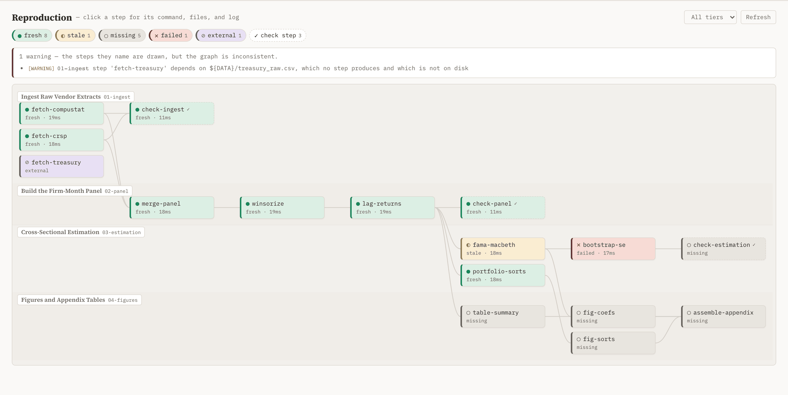

## Objective

Let the researcher review an agent-built graph in the dashboard and comment on it, so graph feedback flows through the task-comment loop agents already read.

- **DAG navigator:** integrate one hierarchical task DAG as an alternative to Tree navigation, sharing task selection, reader, comments, and attachments. Keep selection, expansion/folding, and subtree focus distinct. Remove the duplicate reproduction tree and subtree picker. Support expandable steps, subtree and tier filters, identifiable task ownership, a state legend (`fresh`, `stale`, `missing`, `failed`, `external`, `unknown`), and a separate check-kind indicator. Selecting a step exposes its command, deps, outs, owner task, state reason, last duration, and log tail. Layout is deterministic for the same graph; navigation and filtering follow the [scalable navigation contract](scalable-navigation/attachments/design.md).
- **Task page:** when a task has a `## Reproduction` section, render a step table (name, state, reason, outs) above the raw YAML block and link each row to the node in the Reproduction view. The section keeps its existing comment gutter; verify that a comment on a step line round-trips through `task comment list`.
- **Data path:** `GET /api/repro/graph` and `GET /api/repro/status` serve the JSON from [01-section-contract](../01-section-contract/task.md) and [02-runner](../02-runner/task.md); state refreshes on the existing SSE reload after a build touches the lock. The standalone export embeds a snapshot of both.
- **Validation criteria:** dashboard tests cover the two routes, the export snapshot, and rendering with no reproduction declarations (logical-only tasks and prerequisites remain visible, without errors); a tree with no task nodes shows an empty state; a manual pass on a fixture graph of at least 15 steps across 4 owner tasks is recorded with a screenshot in `attachments/`. The real-graph pass belongs to [08-pilot-treasurygiv](../08-pilot-treasurygiv/task.md).

## Details

- The current reproduction view uses dependency-depth columns without task grouping in [dashboard.js](../../../skills/task-tree/scripts/templates/dashboard.js#L966). Its navigation redesign is tracked in [scalable-navigation](scalable-navigation/task.md); the existing results below describe the shipped baseline until that work lands. Any layout dependency follows [vendor/README.md](../../../skills/task-tree/scripts/vendor/README.md).
- Route and export mechanics: [plan_dashboard.py](../../../skills/task-tree/scripts/plan_dashboard.py) `/api/children-graph` and `/export`; theme tokens in `templates/base.html`.
- Preserve the state palette's glyph-and-label accessibility in both themes.

## Revision Notes

Extend the reproduction UI to support larger graphs and combined subtree/tier filtering. The nested navigation task owns implementation and validation; historical results below establish the earlier implementation only; the 0.5 graph and acceptance changes require fresh UI verification.

## Results

The dashboard has a third top-level view, **Reproduction**, over the graph [01-section-contract](../01-section-contract/task.md) defines and the freshness [02-runner](../02-runner/task.md) computes. Graph feedback goes back to agents through the `## Reproduction` section's existing comment gutter. The real-graph pass is [08-pilot-treasurygiv](../08-pilot-treasurygiv/task.md)'s.



### What the researcher sees

- **The graph, laid out in swimlanes.** Rows are owner tasks, labelled with the task title and its path; columns are longest-path dependency depth, so every drawn edge points rightward and the pipeline reads left to right. Lanes follow the tree's own task order and both ordering passes break ties on the step name, so the same graph lays out identically every time and reordering its edges moves nothing ([dashboard.js:966](../../../skills/task-tree/scripts/templates/dashboard.js#L966)).
- **A node names its state twice** — a glyph and the state word, beside a wash and a 3px state border — and check steps carry a `✓` and a dashed edge. Clicking one opens its command, tier, deps, outs, owner-task link, state reason, last duration, and log tail ([dashboard.js:1258](../../../skills/task-tree/scripts/templates/dashboard.js#L1258)), and lights its incident edges. A sidecar-tracked out names the file the runner hashes in its place, in the panel and in the step table alike — otherwise a large intermediate reading `fresh` has no visible explanation.
- **A task page with a `## Reproduction` section gets a step table** — name, state, reason, outs — above the raw YAML, each row linking to its node in the view ([task-step-table.png](attachments/task-step-table.png)). The table is prepended after `renderMarkdown` has wrapped the section's commentable blocks, so it adds no block and the fence keeps its comment anchors ([dashboard.js:1328](../../../skills/task-tree/scripts/templates/dashboard.js#L1328)).
- **Graph findings sit above the canvas**, and the strip says what each severity means: an error's steps did not load and are absent, a warning's steps are drawn on a graph that is inconsistent. Not in `## Objective`, but a graph that failed to parse is missing steps, and letting a researcher review it without saying so would mislead.
- **Two empty states, because no steps has two causes.** A tree that declares no section shows what to add and the command that reports it. A tree whose sections failed to load shows the errors and says so ([graph-load-error.png](attachments/graph-load-error.png)) — one registered task and one `config.yaml` typo is the likeliest first contact with the view. Neither logs a console error.

### Two read-only routes

[`/api/repro/graph`](../../../skills/task-tree/scripts/plan_dashboard.py#L1505) and [`/api/repro/status`](../../../skills/task-tree/scripts/plan_dashboard.py#L1514) serve `graph_to_dict` and `compute_status(...).to_dict()` unchanged, off the event loop.

- **The client fetches `?tier=all` once and filters tiers in the browser**, so the tier control costs no request and the standalone export embeds one snapshot per route that serves every tier the exported view can select.
- **The status payload carries a per-step `log_tail`**, the one dashboard-local addition, so the detail panel needs no third route and the export snapshot is complete. It is read by step name rather than by the path the on-disk run record carries, and bounded to the last 64 KiB — a build step's stdout can run to megabytes ([plan_dashboard.py:3158](../../../skills/task-tree/scripts/plan_dashboard.py#L3158)).
- **A build is reused across the request pair.** Every build resolves `reproduction.vars`, which a project may point at a `git` or `conda` probe, so the two requests the view opens with share one build — keyed on the task-file and `config.yaml` mtimes, and expiring after 2 seconds because the environment those vars read is in no signature ([plan_dashboard.py:1443](../../../skills/task-tree/scripts/plan_dashboard.py#L1443)).
- **Neither route writes to the project.** `.superra-repro/` and its `.gitignore` entry stay `superra repro`'s to create, so the dashboard leaves a never-built tree untouched.
- **Neither needs pytask**, and without `tomllib` the status payload names the reason in `unavailable` and the view reads every step as `unknown` off the graph.

### Two edits push a live refresh, and only those two

Two things move what the view shows, and each has its own path to `repro-updated`. The view also re-fetches on open and on `Refresh`.

- **A build rewrites `pytask.lock`** at the project root, outside the watched plan root, so the watcher is a loop over watch sessions that puts that one file in its set ([plan_dashboard.py:587](../../../skills/task-tree/scripts/plan_dashboard.py#L587)). The lock does not exist until a project's first build, and a watch set is fixed for the life of an `awatch`: while it is absent the session also yields on its timeout, and that tick notices the new file, announces the build its own watch set could not see, then re-enters watching it. Verified end to end: with the view open, `superra repro build` in another process moved `fama-macbeth` from `stale` to `fresh` with no page reload.
- **A `## Reproduction` edit changes the graph**, and only such an edit does. Each edited task is tested for the section before and after its reparse, so adding and removing one both count, and a task carrying no section leaves the view alone ([plan_dashboard.py:1419](../../../skills/task-tree/scripts/plan_dashboard.py#L1419)). Measured on the fixture: 0 refetches across an edit to a task with no section, 2 for an edit to a declaring one.

### The state palette is a status scale, not a series palette

Five states plus the check kind, each a wash (`--rp-*`) with an ink (`--rp-*-t`) carrying the border and the glyph; the node's own label stays `--text` so it reads at full contrast whatever the state ([dashboard.css:50](../../../skills/task-tree/scripts/templates/dashboard.css#L50)).

Text that sits *on* a wash — the state word, the legend count, the check tag — wears `--rp-ink-2`, a secondary ink stepped per theme. The chrome's `--text-mid` and `--text-mute` are AA against `--bg` / `--bg-alt` / `--bg-card`, not against these washes, where they fall to 4.28; `--rp-ink-2` clears 4.5:1 on all five in each theme (worst 4.96 light, 5.12 dark) and stays recessive to `--text`, which reads 10.9-12.4 there. The state *word* is what carries the accessibility argument below, so it has to be legible.

Reusing the task-status `--st-*` pairs was the first attempt and failed measurement: `--st-rev-t` against `--st-impl-t` is ΔE 2.3 deuteranopic, and `--st-post-t` against `--st-ns-t` is ΔE 6.0 to full colour vision, both under `dataviz`'s floors. The shipped inks were re-stepped against each theme's own `--bg` and validated with `dataviz/scripts/validate_palette.js --pairs all` over the four chromatic states:

| Check | Light | Dark |
|---|---|---|
| Lightness band | PASS | FAIL, by the trade below |
| Chroma floor | PASS | PASS |
| Normal-vision floor (≥15) | PASS, worst 16.4 | PASS, worst 16.0 |
| CVD separation (≥8 target, ≥6 floor) | WARN, worst 7.3 | WARN, worst 7.5 |
| Contrast vs surface (≥3:1) | PASS | PASS |

Both non-PASS results are deliberate. The dark inks sit above the dark mark band because they double as the glyph's colour on a dark wash, so they must clear text contrast, not only mark contrast. The CVD warn band — `stale` against `fresh` at 7.3 protanopic in light, `failed` against `fresh` at 7.5 deuteranopic in dark — is what `dataviz` licenses for a status scale that ships a glyph and a label, which is why every node, legend row, and table cell spells the state out. The neutral grey `missing` stays out of the chromatic set by design: "never built" is the absence of a state.

### Three judgment calls

- **`check` is a kind, not a sixth state.** `## Objective` lists it among the states, but a check step still has one of the five freshnesses and colouring by kind would erase it. Check steps keep their state colour and take a dashed border, a `✓`, and their own legend row, so all six items stay distinguishable.
- **A comment anchors to the fenced block, not to a step line.** The comment layer anchors `(section, block index)` and the section body is exactly one fence, so a comment on a step lands on the whole block. Verified round-tripping: a comment posted through the gutter came back from `superra task comment list 03-estimation` anchored to `Reproduction`, block 0, with the step lines as its block.
- **A full reload restores the view it interrupted.** `onFullReload` ends in `setActive`, which forces Workspace; the restore is written for any non-Workspace view rather than for Reproduction alone, since the asymmetry would be a latent bug. Kanban gains the same fix.

### Validation

37 tests from [test_dashboard.py:6637](../../../skills/task-tree/scripts/test_dashboard.py#L6637); the suite is 977 passed / 28 skipped, up from the 940 / 28 baseline.

Coverage follows the objective's list — both routes, the export snapshot, and the empty state — plus the tier filter and its 400, the `unavailable` degradation, the bounded log tail, the read-only invariant, the lock watch (its existence guard, its re-arm on a first build, and that every session is closed), and the layout under node (columns, lanes, stacking, determinism under reordered edges, cycles, and edges to filtered-out steps). The review round added cover for each of its six findings: both empty states, the strip's per-severity sentence, the sidecar label, one var resolution per view open, the section-gated broadcast in all three directions, and the on-wash contrast recomputed from the shipped tokens. Each of the six fails with its fix reverted.

The manual pass ran on a 16-step, 4-owner-task fixture built by [repro_fixture.py](attachments/repro_fixture.py), driven into all five states, check steps, and a sidecar-tracked out at once:

```bash
python3 attachments/repro_fixture.py <dir> --cli skills/task-tree/scripts/repro_run.py
superra dashboard --root <dir>/superRA --port 8996 --no-open
```

Recorded in [reproduction-view-light.png](attachments/reproduction-view-light.png), [reproduction-view-dark.png](attachments/reproduction-view-dark.png) (a selected node with its detail panel and log tail), and [task-step-table.png](attachments/task-step-table.png). Also exercised by hand: the standalone export rendering all 16 nodes from `file://` with the network blocked, both empty states, and the layout at 1280px and 430px, each with a clean console.
