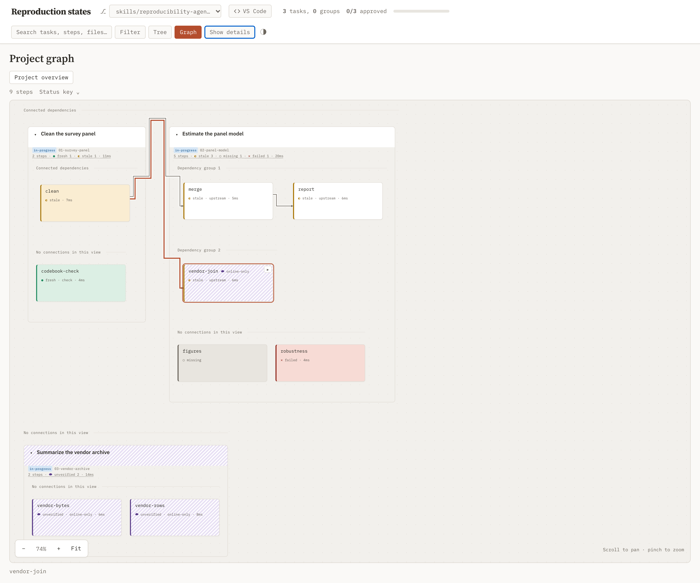
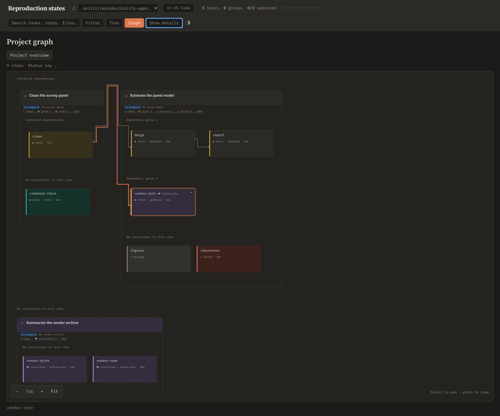
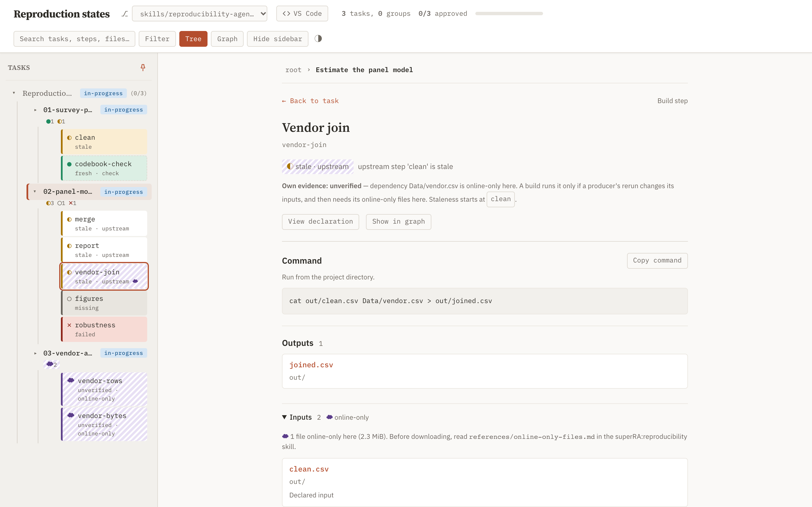
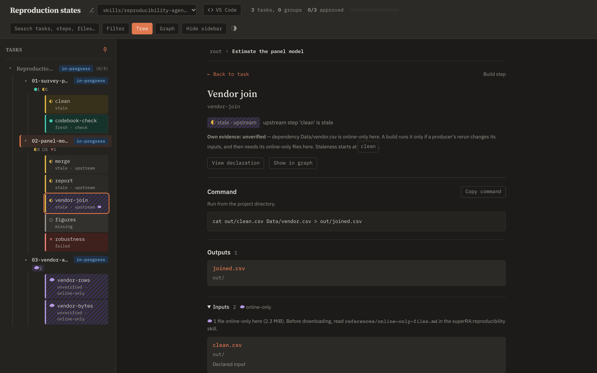
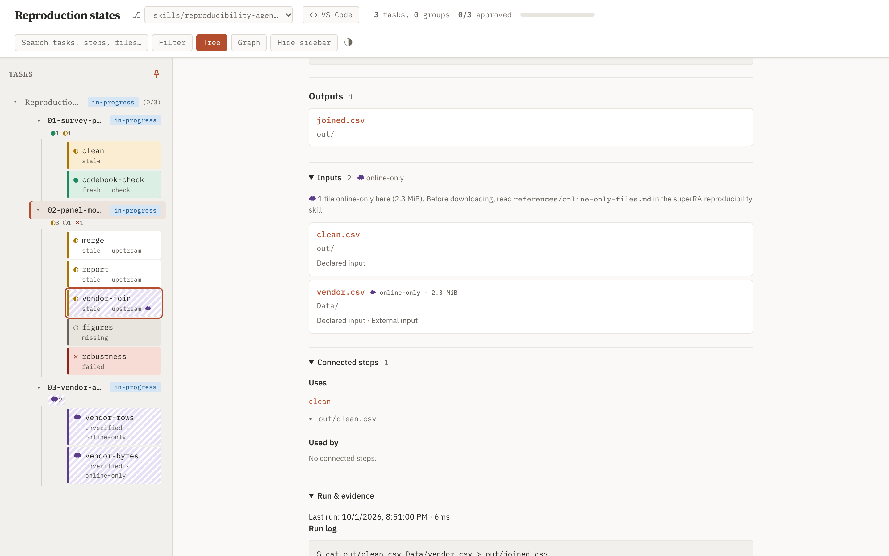
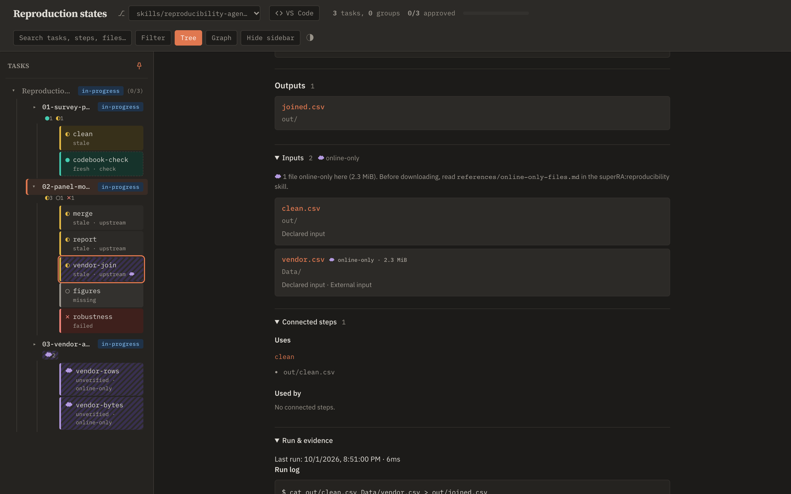
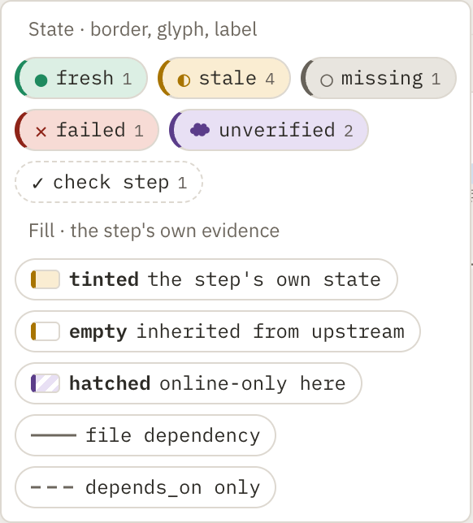
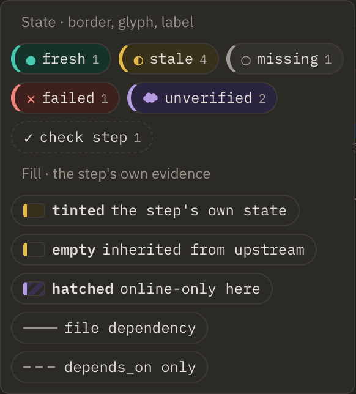
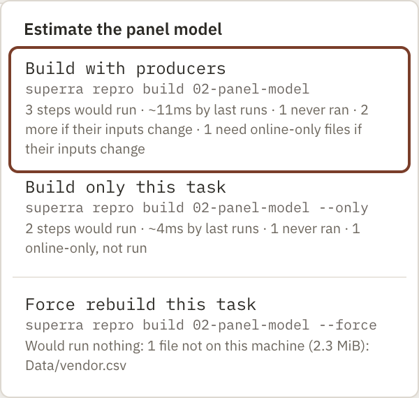
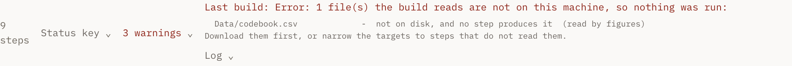

## Objective

Extend the dashboard's reproduction design language so a reader sees at a glance, in the Graph, the Tree, and the step panel, three things: each step's state, which step a staleness starts at, and which steps and files are online-only on this machine.

- **One rule splits each card into two channels.**

  | Card part | Shows | Values |
  |---|---|---|
  | **Left border, glyph, label** | the reported state | its state hue, as today |
  | **Fill** | the step's own state | a tint of its own state's hue (today's look); **empty** when its own state is `fresh` but it is reported `stale` (inherited); **diagonal hatching** in the `unverified` hue when its own state is `unverified` |

  - Today's cards keep their look whenever the two states agree. Only the step where staleness starts has a stale tint; its descendants show a stale border around an empty fill and the label `stale · upstream`.
  - An `unverified` step shows a cloud glyph and the label `unverified · online-only`. If its producer is also stale, it gets a stale border around hatching.
- **Reserved meanings stay put.** Dashed borders mean a check step ([dashboard.css:1704](../../../../skills/task-tree/scripts/templates/dashboard.css#L1704)); dashed wires mean `depends_on` only. Fading means a zero-count legend item ([:1592](../../../../skills/task-tree/scripts/templates/dashboard.css#L1592)) and an unfocused wire during edge focus ([:2527](../../../../skills/task-tree/scripts/templates/dashboard.css#L2527)). The new channels use neither.
- **Tokens.** Replace the `--rp-external` tokens with `--rp-unverified` in both themes, and remove `external` from `REPRO_STATES`, filters, and the legend.
- **Task rollups.** Group nodes and Tree rows count their steps per state, with the same glyphs. A task whose steps are all `unverified` gets the hatched fill.
- **Step panel.**
  - The state line shows the reported state with its reason. When the step's own state differs, a second line reads "Own evidence: fresh" (or `unverified`), followed by when the step would rerun and a link to the origin step.
  - Input and output lists mark each online-only file with the cloud glyph and its size, and lead with a summary: "N files online-only here (size)", followed by a pointer to [online-only-files.md](../../../../skills/reproducibility/references/online-only-files.md).
- **Legend.** Two groups: the states (`fresh`, `stale`, `missing`, `failed`, `unverified`), and how to read a fill (tinted = the step's own state, empty = inherited from upstream, hatched = online-only here).
- **Build menu.** Build (with producers), only this, and force, end to end:
  - the command string ([dashboard.js:2277](../../../../skills/task-tree/scripts/templates/dashboard.js#L2277)) and the scope helper `reproBuildScope` ([dashboard.js:2297](../../../../skills/task-tree/scripts/templates/dashboard.js#L2297));
  - the cost estimate, which today counts every step in scope under force ([dashboard.js:2316](../../../../skills/task-tree/scripts/templates/dashboard.js#L2316));
  - the `POST /api/repro/build` body, which gains `only`, and `_build_args` ([plan_dashboard.py:1860](../../../../skills/task-tree/scripts/plan_dashboard.py#L1860));
  - a build the download gate stops shows the gate's file list instead of a generic error.
- **Docs.**
  - [internals.md](../../../../skills/task-tree/references/internals.md): §Graph actions, and the reproduction workspace description.
  - The [docs-site dashboard page](../../../../docs/site/04-utility-skills/01-task-tree/04-dashboard/task.md): line 26's Build menu, and how to read a card.

### Constraints

- **State is never carried by color alone:** each channel also has a glyph or label. Hatching stays light enough for text to meet contrast in both themes.
- **Wires.** Dashed wires already mean `depends_on` only. The upstream channel lives on card borders, never on wires.

### Validation

- Browser screenshots of the Graph and the Tree, in light and dark themes, on a fixture holding each state. The fixture includes an own-stale step with two inherited-stale descendants, an `unverified` task, an `unverified` step with a stale producer, and a check step. Attach them to `## Results`.
- [test_dashboard.py](../../../../skills/task-tree/scripts/test_dashboard.py) and [tests/test_dag_workspace_browser.py](../../../../skills/task-tree/scripts/tests/test_dag_workspace_browser.py) cover the new classes, the panel's own-evidence line, the online-only file list, the legend, and the Build menu's `only` request.

## Details

- **Current design language.** Each state has a tinted background, a colored left border, and a glyph ([dashboard.css:68-72](../../../../skills/task-tree/scripts/templates/dashboard.css#L68-L72) light, [:128-132](../../../../skills/task-tree/scripts/templates/dashboard.css#L128-L132) dark, classes at [:1731-1750](../../../../skills/task-tree/scripts/templates/dashboard.css#L1731-L1750)). Glyphs live in `REPRO_STATES` ([dashboard.js:1059-1066](../../../../skills/task-tree/scripts/templates/dashboard.js#L1059-L1066)), and the legend in [dashboard.js:1881-1896](../../../../skills/task-tree/scripts/templates/dashboard.js#L1881-L1896).
- **Where the inherited state is computed.** The dashboard already receives `status`, `reason`, and `local_status` per step and prints "For saved inputs: …" in the panel ([dashboard.js:2233](../../../../skills/task-tree/scripts/templates/dashboard.js#L2233)). Inherited-only means `status` is `stale` while `local_status` is `fresh` or `unverified`.
- **Review focus.** This task is mostly visual judgment. A review should look at the screenshots, not only the tests.

## Results

Every step card in the Graph, the Tree, the task-page step table, the step panel, and the explain card now shows two things. Its border, glyph, and label show the reported state. Its fill shows the step's own state: a tint, an empty fill when the staleness is inherited, or hatching when files are online-only. The Build menu sends `only`, and its estimate stops where the runner's download gate would. A build stopped by the gate, or a step stopped at its start, shows the files it needs. `/api/file-peek` never reads an online-only file. On the every-state fixture below, only `clean` has a stale tint; `merge` and `report` have empty fills labelled `stale · upstream`; `vendor-join` has a stale border around hatching; the `03-vendor-archive` task is hatched.

### How a card reads

- **One mapping, `reproChannels`** ([dashboard.js:1091](../../../../skills/task-tree/scripts/templates/dashboard.js#L1091)). It returns the reported state's class, glyph, and label, plus a fill modifier:

  | Own state vs reported | Fill class | Label |
  |---|---|---|
  | Same | none (today's tint) | the state |
  | Own `fresh`, reported `stale` | `rp-inherited`: the card surface | `stale · upstream` |
  | Own `unverified`, reported `unverified` | `rp-hatched` | `☁ unverified · online-only` |
  | Own `unverified`, reported `stale` | `rp-hatched` | `stale · upstream`, plus a `☁ online-only` tag beside the name |

- **Hatching keeps text contrast.** Light theme: the stripes are the unverified wash on the card surface, two surfaces `--text` and `--rp-ink-2` already clear 4.5:1 on. Dark theme: the wash sits too close to `--bg-card` to read as stripes, so it takes 10% of the unverified ink. `--rp-ink-2` keeps about 4.8:1 on the stripe. The pattern is one token, `--rp-hatch` ([dashboard.css:77](../../../../skills/task-tree/scripts/templates/dashboard.css#L77), dark [:141](../../../../skills/task-tree/scripts/templates/dashboard.css#L141)). A first draft used 16% ink stripes, which dropped `--rp-ink-2` to about 4.0:1 in light and 4.3:1 in dark.
- **The cloud is a text glyph** (U+2601 U+FE0E). Menlo and IBM Plex Mono draw it as a squat mark, so `.repro-cloud` and the unverified glyph use Hiragino Sans or Lucida Grande ([dashboard.css:1769](../../../../skills/task-tree/scripts/templates/dashboard.css#L1769)).
- **Tokens.** `--rp-external` became `--rp-unverified` in both themes, with the same validated purple. `external` is gone from `REPRO_STATES`, the legend, the class rules, `reproExplainable`, and the estimate. The view had no state filter to update.
- **Reserved meanings are unchanged.** The new channels use no dashed borders and no fading. Check steps had lost their `is-check` class in an earlier rewrite, though the CSS rule was still there. The class is back, so check cards are dashed again, and check rows in the Tree are too.

### Graph, Tree, panel, legend

- **Task rollups** (`reproRollup`, [dashboard.js:1082](../../../../skills/task-tree/scripts/templates/dashboard.js#L1082)) count each task's steps by reported state, using the state glyphs.
  - On a task card, the rollup replaces the summary line.
  - Under a Tree row, it is a compact line (`◐3 ○1 ✕1`) of its own, so the row's slug and title keep the width they had before this task.
  - A task whose steps all have own state `unverified` gets hatching: the whole card when collapsed, the head band when expanded, or the badge in the Tree.
- **Tree step rows** (`syncTreeSteps`, [dashboard.js:574](../../../../skills/task-tree/scripts/templates/dashboard.js#L574)) used to show only the step name. Each row now shows the glyph, name, and label, with the same border and fill as a card. A selected row has an accent outline, so its fill stays visible.
- **Step panel** (`renderReproDetail`, [dashboard.js:2264](../../../../skills/task-tree/scripts/templates/dashboard.js#L2264)).
  - The status chip carries both channels.
  - When the step's own state differs, a second line reads `Own evidence: fresh.` or `Own evidence: unverified — <reason>.` For `fresh` it says a build reruns the step only if a producer's rerun changes its inputs. For `unverified` it adds that the step then needs its online-only files here. It links the origin step, and it replaces "For saved inputs: …".
  - Outputs and Inputs start with a summary (`1 file online-only here (2.3 MiB)`) and a pointer to `references/online-only-files.md`. Each online-only file shows the cloud tag and its size. The Inputs header carries the tag too, and that section opens by default when it holds online-only files.
- **Online-only files are never read for a preview.** `_file_peek` ([plan_dashboard.py:1597](../../../../skills/task-tree/scripts/plan_dashboard.py#L1597)) tests `is_online_only` right after its `stat`. For an online-only file or folder, or a legacy Dropbox placeholder, it returns `online_only`, the size `SF_DATALESS` knows, and `mtime_ns`, and reads and lists nothing. The hover card and the in-page file view (`loadProjectFile`, [dashboard.js:3598](../../../../skills/task-tree/scripts/templates/dashboard.js#L3598)) show "Online-only here (2.3 MiB): no preview…" with the `online-only-files.md` pointer. They offer no Download link and never request `/files/` for the path.
- **Legend** ([dashboard.js:1903](../../../../skills/task-tree/scripts/templates/dashboard.js#L1903)) has two groups. *State · border, glyph, label* lists the five states, with `unknown` only when present, plus check step. *Fill · the step's own evidence* lists tinted, empty, and hatched, each with a swatch.













 

### Build menu and the download gate

- **Three items:** Build with producers (`superra repro build X`), Build only this task or step (`--only`), and Force rebuild (`--force`). The page sends `{target, only, force}`. `_build_args` emits `--only` ([plan_dashboard.py:1860](../../../../skills/task-tree/scripts/plan_dashboard.py#L1860)), and the job record stores `only` in place of `upstream`.
- **The estimate follows the runner's rule** (`reproBuildEstimate`, [dashboard.js:2369](../../../../skills/task-tree/scripts/templates/dashboard.js#L2369)).
  - It runs the steps whose own state is `stale`, `missing`, or `failed`, plus the forced targets. Force covers the targets, not every step in scope.
  - An inherited-stale step whose origin is in scope counts as "more if their inputs change". An own-`unverified` one counts as "need online-only files if their inputs change"; any other `unverified` step counts as "online-only, not run".
  - `reproGatedFiles` ([dashboard.js:2398](../../../../skills/task-tree/scripts/templates/dashboard.js#L2398)) mirrors the runner's `_gate`. If a step that will run reads a file that is online-only, or absent with no producer, and no running step writes it first, the item reads "Would run nothing: N file(s) not on this machine (size): <files>". On the fixture, Force for `02-panel-model` reads "Would run nothing: 1 file not on this machine (2.3 MiB): Data/vendor.csv", which matches `superra repro build --dry-run --force`.
- **Build detail.** `_build_summary` ([plan_dashboard.py:1987](../../../../skills/task-tree/scripts/plan_dashboard.py#L1987)) returns the lines that explain the summary as `detail`, and the page prints them under "Last build".
  - After an `Error:` summary, the detail is the lines that follow it: the download gate's file list. A real gated build on the test fixture returned `code/fetch.sh  -  not on disk, and no step produces it`.
  - After a step count, the detail is each failed step's block, capped at 12 lines. A step stopped at its start names its files there, for example `vendor-join` behind a rebuilt `clean`.
  - The runner needed no change: its step-start refusal already prints the files with the gate's capped list format.





### Docs

- [internals.md](../../../../skills/task-tree/references/internals.md). A new **Card channels** paragraph sits after the workspace description. §Graph actions covers the three modes, `{target, only, force}`, the estimate rule, and `detail`. The file-preview paragraph notes that online-only files never preview.
- [Docs-site dashboard page](../../../../docs/site/04-utility-skills/01-task-tree/04-dashboard/task.md). The state list now reads `unverified`. A "Read a card in two parts" list explains the two channels and the three fills. The Build menu paragraph names the three items and the gate.

### Deviations and decisions

- **The state-fixture browser tests live in a new module,** [tests/test_repro_states_browser.py](../../../../skills/task-tree/scripts/tests/test_repro_states_browser.py), not in `test_dag_workspace_browser.py`. Each module runs one in-process server bound to the global `PLAN_ROOT`, so two module-scoped fixtures in one file would serve the wrong tree. `test_dag_workspace_browser.py` keeps its menu test, updated to the new labels and `--only`.
- **The fixture uses realistic slugs** (`01-survey-panel`, `02-panel-model`, `03-vendor-archive`). At the default sidebar width they still truncate (`01-survey-p…`), because the row's title and status badge already filled it before this task. The browser test checks that the rollup line leaves each slug's width unchanged.

### Out of scope, found while working

- **Sidebar rows sometimes land out of order** (01, 03, 02), even on a freshly loaded Tree page. This bug predates this task: the unchanged code showed it in one of two runs. [screenshots.py](attachments/screenshots.py) reloads the Tree until the rows read in tree order, and fails after five tries.

### Verification

- **Tests.** The full suite, playwright included, passed: 1123 tests, none skipped. Command: `uv run --with pytest --with playwright --with pyyaml --with fastapi --with jinja2 --with 'uvicorn[standard]' --with watchfiles --with httpx python -m pytest skills/task-tree/scripts`.
  - [test_dashboard.py](../../../../skills/task-tree/scripts/test_dashboard.py):
    - the card classes, the hatched task card, and both legend groups, rendered under node;
    - the estimate for each mode on an inherited-stale and an unverified fixture;
    - `_build_args` with `--only`;
    - `_build_summary` keeping an error's lines, each failed step's block, and the 12-line cap;
    - a live `only` build stopped by the gate, whose job carries the file in `detail`;
    - the Force estimate stopping at the gate, and an input that a running step writes first not counting;
    - `/api/file-peek` answering an `SF_DATALESS` file, an `SF_DATALESS` folder, and a legacy placeholder from the stat, with `open` and `scandir` refusing those paths.
  - [test_repro_states_browser.py](../../../../skills/task-tree/scripts/tests/test_repro_states_browser.py), on the every-state fixture with `SF_DATALESS` simulated:
    - the Graph classes and labels, the check class, the hatched task, and the legend text;
    - the Tree rollup, its unchanged slug widths, the step classes, and `fresh · check`;
    - the own-evidence lines, the origin link, the online-only summary and size, and the hover card's online-only note;
    - the in-page file view of `Data/vendor.csv`, which shows the note, has no Download link, and makes no `/files/` request;
    - the menu's `only` POST body, the Force item's gate text, and the gate detail rendering.
- **Screenshots are the `state-screenshots` step** in `## Reproduction` below. Its deps are [screenshots.py](attachments/screenshots.py), the fixture module, `plan_dashboard.py`, and the three page templates; its outs are the ten PNGs.
  - `superra repro build reproducibility/11-local-builds/03-state-display` ran the step (9.7 s, OlinStudio, Chrome); nothing was accepted. `superra repro status` then read it `fresh`.
  - The step has no saved inputs and no check steps. It reads the fixture's inputs from a temp directory it creates.
  - `superra task check` reports no warnings for this task.

## Reproduction

```yaml
steps:
  - name: state-screenshots
    cmd: uv run --with pytest --with playwright --with pyyaml --with fastapi --with jinja2 --with 'uvicorn[standard]' --with watchfiles --with httpx python superRA/reproducibility/11-local-builds/03-state-display/attachments/screenshots.py
    deps:
      - superRA/reproducibility/11-local-builds/03-state-display/attachments/screenshots.py
      - skills/task-tree/scripts/tests/test_repro_states_browser.py
      - skills/task-tree/scripts/plan_dashboard.py
      - skills/task-tree/scripts/templates/base.html
      - skills/task-tree/scripts/templates/dashboard.js
      - skills/task-tree/scripts/templates/dashboard.css
    outs:
      - superRA/reproducibility/11-local-builds/03-state-display/attachments/graph-light.png
      - superRA/reproducibility/11-local-builds/03-state-display/attachments/graph-dark.png
      - superRA/reproducibility/11-local-builds/03-state-display/attachments/legend-light.png
      - superRA/reproducibility/11-local-builds/03-state-display/attachments/legend-dark.png
      - superRA/reproducibility/11-local-builds/03-state-display/attachments/tree-light.png
      - superRA/reproducibility/11-local-builds/03-state-display/attachments/tree-dark.png
      - superRA/reproducibility/11-local-builds/03-state-display/attachments/panel-light.png
      - superRA/reproducibility/11-local-builds/03-state-display/attachments/panel-dark.png
      - superRA/reproducibility/11-local-builds/03-state-display/attachments/build-menu.png
      - superRA/reproducibility/11-local-builds/03-state-display/attachments/build-gate.png
```
