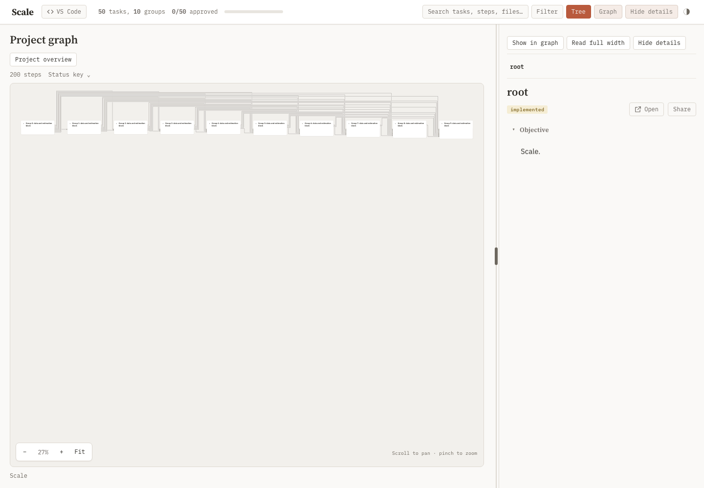
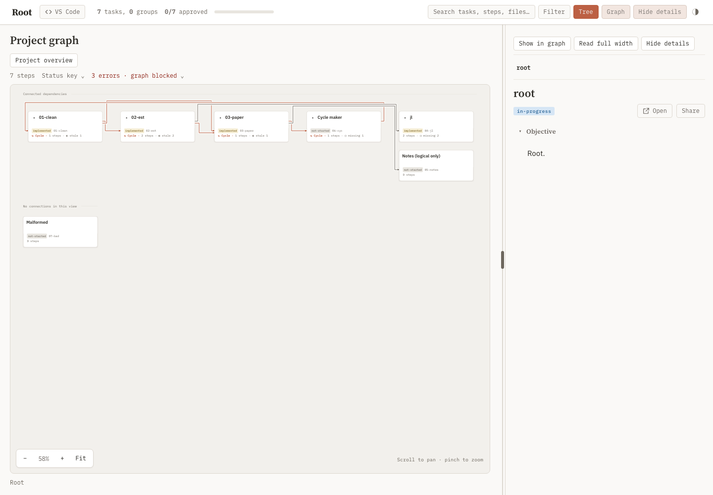
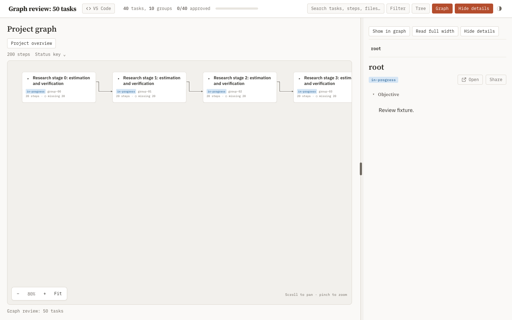
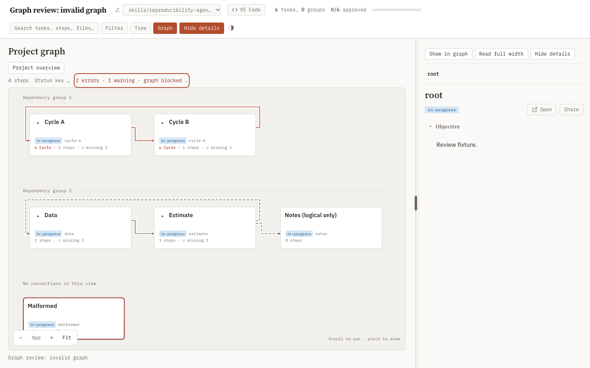

## Objective

Fix six problems in the dashboard's Graph view, where task nodes expand into their steps: three a researcher sees on screen and three in the code behind them. The [navigation contract](../../04-dashboard-view/scalable-navigation/attachments/design.md) is the specification. A headless-browser review on 2026-09-28 found each problem, and the screenshots below come from it.

### Problems a researcher sees

1. **The graph opens too small to read.** On open, the view shrinks the whole graph to fit the canvas, with no minimum zoom. With 7 tasks it opens at 58%. With 50 tasks in 10 top-level groups it opens at 27%: task titles are about 3 px tall, and every edge runs through one bundle above the cards, so nobody can tell which task feeds which. The contract asks for a readable initial scale, with Fit as an explicit button.
   - **Fix:** open near 80%, centered on the selected task; keep Fit as a button.

   

2. **A written prerequisite looks the same as a file dependency.** An edge from `depends_on` and an edge inferred from one step reading another's output are drawn identically (both use the `rp-wire` style). The words "Logical prerequisite" appear only in a popup after clicking the edge. In the screenshot below, the edge into "Notes (logical only)" looks like every file edge.
   - **Fix:** draw logical edges distinctly, for example dashed.

3. **A broken task looks like an empty one.** A task whose `## Reproduction` block fails to parse shows "0 steps" with no error marker, filed under "No connections in this view". It is indistinguishable from a task that simply has no steps, although the header reports "3 errors · graph blocked".
   - **Fix:** mark the card as an error and link it to its finding.

   

### Problems in the code behind it

4. **Dead code from removed views.** About 100 lines of [dashboard.js](../../../../skills/task-tree/scripts/templates/dashboard.js) serve the trace, scope, and tier modes, which no longer exist. Tests still exercise that code, so every dashboard change has to keep dead code working. One piece still shows users a notice naming a control that is gone: "Use Whole project to recover".
   - The code: `reproSearch` (never called); `reproBranchExpansion`, `reproBoundaryHTML`, and `reproLogicalBoundaryHTML` (called only from tests); the walk, anchor, mode, and roots state in `reproProject`, which navigation always resets; and the "Outside scope" labels.
   - The older dependency views: the `/dag` Mermaid page and `dag.html`, reached only by tests, and the `buildChildFlow` mini-graph, which duplicates the Graph view.
   - **Fix:** remove all of it with the tests that pin it.

5. **The graph data repeats itself.** `/api/repro/graph`, the endpoint the Graph view loads, returns 352 KB at 200 steps, and about 40% of it is repeated:
   - `task_edges` repeats `dependencies.edges`, and `boundaries` repeats the edge evidence.
   - Every finding is sent twice, and the browser removes the copies by comparing JSON strings pairwise, which grows with the square of the number of findings.
   - One cycle is reported both as a step cycle and as a dependency cycle.
   - **Fix:** send each fact once.

6. **The layout code cannot be reviewed.** `reproHierarchyLayout` is about 80 lines of 300–900 characters each, so a change to the layout cannot be read in a diff. Speed is fine: layout takes 16 ms and drawing 38 ms at 200 expanded steps.
   - **Fix:** reformat the layout and edge router so a diff can be read; keep the algorithm.

### Validation

A headless browser runs a 50-task, 200-step fixture collapsed and fully expanded, plus an invalid-graph fixture, with no page errors. Problems 1–3 are checked on screenshots, and 4–6 in the code and payload. The contract items the review found already met stay met:

- one hierarchy, with task nodes expanding into steps;
- logical edges ending at the task boundary, even for expanded tasks or tasks with no steps;
- labeled cycles under a "graph blocked" header, with nothing offered for execution;
- diagnostics that separate malformed steps from steps caught in a cycle.

Owning task: [scalable-navigation](../../04-dashboard-view/scalable-navigation/task.md).

## Results

All six problems are fixed. The [review script](attachments/graph_review.py) passes every check on a 50-task, 200-step fixture and on an invalid-graph fixture, with no page errors ([measurements.json](attachments/browser/measurements.json)). The contract items the 2026-09-28 review found met stay met: one hierarchy with task nodes expanding into steps, logical edges ending at task boundaries, labeled cycles under the "graph blocked" header, and diagnostics that separate a malformed declaration from a step cycle.

### What a researcher sees

- **The graph opens at 80%.** [reproOpen](../../../../skills/task-tree/scripts/templates/dashboard.js) opens on the selected step or task: centered when it fits the canvas, otherwise from its top-left corner, clamped to the graph's edges. A graph that fits whole at 80% or more opens fitted. **Fit** and **Project overview** still fit on request.
  - The 50-task fixture opened at 30% collapsed and 1.4% fully expanded; it now opens at 80% in both. Fit still gives 30%.

  

- **Written prerequisites are dashed.** An arrow whose every connection is a `depends_on` is dashed and its label says `depends_on`; an arrow carrying any file connection stays solid. The Status key shows both styles.
- **A broken task is marked.** A card whose declaration has an error gets a red outline and an "✕ 1 error" link that opens the diagnostics on its finding. A folded parent carries the errors inside it.
- **Only real cycles are labeled.** Following [03-readiness-model](../03-readiness-model/task.md), step cycles and `depends_on` cycles are marked; a loop that appears only when file edges are grouped by task is not. Before, the layout labeled any such loop "Task-group cycle".
  - In the screenshot below, Data and Estimate form a loop (Estimate reads Data's output; Data `depends_on` Estimate) and are not marked. Cycle A and Cycle B, whose steps read each other's outputs, are.
  - The diagnostics now say errors block "builds of the steps they touch" instead of "graph is not executable"; the header still reads "graph blocked".

  

### What changed in the code

- **Dead code is gone, with the tests that pinned it.**
  - [dashboard.js](../../../../skills/task-tree/scripts/templates/dashboard.js): `reproSearch`, `reproBranchExpansion`, `reproBoundaryHTML`, `reproLogicalBoundaryHTML`, `reproRoots`, `reproMatches`; the `roots` / `mode` / `anchor` / `view` navigation state, the trace walk in `reproProject`, and `_reproContext`; the "Outside scope" labels and the "Use Whole project to recover" notice; the `explore` / `focus` / `find-task` / `clear` click actions.
  - The `/dag` route with `dag.html`, and `buildChildFlow` with its `↳ after:` card footers and CSS.
  - Legacy scope, trace, and tier URLs still normalize to the full map.
- **Each fact travels once.**
  - [graph_to_dict](../../../../skills/task-tree/scripts/_repro.py) drops `task_edges`; its `dependencies` block keeps `tasks`, `archived_tasks`, and the `depends_on` edges as `logical`. The client groups file edges from `step_edges`, including the reader's Task dependencies list.
  - The status route drops `findings`, and the children-graph route drops `boundary`, `valid`, and `findings`. The client reads findings once and no longer compares them as JSON strings.
  - On the 200-step fixture the graph payload falls from 168.5 KB to 104.5 KB (−38%). The invalid fixture's 3 findings were sent 7 times and are now sent 3 times.
  - The cycle reported both as a step cycle and as a dependency cycle did not reproduce after 03: a step cycle is one finding.
- **The layout reads in a diff.** `reproHierarchyLayout` was 80 lines of up to 390 characters; it is now about 270 lines of at most 111, split into ranking, banding, port reservation, sizing, placement, and routing. The Tarjan pass moved to `reproStronglyConnected`, which cycle marking also uses. The algorithm is unchanged: on 3,000 random nested models the old and new functions return identical positions, bands, and routes ([layout_equivalence.js](attachments/layout_equivalence.js), against the [base function](attachments/layout_before.js)). At 200 expanded steps, layout takes 4 ms and drawing 15 ms.

### Limits

- Click handlers unrelated to the removed modes still have no emitter: `center`, `refresh`, `reader`, `close-detail`, `open`.
- Each step in the graph payload still repeats its declared inputs across `deps`, `declared_deps` (unused by the client), and `dependency_origins`.
- The objective's 352 KB figure came from the review's own fixture; this fixture measures 168.5 KB before the change, 36% of it `task_edges`, grouped edges, and boundary views.
- Three steps owned by other tasks read the edited files and are now stale: `dashboard-navigation-heterogeneity` (scalable-navigation), `dashboard-dag-design-browser` (dag-design), and `task-scoped-builds-pilot`. They write into their owners' attachments and were not rebuilt here. Twelve other check steps read `missing` because they were never stamped in this worktree; their test files pass in the suite below.
  - `dashboard-navigation-heterogeneity` replays a research-graph snapshot captured in the old payload shape, which has no `logical` edges. Run against this change into a scratch directory, it opens at 80% with no page errors, and the synthetic 500-step run passes. Recapture the snapshot with [navigation_snapshot.py](../../../../skills/task-tree/scripts/tests/navigation_snapshot.py) at fold-back.
- `test_resized_desktop_preview_fits_phone_with_all_toolbar_controls` fails intermittently when the whole browser file runs, before and after this change; it passes alone.

### Verification

- The review script's 17 checks: 11 fail at the base commit `7acbc7f7`, all pass here. The before figures above come from that base run.
- New regression tests: [depends_on and step cycles only](../../../../skills/task-tree/scripts/tests/test_navigation_projection.py), declaration errors on folded ancestors, the error card and dashed edge in [test_dashboard.py](../../../../skills/task-tree/scripts/test_dashboard.py), findings sent once, and the [80% open](../../../../skills/task-tree/scripts/tests/test_dag_workspace_browser.py) in a browser.
- Deferred advisories: `workspaceGraph` filters `dependencies.logical` (the payload's edge list) and no longer touches the removed `edges`/`boundaries`; the unreferenced `reader`, `refresh`, and `center` click handlers are gone.
- The task-tree suite and harness tests: 1,433 passed, 9 skipped, and the intermittent browser test above failed once.

## Reproduction

```yaml
steps:
  - name: dashboard-graph-review
    cmd: uv run --with playwright --with pyyaml --with fastapi --with jinja2 --with 'uvicorn[standard]' --with watchfiles --with httpx python superRA/reproducibility/14-review-revisions/06-dashboard/attachments/graph_review.py --evidence superRA/reproducibility/14-review-revisions/06-dashboard/attachments/browser
    deps:
      - superRA/reproducibility/14-review-revisions/06-dashboard/attachments/graph_review.py
      - skills/task-tree/scripts/plan_dashboard.py
      - skills/task-tree/scripts/templates
      - skills/task-tree/scripts/vendor
      - skills/task-tree/scripts/_artifacts.py
      - skills/task-tree/scripts/_comments.py
      - skills/task-tree/scripts/_repro.py
      - skills/task-tree/scripts/_repro_state.py
      - skills/task-tree/scripts/_repro_scope.py
      - skills/task-tree/scripts/_repro_acceptance.py
      - skills/task-tree/scripts/_task_io.py
      - skills/task-tree/scripts/_task_dependencies.py
      - skills/task-tree/scripts/_task_snapshot.py
      - skills/task-tree/scripts/_task_validate.py
      - skills/task-tree/scripts/_worktree_discovery.py
      - skills/task-tree/scripts/cli.py
      - skills/task-tree/scripts/task_comment.py
    outs:
      - superRA/reproducibility/14-review-revisions/06-dashboard/attachments/browser
  - name: layout-equivalence-check
    kind: check
    cmd: node superRA/reproducibility/14-review-revisions/06-dashboard/attachments/layout_equivalence.js
    deps:
      - superRA/reproducibility/14-review-revisions/06-dashboard/attachments/layout_equivalence.js
      - superRA/reproducibility/14-review-revisions/06-dashboard/attachments/layout_before.js
      - skills/task-tree/scripts/templates/dashboard.js
  - name: dashboard-graph-review-check
    kind: check
    cmd: "uv run --with pytest --with playwright --with pyyaml --with fastapi --with jinja2 --with 'uvicorn[standard]' --with watchfiles --with httpx python -m pytest skills/task-tree/scripts/tests/test_navigation_projection.py skills/task-tree/scripts/tests/test_dag_workspace_browser.py::test_a_large_graph_opens_readable_on_the_selected_task skills/task-tree/scripts/test_dashboard.py::TestReproFindingsRendering skills/task-tree/scripts/test_dashboard.py::TestReproNavigationRepair skills/task-tree/scripts/test_dashboard.py::TestReproRoutes::test_findings_travel_once_in_the_graph_payload skills/task-tree/scripts/test_repro.py::TestEdges::test_json_serialization_round_trips skills/task-tree/scripts/test_task_dependencies.py::test_dashboard_children_payload_uses_global_snapshot -q -p no:cacheprovider"
    deps:
      - skills/task-tree/scripts/tests/test_navigation_projection.py
      - skills/task-tree/scripts/tests/test_dag_workspace_browser.py
      - skills/task-tree/scripts/test_dashboard.py
      - skills/task-tree/scripts/test_repro.py
      - skills/task-tree/scripts/test_task_dependencies.py
      - skills/task-tree/scripts/conftest.py
      - skills/task-tree/scripts/plan_dashboard.py
      - skills/task-tree/scripts/templates
      - skills/task-tree/scripts/vendor
      - skills/task-tree/scripts/_artifacts.py
      - skills/task-tree/scripts/_comments.py
      - skills/task-tree/scripts/_repro.py
      - skills/task-tree/scripts/_repro_state.py
      - skills/task-tree/scripts/_repro_scope.py
      - skills/task-tree/scripts/_repro_acceptance.py
      - skills/task-tree/scripts/_task_io.py
      - skills/task-tree/scripts/_task_dependencies.py
      - skills/task-tree/scripts/_task_snapshot.py
      - skills/task-tree/scripts/_task_validate.py
      - skills/task-tree/scripts/_worktree_discovery.py
      - skills/task-tree/scripts/cli.py
      - skills/task-tree/scripts/task_comment.py
```
