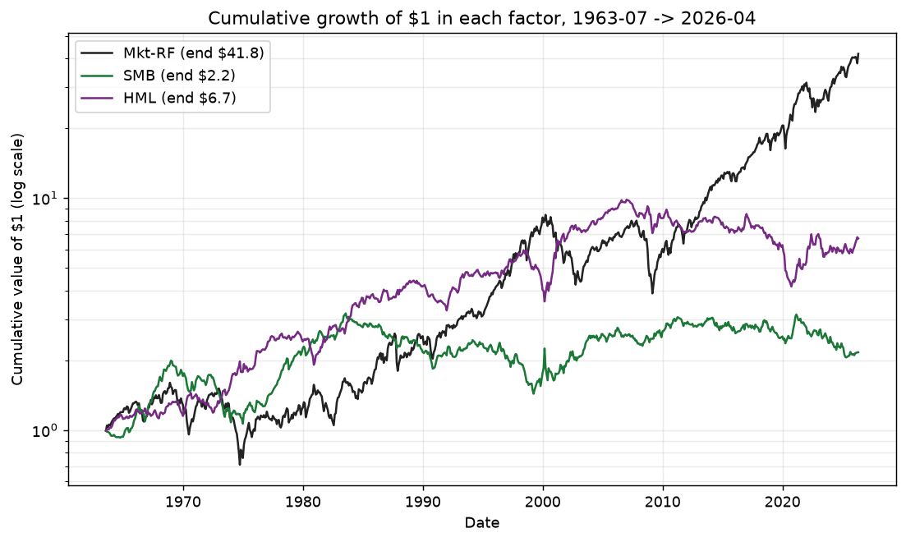
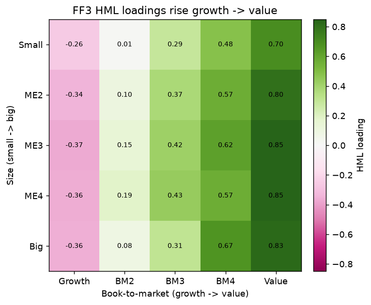

## Objective

The core of the study: estimate both factor models for the 25 portfolios, run the GRS joint test on each, and produce the showcase figures — one coherent estimate→test→visualize unit.

### Regressions

For each of the 25 portfolios, estimate by OLS on the baseline sample from `01-data`:

- **CAPM:** $R_{it}-R_{ft} = \alpha_i + \beta_i\,(\text{Mkt-RF})_t + \varepsilon_{it}$
- **FF3:** $R_{it}-R_{ft} = \alpha_i + \beta_i\,(\text{Mkt-RF})_t + s_i\,\text{SMB}_t + h_i\,\text{HML}_t + \varepsilon_{it}$

Record, per portfolio and model, the intercept $\alpha_i$ (percent/month), the factor loadings, OLS t-statistics, and $R^2$. Persist the full estimate table to `data/regression_estimates.parquet`, and retain each model's $25\times1$ alpha vector and $25\times25$ residual covariance for the GRS step.

### GRS joint test

Test the null that all 25 intercepts are jointly zero, for CAPM ($K=1$) and FF3 ($K=3$), with the Gibbons-Ross-Shanken (1989) statistic:

$$ \text{GRS} = \frac{T-N-K}{N}\,\Big(1 + \bar{f}'\,\hat{\Omega}^{-1}\,\bar{f}\Big)^{-1}\,\hat{\alpha}'\,\hat{\Sigma}^{-1}\,\hat{\alpha} \;\sim\; F_{N,\;T-N-K} $$

where $N=25$ test portfolios, $K$ factors, $T$ months, $\hat{\alpha}$ the $N\times1$ intercept vector, $\hat{\Sigma}$ the $N\times N$ (ML) residual covariance, $\bar{f}$ the $K\times1$ factor means, and $\hat{\Omega}$ the $K\times K$ factor covariance. Compute the statistic, its degrees of freedom $(N,\,T-N-K)$, and the p-value for each model. Report two economic summaries of the pricing errors: the mean absolute alpha, and the quadratic form $\hat{\alpha}'\hat{\Sigma}^{-1}\hat{\alpha}$ — which is the **squared Sharpe ratio of the maximal pricing-error portfolio**, equivalently the increment $Sh^2(\text{factors}+\text{test assets}) - Sh^2(\text{factors})$ to the maximum squared Sharpe ratio from adding the test assets to the factors (it is not a ratio of Sharpe ratios). Save to `data/grs_results.csv`.

### Figures

With matplotlib (PEP 723, headless `Agg`), save PNGs into this task's `attachments/`, each embedded in `## Results` with a self-contained caption:

1. **Alpha grids (CAPM vs FF3)** — two 5×5 heatmaps of the alphas on the size × book-to-market grid, shared diverging scale, so the collapse of pricing errors from CAPM to FF3 is visually immediate.
2. **Realized vs. predicted** — scatter of mean realized excess return against model-predicted return for the 25 portfolios under each model; distance off the 45° line is the pricing error, tighter under FF3.
3. **Cumulative factor returns** — cumulative growth of \$1 in `Mkt-RF`, `SMB`, `HML` over the sample.
4. **FF3 HML loadings across the grid** — illustrating the monotone growth-to-value gradient that lets FF3 price the value sort.

### Validation

Report the regression results as 5×5 grids (CAPM alphas, FF3 alphas with t-stats, FF3 SMB and HML loadings) and the GRS results as a two-model table in `## Results`. Check against the expected results in the root `### Context`: FF3 alphas smaller and less dispersed than CAPM; `SMALL LoBM` retains a notable negative FF3 alpha; HML loadings rise growth→value, SMB loadings fall small→big; both models typically rejected on the modern sample, with FF3's GRS statistic and mean absolute alpha well below CAPM's. Cross-check the GRS implementation directly on the residual covariance (confirm $\hat{\Sigma}$ symmetric positive-definite, $T-N-K>0$) rather than trusting a black-box one-liner. State each model's verdict (reject / fail to reject) explicitly, and flag any loading sign reversal before marking done.

## Results

Estimated CAPM and FF3 for all 25 size × book-to-market portfolios on the baseline panel (754 months, 1963-07 → 2026-04), ran the Gibbons-Ross-Shanken joint test on each, and produced the four showcase figures. The full pipeline ([../run_all.sh](../run_all.sh), `set -euo pipefail`) reproduces every output end-to-end: re-running `bash superRA/showcase-analysis/run_all.sh` rebuilds the panel and regenerates the estimates, GRS table, and figures with no manual steps.

**Script (committed):** [../analysis/02_analysis.py](../analysis/02_analysis.py) — PEP 723 / `uv run --script` (pandas, numpy, scipy, statsmodels, matplotlib, pyarrow), headless `Agg`. Jupytext percent format.

**Outputs:**
- [grs_results.csv](../data/grs_results.csv) — the two-model GRS table (committed; tiny, useful for the writeup).
- `data/regression_estimates.parquet` — full per-portfolio estimate table, 50 portfolio-model rows (gitignored as intermediate, per [../.gitignore](../.gitignore); rebuilt by the script).
- Figures in [attachments/](attachments/).

### Headline result

Adding SMB and HML to the market factor **halves the average pricing error** — mean |α| falls from 0.195 to 0.089 %/month and the alpha dispersion collapses (std 0.213 → 0.131) — yet **both models are still rejected** by the GRS test on the modern sample, exactly the textbook answer. FF3 explains most of the size-value cross-section but is defeated by a few precisely-estimated residual alphas, chiefly the small-growth corner.

| Model | GRS $F(df_1,df_2)$ | $p$-value | Verdict | mean \|α\| (%/mo) | $\hat\alpha'\hat\Sigma^{-1}\hat\alpha$ (monthly) |
|---|---:|---:|:--|---:|---:|
| CAPM | $F(25,728)=4.104$ | $1.7\times10^{-10}$ | **reject** $H_0$ | 0.195 | 0.1434 |
| FF3  | $F(25,726)=3.554$ | $1.8\times10^{-8}$  | **reject** $H_0$ | 0.089 | 0.1267 |

Both models **reject** the null that all 25 intercepts are jointly zero at any conventional level.

The last column is the quadratic form $\hat\alpha'\hat\Sigma^{-1}\hat\alpha$ — the **squared Sharpe ratio of the maximal pricing-error portfolio**, i.e. the increment $Sh^2(\text{factors}+\text{test assets}) - Sh^2(\text{factors})$ to the maximum monthly squared Sharpe ratio from adding the 25 test assets to the factors (not a ratio of Sharpe ratios). It barely moves (0.143 → 0.127) even as mean |α| halves: the residual pricing ability that defeats FF3 is concentrated in a handful of corners with large, sharply-estimated alphas rather than spread evenly, so a test that weights alphas by their precision (through $\hat\Sigma^{-1}$) still rejects strongly. For scale, the factors' own squared Sharpe is $Sh^2(\text{factors})=0.018$ (CAPM) and $0.035$ (FF3) per month.

### GRS implementation and cross-checks

The statistic is computed directly from the matrices in [`grs_test`](../analysis/02_analysis.py) — ML residual covariance $\hat\Sigma = \frac{1}{T}\hat\varepsilon'\hat\varepsilon$, ML factor covariance $\hat\Omega$, factor means $\bar f$ — using `np.linalg.solve` rather than explicit inverses, with no black-box one-liner. Preconditions and cross-checks (all enforced as run-time asserts, so `run_all.sh` fails fast on any violation):

- $\hat\Sigma$ **symmetric** (`allclose(Σ, Σ.T)`) and **positive-definite** — min eigenvalue 0.745 (CAPM), 0.226 (FF3), both $>0$.
- $T-N-K = 728 > 0$ (CAPM), $726 > 0$ (FF3).
- Quadratic form $\hat\alpha'\hat\Sigma^{-1}\hat\alpha$ **cross-checked** via an independent Cholesky solve ($L z=\hat\alpha,\ q=z'z$) — matches to `rtol=1e-8`.
- Full statistic **cross-checked** against the algebraic reformulation $\frac{T-N-K}{N}\cdot\frac{a}{1+b}$ from the stored scalars — matches to `rtol=1e-10`.

### Pricing-error grids (5×5 size × book-to-market)

The 25 columns are Ken French's row-major layout (size ME1→ME5 down rows, book-to-market BM1→BM5 — growth→value — across columns); the script asserts the grid layout equals the panel column order before plotting, so no heatmap can be silently scrambled.

**CAPM alphas (%/month):**

|        | Growth | BM2 | BM3 | BM4 | Value |
|:--|---:|---:|---:|---:|---:|
| Small | -0.528 | 0.057 | 0.115 | 0.337 | 0.472 |
| ME2   | -0.274 | 0.094 | 0.228 | 0.287 | 0.316 |
| ME3   | -0.226 | 0.115 | 0.143 | 0.276 | 0.346 |
| ME4   | -0.074 | 0.016 | 0.135 | 0.279 | 0.225 |
| Big   |  0.024 | 0.024 | 0.079 | 0.027 | 0.167 |

CAPM mis-prices the value sort badly: alphas climb monotonically growth→value in every size row (the market factor cannot explain the value premium), and the small-growth corner is a large negative −0.528.

**FF3 alphas (%/month), with OLS $t$-stats below:**

|        | Growth | BM2 | BM3 | BM4 | Value |
|:--|---:|---:|---:|---:|---:|
| Small | **-0.472** | 0.013 | -0.027 | 0.123 | 0.176 |
| ME2   | -0.176 | 0.028 | 0.063 | 0.050 | -0.014 |
| ME3   | -0.109 | 0.042 | -0.029 | 0.027 | 0.006 |
| ME4   | 0.051 | -0.062 | -0.034 | 0.056 | -0.106 |
| Big   | 0.166 | -0.002 | -0.031 | -0.221 | -0.144 |

| $t(\alpha)$ | Growth | BM2 | BM3 | BM4 | Value |
|:--|---:|---:|---:|---:|---:|
| Small | **-5.13** | 0.18 | -0.50 | 2.55 | 2.50 |
| ME2   | -2.70 | 0.53 | 1.15 | 1.06 | -0.28 |
| ME3   | -1.83 | 0.73 | -0.49 | 0.49 | 0.09 |
| ME4   | 0.87 | -1.00 | -0.54 | 0.87 | -1.39 |
| Big   | 4.11 | -0.04 | -0.50 | -3.79 | -1.49 |

FF3 flattens the value gradient — alphas no longer rise systematically growth→value — and shrinks the typical alpha toward zero. But the **small-growth corner `SMALL LoBM` keeps a large, highly significant negative alpha of −0.472 %/mo ($t=-5.1$)**, the classic problem portfolio that keeps the model rejected, together with a few other precisely-estimated cells (big-growth $+0.166$ at $t=4.1$, `ME5 BM4` $-0.221$ at $t=-3.8$).

### FF3 loadings — the size and value gradients (validation of model mechanics)

**FF3 SMB loadings** fall monotonically from small to big (row means small→big: 1.20, 0.88, 0.56, 0.27, **−0.19** — big portfolios load negatively on the small-minus-big factor, as expected):

|        | Growth | BM2 | BM3 | BM4 | Value |
|:--|---:|---:|---:|---:|---:|
| Small | 1.403 | 1.329 | 1.097 | 1.087 | 1.102 |
| ME2   | 1.047 | 0.926 | 0.764 | 0.742 | 0.898 |
| ME3   | 0.750 | 0.598 | 0.447 | 0.446 | 0.581 |
| ME4   | 0.411 | 0.233 | 0.171 | 0.237 | 0.303 |
| Big   | -0.232 | -0.187 | -0.211 | -0.200 | -0.112 |

**FF3 HML loadings** rise monotonically from growth to value (column means growth→value: **−0.337**, 0.107, 0.364, 0.581, 0.804 — growth portfolios load negatively, value positively on the high-minus-low factor). This growth→value gradient is precisely the mechanism that lets FF3 price the value sort the market factor alone cannot:

|        | Growth | BM2 | BM3 | BM4 | Value |
|:--|---:|---:|---:|---:|---:|
| Small | -0.259 | 0.014 | 0.289 | 0.479 | 0.695 |
| ME2   | -0.340 | 0.104 | 0.373 | 0.569 | 0.800 |
| ME3   | -0.367 | 0.146 | 0.417 | 0.622 | 0.850 |
| ME4   | -0.362 | 0.185 | 0.433 | 0.569 | 0.847 |
| Big   | -0.356 | 0.084 | 0.308 | 0.667 | 0.827 |

Both gradients are checked monotone in the run log, and hard sign-guard asserts confirm no loading sign reversal (HML value > growth, SMB small > big) before the script completes — **no sign reversals flagged.**

### Figures

**Figure 1 — Pricing errors collapse from CAPM to FF3.** Two 5×5 alpha heatmaps on a shared diverging scale centered at zero. The CAPM panel is saturated (deep red on the value/large-cap cells, deep blue on small-growth); the FF3 panel is visibly washed out toward white, mean |α| falling 0.195 → 0.089 %/mo. Small-growth (top-left) stays blue in both — the alpha FF3 cannot remove.

**Figure 2 — Realized vs. predicted mean excess return.** Each point is one portfolio; the $x$-axis is the model-predicted mean ($\hat\beta_i'\bar f$ = realized mean − alpha) and the $y$-axis the realized mean. Distance off the 45° line is the pricing error. Under CAPM the cloud is scattered and tilted off the diagonal; under FF3 the points hug the line — except the annotated small-growth portfolio, which sits far below in both.

**Figure 3 — Cumulative factor returns.** Growth of \$1 (log scale) in each factor over the sample. The market compounds to ~\$42, HML to ~\$6.7, SMB to ~\$2.2 — and HML's flat-to-declining run since the mid-2000s is visible, consistent with the well-documented post-2007 value drawdown.

**Figure 4 — FF3 HML loadings across the grid.** Heatmap of the FF3 HML loadings, diverging green (positive/value) vs pink (negative/growth). The clean left-to-right green gradient in every size row is the value-pricing mechanism made visual.

### Validation against the expected-results benchmark

Every benchmark in the root `### Context` is met, no divergences to flag:

- FF3 alphas smaller and less dispersed than CAPM (mean |α| 0.089 < 0.195; std 0.131 < 0.213). ✓
- `SMALL LoBM` retains a notable negative FF3 alpha (−0.472 %/mo, $t=-5.1$). ✓
- HML loadings rise monotonically growth→value; SMB loadings fall monotonically small→big; sign guards pass — no loading reversals. ✓
- Both models rejected on the modern sample, with FF3's GRS statistic (3.55 < 4.10) and mean |α| (0.089 < 0.195) well below CAPM's. ✓
