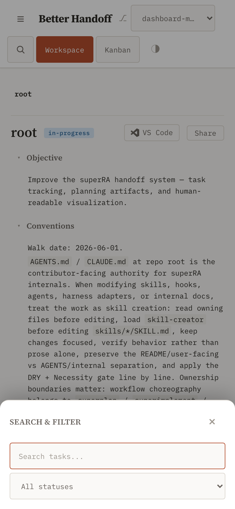
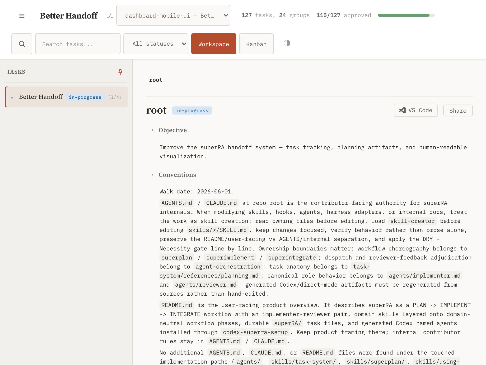

## Objective

Layer the mobile/touch polish onto the finalized layout from [`01-touch-sidebar`](../01-touch-sidebar/task.md). All edits in [`base.html`](../../../../../skills/task-system/scripts/templates/base.html); reuse the existing theme tokens and motion discipline.

- **Tap targets ≥ 44×44px on touch (iOS HIG).** Audit and enlarge the hit area of every control a phone/iPad user taps: the pin/collapse toggle, header hamburger, breadcrumb crumbs, view toggle, theme toggle, worktree selector, and the sidebar tree rows. Grow the hit area with padding / `min-height` / a pseudo-element hit-slop — **gated behind the coarse-pointer media query** so the desktop layout's compact density is untouched. Where a control must stay visually small, expand the tappable area without changing the rendered glyph size.
- **Phone search/filter reachable behind an icon.** On phone (≤620px) the search input (`.hc-search`) and status filter (`#filter-status`) are currently `display:none`. Add a single search/filter affordance (icon button) to the header that expands an overlay or bottom sheet containing **the existing search + filter elements** — move them into the expandable container at narrow widths rather than duplicating the inputs or their logic. The sheet closes on selection, `Esc`, and backdrop tap, and reuses the existing search/filter behavior unchanged.
- **Safe-area content insets.** Pad the detail panel and the header *content* with `env(safe-area-inset-*)` on phone so text/controls clear the notch and home indicator in both orientations. This complements the header/drawer chrome insets done in `01`; together they must leave no content under the notch or home indicator at any tested size.
- **Scroll ergonomics.**
  - `overscroll-behavior: contain` on the sidebar tree scroll, the detail panel, and the drawer so scrolling to the end of one region doesn't chain to the body or trigger pull-to-refresh.
  - `-webkit-tap-highlight-color: transparent` on tappable controls, paired with a real `:active` / `:focus-visible` affordance so taps don't flash the default gray box and still give feedback.
  - Give the children-DAG (`.children-dag`, `overflow-x:auto`) and the kanban board a visible horizontal-scroll affordance on touch (edge fade or scroll-snap) so they read as scrollable rather than clipped.
- Honor `@media (prefers-reduced-motion: reduce)` for any new transition (the search/filter sheet open/close).

**Validation:** With Playwright touch contexts (iPhone + iPad):

- Every named control's bounding box is ≥44×44px in the coarse-pointer layout.
- The phone search/filter affordance opens, searches and filters the tree using the existing logic, and closes on selection / `Esc` / backdrop tap.
- No content sits under simulated safe-area insets, and there is **no horizontal page overflow** at 390 / 768 / 1024px in either orientation.
- The children-DAG and kanban scroll horizontally with a visible affordance.
- Desktop is unchanged: at a 1280px mouse context, key control sizes and layout density match the pre-change baseline.
- `cd skills/task-system/scripts && pytest test_dashboard.py test_task_system.py` green; `node --check` passes.

## Planner Guidance

- The header controls (`.header-controls`, `.hc-search`, `.hc-select`, `#filter-status`, `.worktree-selector`), the phone `@media (max-width: 620px)` block, and the `.crumbs`/`.crumb` styles are the main surfaces here (CSS ≈ lines 470–520; header markup later in the file).
- Reuse the drawer's existing backdrop + focus-trap pattern for the search/filter sheet rather than inventing a second overlay mechanism.
- Prefer `@media (pointer: coarse)` for the tap-target enlargement so it tracks the same capability signal `01` uses for the sidebar, keeping mouse and touch layouts cleanly separated.

## Results

The touch/mobile polish now sits on top of 01's capability-aware sidebar: tap targets meet the iOS 44×44px floor, phone search/filter is reachable through a bottom sheet, content clears the notch and home indicator, and the scroll regions contain their overscroll with a visible horizontal-scroll affordance. Every change is gated behind `@media (pointer: coarse)` (tap targets / scroll affordance) or the existing phone width / capability signals, so the desktop mouse layout's compact density is byte-for-byte unchanged in effect. All edits are in the single dashboard source [`base.html`](../../../../../skills/task-system/scripts/templates/base.html); the live server and the static export render it identically.

### What changed

**Tap targets ≥ 44×44px, coarse-pointer only.** A new `@media (pointer: coarse)` block enlarges every control a touch user taps, using two techniques so visual density is preserved where a glyph must stay small:
- **Box-grown to 44px:** the view-toggle / Kanban buttons and the status + worktree selects (`.hc-btn`, `.hc-select`) and the in-sheet search input (`.hc-search`) get `min-height: 44px; padding: 10px 14px`; the breadcrumb crumbs get `min-height/min-width: 44px` with centered flex (the non-tappable *active* crumb and separators keep compact metrics); the sidebar tree rows (`.task-row`) grow to a 44px min-height, and the expand/collapse caret (`.task-toggle`) gets its own 28×44 hit area distinct from the row's navigate target.
- **Hit-slop without resizing the glyph:** the hamburger and theme toggle get `min-width/min-height: 44px`; the 24px pin-toggle chip keeps its rendered size but gains a centered 44×44 `::before` hit-slop; the expand/collapse caret keeps the small glyph but gets a 28×44 hit area via `.task-row > .task-toggle` (a higher-specificity child selector so it wins over the later unconditional `.task-toggle` base rule, not just a media-query wrapper that adds no specificity). The effective tap area was verified with `elementFromPoint` probes and direct `getBoundingClientRect()` measurement on a coarse/touch render (not just the visible box or the CSS string).
- **The phone search trigger is phone-only:** its 44×44 hit-slop sizing lives in a `@media (max-width: 620px) and (pointer: coarse)` block, and it is *not* in the coarse-pointer display group — so on a wide touch iPad (768–1366px, where the inline search box is still shown) the trigger stays hidden and there is exactly one search affordance per device class.
- Enlarging the *inline* header controls would push the row past a wide touch iPad's viewport (768–1366px, above the 620px phone breakpoint), so the coarse-pointer block also lets `.header` / `.header-controls` wrap — the same mechanism the 860px width block uses. This fixed a real horizontal-overflow regression caught at 1024px during verification.

**Phone search/filter reachable behind a sheet.** At ≤620px the inline `.hc-search-host` (which wraps the existing `#search-box` + `#filter-status`) is hidden and a phone-only search-trigger icon appears. Tapping it opens a bottom sheet that **adopts the live search/filter elements** (`body.appendChild(host)`) rather than duplicating inputs or their logic — their ids travel with them, so `applyFilters()` is reused verbatim. The sheet reuses the drawer's backdrop + focus-trap + Esc pattern (`openSearchSheet` / `closeSearchSheet` / `searchSheetKeydown`), returns the host to the header on close, and closes on a status selection (a "done filtering" signal, wired as a separate `change` listener in `initSearchSheet` so `applyFilters` stays untouched), on `Esc`, on backdrop tap, on a navigation selection (`onNavigationChrome` now also calls `closeSearchSheet`), and when the viewport widens past the 620px phone breakpoint while open (a `matchMedia('(max-width: 620px)')` change listener returns the host to the header instead of stranding it in the sheet — mirrors the drawer's resize-up drop). Free-text typing leaves the sheet open so input isn't interrupted.

**Safe-area content insets.** The detail panel (the full-width content area in drawer mode) pads its left/right/bottom with `max(<floor>, env(safe-area-inset-*))` so text/controls clear the notch (landscape) and home indicator; the bottom sheet pads its left/right/bottom likewise. This complements 01's header/drawer *chrome* insets — together no content sits under the system UI at any tested size (`env()` resolves to 0 on a non-notched device, so the existing padding floor is unchanged there).

**Scroll ergonomics.** `overscroll-behavior: contain` on the sidebar tree scroll and the detail panel, and `overscroll-behavior-x: contain` on the children-DAG and Kanban, so reaching the end of one region doesn't scroll-chain to the body or fire pull-to-refresh. `-webkit-tap-highlight-color: transparent` on the tappable controls kills the gray flash, paired with real `:active` press states (and the existing `:focus-visible` rings, kept for an iPad with a keyboard). The children-DAG and Kanban get a trailing-edge `mask-image` fade plus, on the Kanban, `scroll-snap-type: x proximity` with `scroll-snap-align` columns, so a clipped horizontally-scrollable region reads as scrollable on touch. All new transitions are covered by the existing universal `@media (prefers-reduced-motion: reduce)` duration override (verified: the sheet's `transition-duration` collapses to ~0 and it still opens/closes correctly under reduced motion).

### Verification (real device path, not CSS-only)

Drove the live server (`superra dashboard --foreground --no-open --port 57841`) with Playwright (Chromium, `hasTouch`/`isMobile` contexts) across the full matrix. **All 48 behavioral checks passed:**

| Context | What was asserted |
|---|---|
| iPhone 390×844 | `.sb-drawer`+`.sb-touch`, no `.sb-unpinned`; **no horizontal overflow**; hamburger→drawer, backdrop-tap→close; tap targets ≥44 on hamburger / view toggle / theme / search-trigger / tree row, pin-toggle effective hit-slop ≥44 |
| iPhone search sheet | trigger opens sheet; `#search-box`/`#filter-status` adopted, visible, ≥44 tall; typing filters the tree via existing logic (33 nodes hidden) and keeps the sheet open; Esc / status-selection / backdrop-tap each close it; host returns to the header on close |
| iPad portrait 768×1024 & 1024×1366 | drawer+touch, no unpinned; **no horizontal overflow**; clickable breadcrumb crumb ≥44×44 |
| iPad landscape 1024×768 & 1366×1024 | persistent `.sb-pinned`+`.sb-touch`; **no horizontal overflow**; tree row ≥44, pin-toggle hit-slop ≥44, resizer hidden on touch |
| children-DAG + Kanban | Kanban horizontally scrollable, edge-fade mask present, scroll-snap active on touch |
| desktop mouse 1280×800 | **unchanged:** not `.sb-touch`, pinned default, inline search visible + trigger hidden, view toggle 25px tall and tree row 29.5px tall (compact density preserved), resizer visible |

`node --check` on the extracted client JS (live-rendered standalone HTML, largest inline `<script>`) passes.

`cd skills/task-system/scripts && pytest test_dashboard.py test_task_system.py` → **383 passed** (was 372; +9 cheap template-level regression tests in `TestTouchPolish` and +2 Playwright-gated rendered tests in `TestTouchPolishRendered`). ([test_dashboard.py TestTouchPolish](../../../../../skills/task-system/scripts/test_dashboard.py))

The static export (`superra dashboard export`) was spot-checked and carries all polish primitives. The generated `superRA/dashboard.html` is an untracked build artifact and is intentionally not committed.

### Revise round (review findings 1–4)

Two control surfaces from the review did not match the objective; both are now fixed and pinned by red-green regression tests (each new assertion was confirmed to FAIL against the pre-fix code):

- **MAJOR 1 — the phone search trigger leaked onto iPad.** The trigger was in the coarse-pointer `display: inline-flex` group, forcing it visible on *all* coarse devices alongside the still-inline iPad search box. Fixed by dropping it from that group and scoping its hit-slop to `@media (max-width: 620px) and (pointer: coarse)`, so its display stays owned by the phone-width block. Driven: exactly one search affordance per device class (trigger-only iPhone; inline-only iPad 768/1024/1366).
- **MAJOR 2 — the `.task-toggle` caret stayed 16×16 on touch.** The coarse `.task-toggle` rule tied the later unconditional `.task-toggle` base rule on specificity and lost on source order. Fixed by raising the coarse selector to `.task-row > .task-toggle` (0,0,2,0). Driven: caret now renders 28×44 on iPad landscape and the iPhone drawer.
- **MINOR 3 — the sheet stranded the host when widened past 620px while open.** Added a `matchMedia('(max-width: 620px)')` change listener in `initSearchSheet` that closes the sheet (returning the host to the header) on a widening crossing. Driven (390→900px with the sheet open): sheet closes, host home, single `#search-box`.
- **MINOR 4 — the tap-target test couldn't catch MAJOR 2.** Added the Playwright-gated `TestTouchPolishRendered` (rendered caret box ≥44px tall; one search affordance per device class) plus a cheap cascade-specificity check, so the regression is caught with or without a browser.

A focused re-drive of the touch matrix (MAJOR 1, MAJOR 2, MINOR 3, plus a desktop-unchanged spot check confirming the caret stays 16×16 and the trigger stays hidden on a 1280px mouse context) passed all 13 checks.
