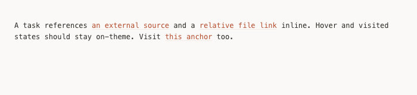
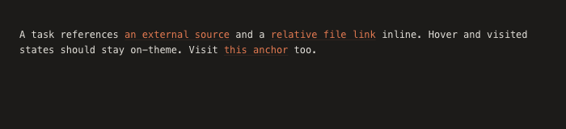

## Objective

Hyperlinks in the generated dashboard render as classic browser blue (and purple when visited), which clashes with the dashboard's warm accent palette and overall design. Restyle them to fit the dashboard's visual language.

Load `frontend-design` before touching markup or CSS. Locate where the blue links actually come from — the dashboard renders task markdown via markdown-it, so the offending anchors are most likely in the rendered-markdown content and any served/exported views that don't inherit a themed `a` rule. Find the real source rather than assuming; check both `skills/task-tree/scripts/templates/base.html` and the live-server / serve path.

Style links to use the existing accent tokens (`--accent` / `--accent-hover`) with a tasteful hover and an on-theme visited state — no raw `#0000EE` default blue or default purple — and keep them legible in both light and dark themes (the dashboard has a `[data-theme="dark"]` block). Underline treatment should match the dashboard's restrained aesthetic.

Validation: links across the tree/task views render in the dashboard's accent style in both themes, with distinct normal/hover/visited states and no default-blue anywhere; regenerate or serve the dashboard to confirm.

## Results

### Source of the blue links

Task-body markdown is rendered via markdown-it inside a `.rendered-md` container. That block styled headings, lists, code, blockquotes, and tables but had **no `a` rule**, so anchors fell back to the browser default `#0000EE` (blue) / purple (visited). There are **two** copies of this CSS, both needing the fix:

- [skills/task-tree/scripts/templates/base.html](../../../../skills/task-tree/scripts/templates/base.html#L890) — the Jinja template served by the live server (`serve`) and used by the `/` and `/node/` routes.
- [skills/task-tree/scripts/plan_dashboard.py](../../../../skills/task-tree/scripts/plan_dashboard.py#L1293) — the inline `DASHBOARD_HTML` constant used by the static `generate` path. Editing only `base.html` left default-blue links in every statically generated dashboard; this second copy was the real "exported view that doesn't inherit a themed `a` rule" the objective warned about.

The dag/kanban views carry no rendered markdown links, so no change was needed there.

### Fix

Added an identical `.rendered-md a` rule to both copies, right after the table styles:

```css
.rendered-md a {
  color: var(--accent);
  text-decoration: underline;
  text-decoration-color: var(--accent-soft);
  text-underline-offset: 2px;
  transition: color 0.15s ease, text-decoration-color 0.15s ease;
}
.rendered-md a:hover {
  color: var(--accent-hover);
  text-decoration-color: var(--accent-hover);
}
.rendered-md a:visited { color: var(--accent); }
.rendered-md a:visited:hover { color: var(--accent-hover); }
```

Design choices, matching the dashboard's restrained aesthetic:
- Uses the existing `--accent` / `--accent-hover` / `--accent-soft` tokens. These are already defined per-theme in both `:root` and `[data-theme="dark"]`, so **one rule covers both themes** — no separate dark-mode override needed.
- Restrained underline rendered in `--accent-soft` (faint) at rest, solidifying to `--accent-hover` on hover, with `2px` offset so it reads as a deliberate accent rather than a heavy browser underline.
- Visited stays on the accent (never default purple); `:visited:hover` keeps the hover cue consistent.
- `0.15s ease` transition matches the dashboard's standard micro-interaction timing.

### Verification

- **Computed styles (Chrome via Playwright)**: link color resolves to `rgb(180,77,45)` (= `#b44d2d`, light accent) in the light theme and `rgb(224,120,80)` (= `#e07850`, dark accent) in the dark theme, with `text-decoration-line: underline`. No blue anywhere.
- **Static regeneration**: `plan_dashboard.py generate --plan-root .plan` now emits the `.rendered-md a` rule in the output (was absent before the second-copy fix).
- **Test suite**: `pytest skills/task-tree/scripts/test_dashboard.py` — 72 passed.

Light theme:



Dark theme:



## Review Notes

*(Retrospective audit, 2026-06-10 — MINOR items only; status stays `approved`.)*

1. **MINOR** — the Results' "two copies" framing is stale: the inline `DASHBOARD_HTML` constant this task patched (cited at `plan_dashboard.py#L1293`, an anchor that now points at unrelated code) was deleted by [unify-static-export](../unify-static-export/task.md), so there is one `.rendered-md a` rule in [base.html](../../../../skills/task-tree/scripts/templates/base.html) and no second copy to keep in sync. Add a one-line supersession note so future styling work doesn't go hunting for the removed duplicate.
