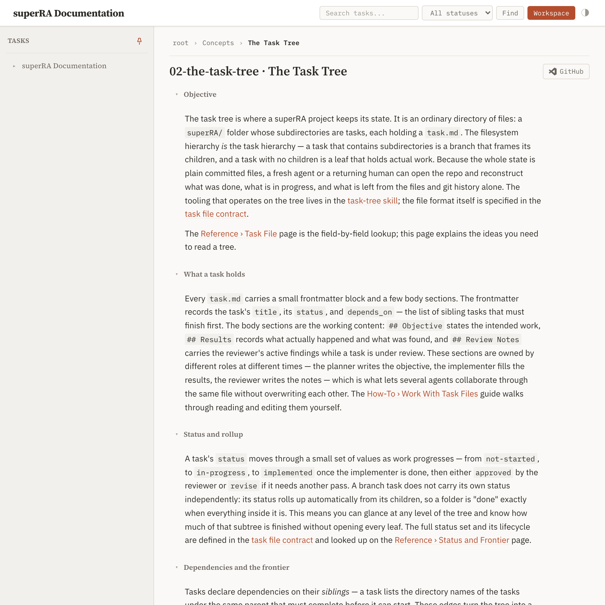
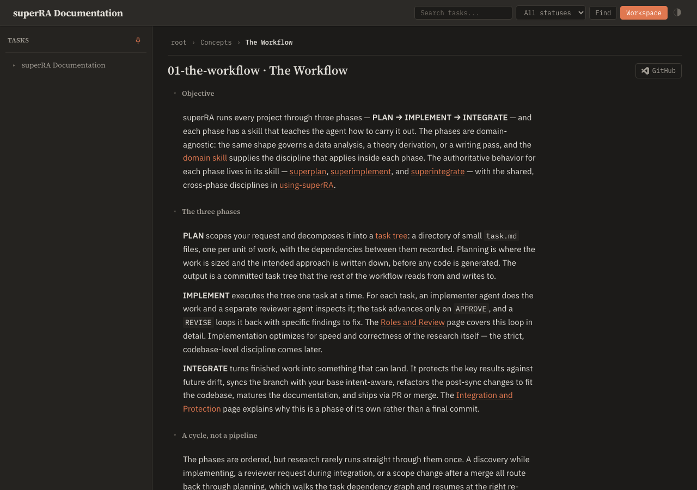
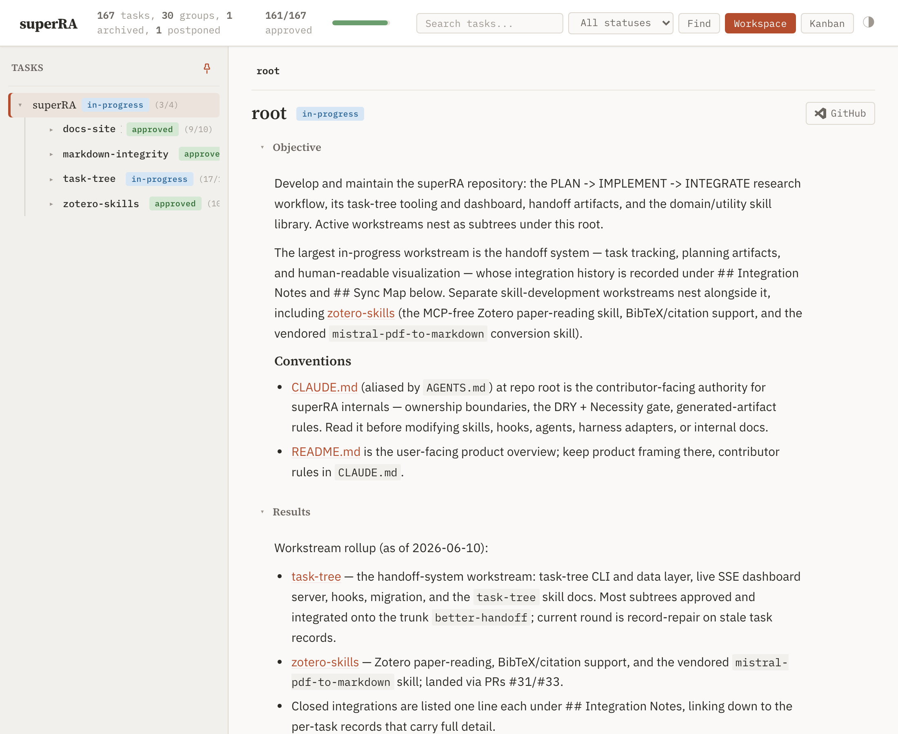
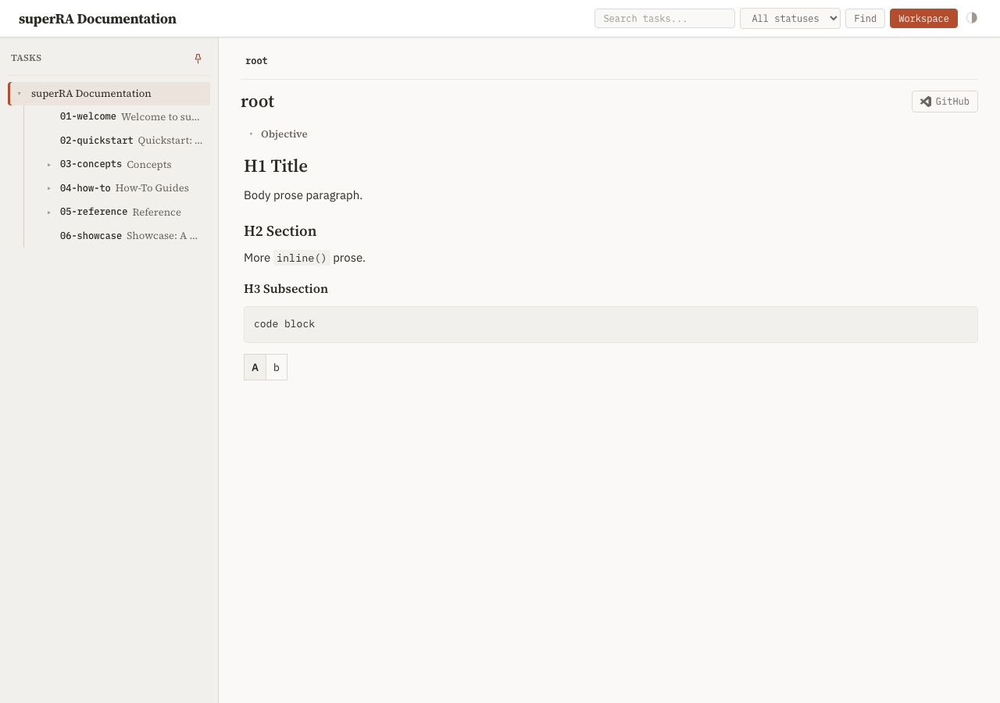

## Objective

Rebuild the content typography in `skills/task-tree/scripts/templates/base.html` around three explicit type roles, so rendered markdown (task bodies and doc pages alike) reads as documentation rather than terminal output.

Deliverables:

1. **Type-role tokens.** Add `--font-text: 'IBM Plex Sans', <system sans fallbacks>` alongside the existing `--font-display` (Source Serif 4) and `--font-mono` (IBM Plex Mono). Extend the existing Google Fonts `<link>` (base.html:9) with IBM Plex Sans weights 400/500/600 + italic 400. Roles: display = page/section titles; text = all prose; mono = code, slugs, badges, metadata pills, breadcrumbs.
2. **`.rendered-md` becomes a reading surface.** Body in `--font-text` at 14–15px with line-height ≈ 1.6; a real heading scale inside content (h1/h2/h3 clearly differentiated, display face); paragraph spacing ≈ 0.6–0.8em and list-item spacing loosened from the current 4px/2px; tables in the text face.
3. **Measure constraint.** Rendered-markdown line length capped at ~70–75ch (a `max-width` on the content column or on `.rendered-md` block elements). The tracker's active-node card and doc-mode pages both get the cap; code blocks and tables may extend wider than the prose measure.
4. **Code/prose differentiation.** With prose no longer mono, code blocks and inline code must read as distinct: keep mono + `--bg-alt`, size inline code ~0.9em of the surrounding prose, and verify fenced blocks keep syntax-highlight token colors.
5. **KaTeX coherence.** Math is currently tuned against a 12px mono body — check display/inline math sizing still sits naturally in the new prose (the `.katex` integration block in base.html).

Constraints: change `base.html` only (CSS tokens, the fonts link, and the `.rendered-md` rule block); no template-structure or JS changes. Chrome outside the content area (sidebar, header, badges) is task `04-chrome-contrast` — leave its sizes alone here except where a token rename forces a touch. Both modes (tracker + doc-mode) and both themes must be verified per the parent Conventions, with before/after screenshots in Results.

## Planner Guidance

- Load `frontend-design:frontend-design` before choosing sizes — set a deliberate modular scale rather than nudging the existing ad-hoc values.
- The standalone-export path inlines this CSS (`plan_dashboard.py`); no action expected, but confirm the export still builds (dashboard `generate` on the demo tree is a quick check).
- `html { font-size: 14px }` plus many px-sized chrome rules predate this work; px-to-rem conversion is NOT in scope — only the content surface needs the new roles/scale.

## Results

The content typography in [base.html](../../../../../skills/task-tree/scripts/templates/base.html) is rebuilt around three explicit type roles. All five deliverables are implemented; both modes (tracker + doc-mode) and both themes verified via Playwright on the rebuilt export, with screenshots below. The dashboard test suite stays green (678 passed, 2 skipped).

### What changed (all in `base.html`)

1. **Type-role tokens.** Added `--font-text: 'IBM Plex Sans', -apple-system, BlinkMacSystemFont, 'Segoe UI', 'Helvetica Neue', Arial, sans-serif` alongside `--font-display` (Source Serif 4) and `--font-mono` (IBM Plex Mono) ([base.html:35-37](../../../../../skills/task-tree/scripts/templates/base.html#L35-L37)). Extended the Google Fonts `<link>` with `IBM+Plex+Sans:ital,wght@0,400;0,500;0,600;1,400` ([base.html:9](../../../../../skills/task-tree/scripts/templates/base.html#L9)). Roles: display = page/section titles, text = all prose, mono = code/slugs/badges/metadata. (Mono-role chrome — sidebar, badges, breadcrumbs — was left at its existing sizes per the scope note; that is task `04-chrome-contrast`.)

2. **`.rendered-md` is now a reading surface** ([base.html:1326-1382](../../../../../skills/task-tree/scripts/templates/base.html#L1326-L1382)). Body is `--font-text` at 15px, line-height 1.65. Deliberate modular scale (≈1.25 ratio) for content headings in the display face: h1 23px / h2 19px / h3 16px above the 15px body — clearly stepped, replacing the old flat 16/14/13px-over-12px wall. Vertical rhythm loosened from the tracker-dense 4px/2px to em-relative spacing: `p` margin 0.7em, `ul/ol` 0.7em, `li` 0.35em, headings 1–1.1em top. Tables moved to the text face.

3. **Measure constraint.** A `--measure: 72ch` token caps prose-block line length: applied to `p`, `ul`, `ol`, `blockquote`, and the content headings ([base.html:1327](../../../../../skills/task-tree/scripts/templates/base.html#L1327) and the block rules). Code blocks (`pre`) and tables deliberately opt out so wide content uses the full content column. The cap lives on the block elements, so it holds in both the tracker active-node card and doc-mode pages (both reuse `.rendered-md`). Probed measure renders at 648px (= 72ch at 15px IBM Plex Sans), inside the comfortable 60–80ch band.

4. **Code/prose differentiation** ([base.html:1369-1382](../../../../../skills/task-tree/scripts/templates/base.html#L1369-L1382)). With prose now sans, code reads as distinct: fenced blocks keep mono at a fixed 13px on `--bg-alt`; inline code is `0.9em` of the surrounding prose (13.5px at the 15px body) with the `--bg-alt` tint so it separates from running text. The `--hl-*` syntax-highlight token mapping is untouched, so fenced blocks keep their highlight colors in both themes.

5. **KaTeX coherence.** The `.katex` integration block ([base.html:152-153](../../../../../skills/task-tree/scripts/templates/base.html#L152-L153)) is color-only plus an em-relative `0.75em` display margin — no fixed-px sizing — so math now inherits the 15px prose size instead of the old 12px mono body, scaling up naturally. No change was needed there; left as-is per the planner's "check it sits naturally" framing.

### Verification (real user path)

Rebuilt the full site export via [docs/build_site.sh](../../../../../docs/build_site.sh) (all three pages built with no error), then opened the rebuilt files in Chromium via Playwright. Computed-style probes confirm the three roles resolve and the scale lands:

| Element | Font role | Size | Measure |
|---------|-----------|-----:|--------:|
| `p` (body prose) | IBM Plex Sans (text) | 15px | 648px (72ch) |
| `h1` | Source Serif 4 (display) | 23px | capped |
| `h2` | Source Serif 4 (display) | 19px | capped |
| `h3` | Source Serif 4 (display) | 16px | capped |
| fenced `code` | IBM Plex Mono (mono) | 13px | uncapped |
| inline `code` | IBM Plex Mono (mono) | 13.5px (0.9em) | uncapped |
| `table` | IBM Plex Sans (text) | 13.5px | uncapped |

Doc-mode reading surface (light) — sans prose, comfortable measure and rhythm, mono inline code distinct from prose, serif section heading:

Doc-mode, dark theme — same surface, prose color `rgb(224,221,215)` on dark:

Tracker active-node card (light) — the same `.rendered-md` surface inside the tracker; full chrome (badges, progress, Kanban) intact, markdown h3 "Conventions" renders in the display face:

Type-scale and role check (injected h1/h2/h3 + inline code + fenced block + table into a live `.rendered-md`) — the stepped serif heading hierarchy, sans body, and distinct mono code:

### Test suite

`uv run --with pytest --with pyyaml --with fastapi --with jinja2 --with 'uvicorn[standard]' --with watchfiles --with httpx python -m pytest skills/task-tree/scripts` → **678 passed, 2 skipped** (4 expected fixture warnings).

