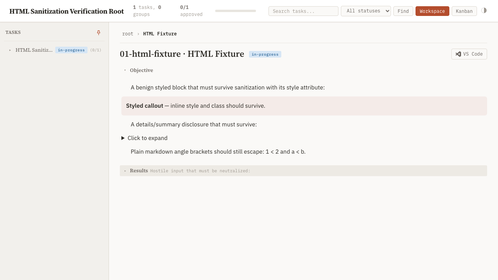
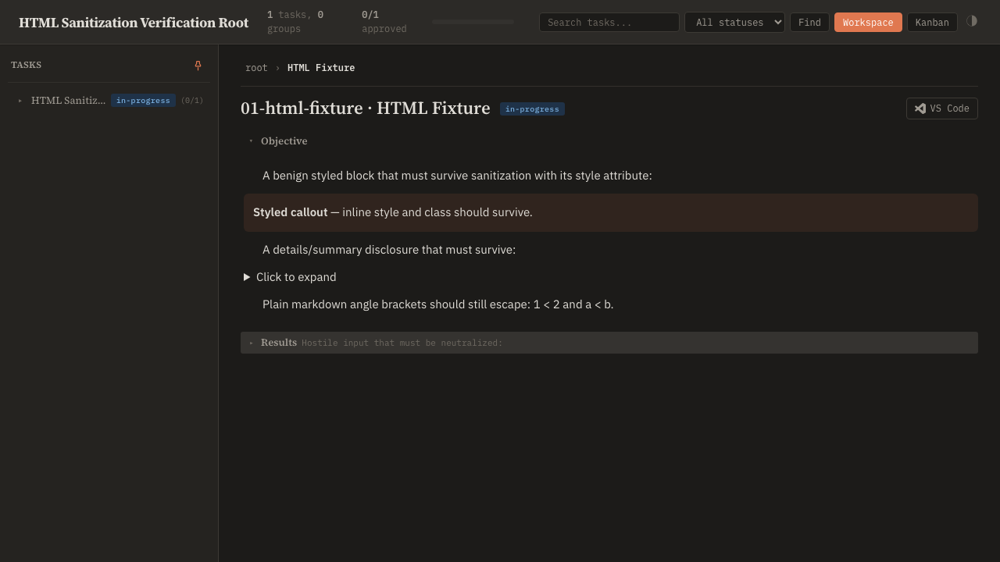

## Objective

Let agents write raw HTML inside task markdown and have it render properly in every dashboard surface, using the standard markdown-it pattern: enable `html: true` and sanitize the rendered output with DOMPurify before DOM insertion.

Deliverables:

1. **Renderer change.** Flip `window.markdownit({ html: false, ... })` (base.html:1861) to `html: true`, and pass every `md.render(...)` result through `DOMPurify.sanitize(...)` before it reaches `innerHTML`. All render call sites must be covered — task sections, doc pages, section previews, search snippets, kanban cards — not just the main body path.
2. **Sanitizer policy.** DOMPurify default allowlist (scripts, iframes, event handlers, `javascript:` URLs stripped) **plus `class` and `style` attributes allowed**, so agent-authored diagrams/callouts can use inline styles and dashboard CSS tokens. Exports are published (GitHub Pages), so treat task content as untrusted input to readers' browsers: sanitization is a hard gate, not optional.
3. **Vendoring.** Add `purify.min.js` (latest 3.x) per the vendoring model: CDN tag in base.html head for live serve, vendored copy under `skills/task-tree/scripts/vendor/` inlined into standalone exports, pinned version + source URL + SHA-256 recorded in `vendor/README.md`, wired into `plan_dashboard.py`'s asset inlining alongside markdown-it/KaTeX/highlight.js.
4. **Authoring guidance.** Add a short section to the `report-in-markdown` skill on writing HTML in task markdown: when to reach for it (layouts/diagrams markdown cannot express), what survives sanitization (no scripts/iframes/event handlers; `class`/`style` allowed), and that GitHub's own markdown rendering strips `style` so HTML-heavy content is dashboard-first.
5. **Tests.** Renderer-level coverage in the dashboard test suite: benign HTML passes through (e.g. a styled `
` survives with its style attribute), hostile input is neutralized (`<script>`, `onerror=`, `javascript:` href), and escaped behavior of plain markdown is unchanged.

Validation: a task.md containing a styled HTML block renders identically in live serve, static export, and doc-mode; a hostile fixture renders inert. Screenshot + DOM-probe evidence in Results.

## Planner Guidance

- DOMPurify config sketch: `DOMPurify.sanitize(html, { ADD_ATTR: ['style', 'class'] })` — defaults already allow most structural tags; verify `
/
` survive since docs use disclosure patterns.
- A single `renderMarkdown(src)` helper wrapping render+sanitize keeps call sites from drifting; check whether one already exists before adding one.
- The how-to pages' HTML comments were stripped earlier because `html: false` displayed them as text (commit 3849fc17) — with `html: true`, comments become invisible-but-present; no action needed, just awareness.

## Results

Raw HTML now renders in task markdown across every dashboard surface, gated by DOMPurify sanitization. All five deliverables landed; the dashboard suite is green (684 passed, 2 skipped) and the behavioral sanitization claims are proven by a headless-Chromium drive of the published standalone export.

### What changed

1. **Renderer (item 1, 2).** [base.html:1888](../../../../../skills/task-tree/scripts/templates/base.html#L1888) constructs `window.markdownit({ html: true, linkify: true, highlight: highlightFence })`. The single render helper [`renderMarkdown` at base.html:2022](../../../../../skills/task-tree/scripts/templates/base.html#L2022) wraps the only `md.render(...)` call site in `DOMPurify.sanitize(md.render(text), { ADD_ATTR: ['style', 'class'] })` ([base.html:2029](../../../../../skills/task-tree/scripts/templates/base.html#L2029)) before the result reaches `innerHTML`. Both client render call sites — task sections and doc pages / section previews / kanban cards at [base.html:2482](../../../../../skills/task-tree/scripts/templates/base.html#L2482) and [base.html:2911](../../../../../skills/task-tree/scripts/templates/base.html#L2911) — route through this one helper, so coverage is structural (`md.render(` count == 1). Search snippets do not render markdown at all — they build escaped text via `escapeHtml` ([base.html:2232](../../../../../skills/task-tree/scripts/templates/base.html#L2232)) — and the server-side `section-preview` in [task_node.html:53](../../../../../skills/task-tree/scripts/templates/task_node.html#L53) is plain truncated text with markdown punctuation stripped, so neither needs the sanitizer.
2. **HTML `` figure embedding (pre-existing, relied on).** Because `html: true` lets agents write `` directly, the standalone figure-embed extractor must match the HTML form alongside ``. This support already exists — [`_iter_body_image_srcs` / `_HTML_IMG_RE` in plan_dashboard.py:1465-1483](../../../../../skills/task-tree/scripts/plan_dashboard.py#L1465-L1483), covered by `test_image_map_handles_html_img_tag` — and is unchanged this turn; noted here because the feature depends on it.
3. **Vendoring (item 3).** `purify.min.js` (DOMPurify 3.4.10) vendored at [vendor/purify.min.js](../../../../../skills/task-tree/scripts/vendor/purify.min.js); pinned version + source URL + SHA-256 recorded in [vendor/README.md:17,35,49](../../../../../skills/task-tree/scripts/vendor/README.md#L17). CDN tag `dompurify@3` in the live-serve head ([base.html:34](../../../../../skills/task-tree/scripts/templates/base.html#L34)); inlined into standalone exports via `standalone_assets.purify_js` ([base.html:26](../../../../../skills/task-tree/scripts/templates/base.html#L26)), built by [`_build_standalone_assets` in plan_dashboard.py:1596](../../../../../skills/task-tree/scripts/plan_dashboard.py#L1596). SHA verified: `shasum -a 256 vendor/purify.min.js` matches the README's `9aca84b8…6565`, and the vendored file self-reports `3.4.10`.
4. **Authoring guidance (item 4).** [report-in-markdown/SKILL.md §Raw HTML](../../../../../skills/report-in-markdown/SKILL.md#L70-L79): when to reach for it (layouts markdown cannot express), what survives (`class`/`style` kept; scripts/iframes/event handlers/`javascript:` stripped), and the dashboard-first caveat (GitHub strips `style`). `check_markdown.py` reports the file clean.
5. **Tests (item 5).** New `TestRawHtmlSanitization` class in [test_dashboard.py:3318-3378](../../../../../skills/task-tree/scripts/test_dashboard.py#L3318-L3378): asserts `html: true` is set and `html: false` is gone, the sole `md.render` site is DOMPurify-wrapped with `ADD_ATTR: ['style','class']`, purify is vendored, the standalone export inlines DOMPurify and drops its CDN tag, and server mode keeps the CDN tag.

### Verification — real user path

- **Suite:** `uv run --with pytest … python -m pytest skills/task-tree/scripts` → **684 passed, 2 skipped** (full suite, this session).
- **Behavioral DOM proof (published standalone export, `file://`).** Generated a standalone export of a fixture tree containing benign and hostile HTML, loaded it in headless Chromium, and drove the real loaded DOMPurify through `renderMarkdown`. The benign-callout `
` from the Objective renders naturally on page load (screenshots below); the hostile payload was rendered through `renderMarkdown` and inserted into the live DOM, then probed:

  | Probe | Result | Meaning |
  |---|---|---|
  | `window.__XSS_FIRED__` | `false` | no payload executed |
  | `<script>` in DOM | absent (0 under wrapper div) | script tag stripped |
  | `` attr | `null` (img kept) | event handler stripped |
  | `<a href="javascript:…">` | `href` `null` (link kept) | `javascript:` URL stripped |
  | benign `
` `style` | `color:red;padding:4px;` | inline style survives |
  | benign `
` `class` | `cc` | class survives |
  | `
/
` | present | disclosure survives |
  | plain `1 < 2` | escaped as literal text | markdown escaping unchanged |

  The standalone export inlines DOMPurify and carries no `cdn.jsdelivr.net/npm/dompurify@` tag (verified at generation), so this drive exercises the published-export path, not a CDN dependency.

- **Visual evidence (light + dark, tracker/served view of the standalone export).** The Objective's `
` renders as a themed callout box using the dashboard's own CSS token in both themes, the `
` renders as "Click to expand", and the plain `1 < 2 and a < b` escapes as literal text:

  

  

### Notes

- The minimal fixture tree's collapsed Results section did not expand under blind toggle-clicking (a `classList` page-error in the lazy-section toggle harness for a single-leaf export), so the hostile payload was proven by invoking the real `renderMarkdown` + loaded DOMPurify directly in page context rather than through a section toggle. The function and library under test are identical to the live-serve path; only the toggle UI differed in this synthetic single-leaf export.
- Live-serve CDN sanitization uses the same `renderMarkdown`/DOMPurify code with a CDN-loaded library; the CDN tag's presence in server-mode output is asserted by `test_served_page_keeps_purify_cdn`, and the standalone drive above is the stronger behavioral proof since it is the published path.
- Per planner guidance: a single `renderMarkdown` helper already existed and was reused (no new helper); `
/
` confirmed surviving sanitization; HTML comments are now invisible-but-present under `html: true` (no action needed).
