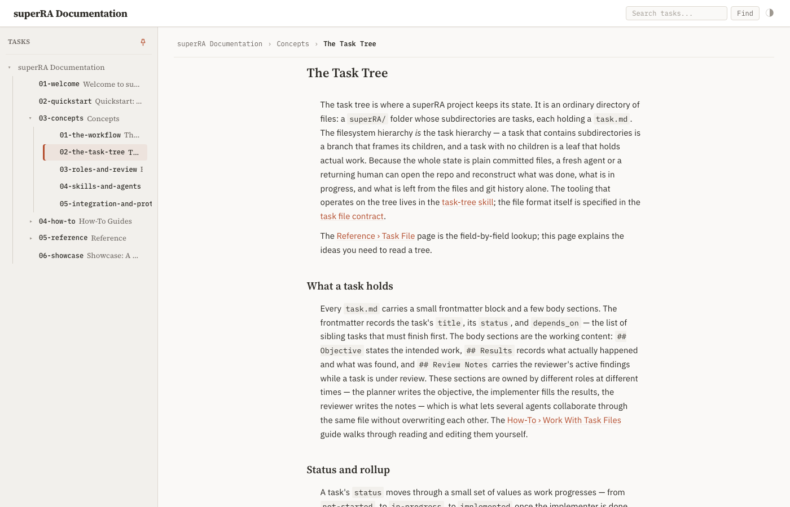
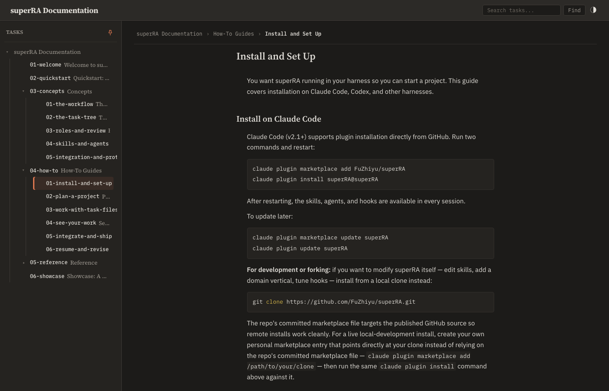
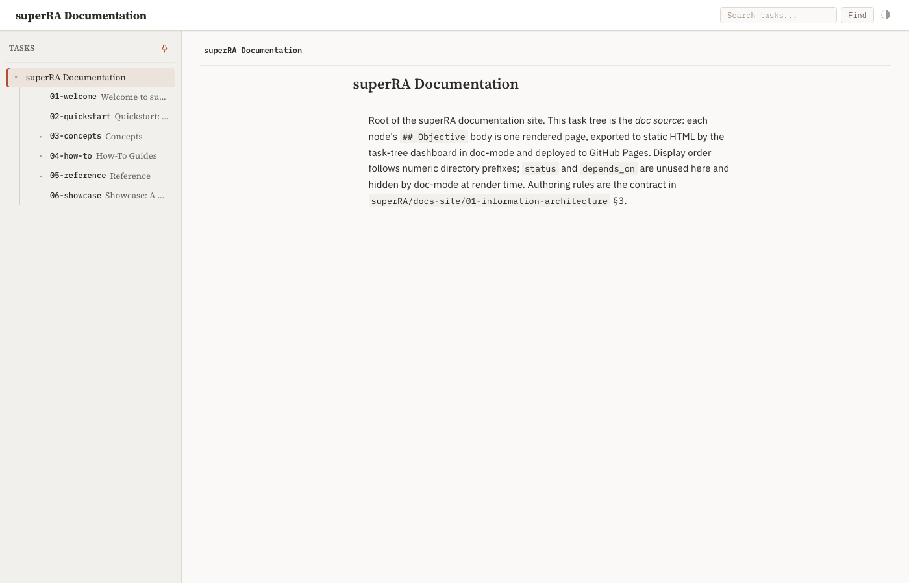
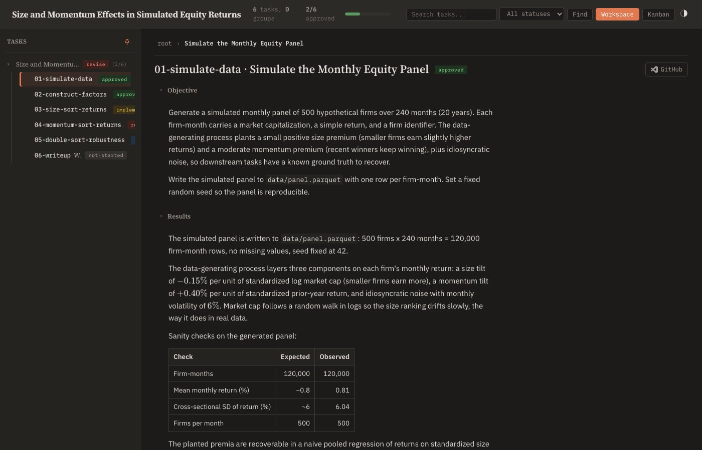

## Objective

In doc-mode (`html[data-doc-mode]`), remove the remaining task-tracker anatomy so a documentation reader sees a doc site, not a tracker. The doc-mode suppression block in `base.html` (the `html[data-doc-mode]` rules + whatever JS gating they need) is the home for these changes; normal dashboard rendering must be byte-for-byte unaffected when the attribute is absent.

Specific leaks to fix, verified against the built site:

1. **Section disclosure headers.** Doc pages currently show a collapsible "▸ Objective" toggle above the content. In doc-mode, render the body content directly — no section-toggle row, no collapse affordance — for `## Objective`; decide and document the treatment for any other sections a docs tree might carry (e.g. render with a plain heading instead of a toggle).
2. **Slug-prefixed titles.** Page titles render as "01-welcome · Welcome to superRA"; doc-mode should show the title alone. Same for the breadcrumb's `root` label — use the site title (the tree root's title) instead of the literal slug.
3. **Reading column.** Doc-mode centers the content column at the measure established by `01-reading-typography`, so wide viewports read like a docs site rather than a left-anchored panel.
4. **Audit the residual chrome.** Walk every visible element on a built doc page (header controls, GitHub button, search, share/VS Code buttons, sidebar) and classify: keep (genuinely useful to a docs reader), suppress in doc-mode, or restyle. Record the keep/suppress table in Results. The existing suppressions (badges, summary bar, kanban toggle, children DAG) stay.

Validation: rebuild the docs site export, open landing + one concept page + one how-to page via Playwright in both themes; no task-anatomy chrome visible; tracker mode (demo tree) confirmed unchanged. Dashboard test suite green.

## Planner Guidance

- Prefer pure-CSS suppression where possible (the existing doc-mode block's pattern); reach for JS gating only where structure must differ (e.g. emitting a heading instead of a toggle row).
- The doc-tree authoring contract lives at `superRA/docs-site/01-information-architecture` §3 — check it for which sections doc pages are allowed to carry before deciding the non-Objective treatment.

## Results

Doc-mode now reads as a documentation site, not a tracker. All changes live in [base.html](../../../../../skills/task-tree/scripts/templates/base.html): one extended `html[data-doc-mode]`-scoped CSS block and three `window.DOC_MODE`-gated JS branches. Tracker mode is provably unaffected — every functional addition is attribute-scoped or flag-gated, so a dashboard rendered without the attribute is byte-for-byte unchanged (verified by diff: the only unscoped additions are comments, and the demo-tree QA confirms the tracker render is intact).

### 1. Section disclosure → reading content

The section markup (`.section-toggle` row + `.section-content`) is shared by tracker and doc-mode via the `render_task_body` macro, so the doc-mode treatment is pure CSS over that shared structure rather than a forked template:

- **Lead `## Objective`** ([base.html:172-178](../../../../../skills/task-tree/scripts/templates/base.html#L172)): the toggle row is hidden and the content indent removed, so the Objective body renders directly under the page title as the page's lead prose — no heading, no caret.
- **Every other `## ` section** ([base.html:180-209](../../../../../skills/task-tree/scripts/templates/base.html#L180)): the toggle row keeps its label but loses the caret, the one-line preview, the hover background, and the pointer cursor; the label is restyled as a `19px` Source Serif 4 heading (the h2 step from `01-reading-typography`). Section content is forced `max-height: none; opacity: 1; overflow: visible`, so nothing depends on the tracker's collapse JS even before the reveal pass runs.

This matches the doc-tree authoring contract at [docs-site/01-information-architecture](../../../../docs-site/01-information-architecture/task.md) §3: doc pages carry `## Objective` (the page body) plus freeform `## ` subheadings for structure (e.g. "What a task holds", "Status and rollup"). The `revealCardSection` JS still runs to lazy-render each section's markdown payload; the CSS only governs framing.

### 2. Slug-prefixed titles → clean titles

- **Active-node title** ([base.html:2904-2907](../../../../../skills/task-tree/scripts/templates/base.html#L2904)): in doc-mode the `slug · title` prefix is dropped — the page shows the title alone.
- **Root title fallback** ([base.html:2875-2882](../../../../../skills/task-tree/scripts/templates/base.html#L2875)): the root node has an empty path/slug, so the tracker falls back to the literal `"root"`. In doc-mode the root *is* the site, so the fallback uses the site title (the tree root's title, carried by `#header-title`). The landing page now titles as "superRA Documentation", not "root".
- **Breadcrumb root crumb** ([base.html:2798-2806](../../../../../skills/task-tree/scripts/templates/base.html#L2798)): the `root` label becomes the site title in doc-mode; the empty-path ascent (`setActive('')`) is unchanged. The breadcrumb reads "superRA Documentation › Concepts › The Task Tree".

The browser tab `<title>` already used the root task title and is never JS-rewritten on navigation, so no slug leaks there.

### 3. Reading column

`#active-node` is centered at `max-width: 76ch; margin: 0 auto` in doc-mode ([base.html:211-217](../../../../../skills/task-tree/scripts/templates/base.html#L211)). The `.rendered-md` prose still caps at the `--measure: 72ch` from `01-reading-typography` (code blocks and tables opt out), and the slightly wider `76ch` column gives the heading row and section headings breathing room. On a 1400px viewport the column centers in the detail panel (`margin-left` resolves to ~236px) so wide screens read like a docs site, not a left-anchored panel.

### 4. Residual chrome audit

Walked every visible element on a built doc page and classified each. Existing suppressions (badges, summary bar, Kanban toggle, children DAG) stay; the new dispositions:

| Element | Disposition | Rationale |
|---|---|---|
| Sidebar nav tree | keep | Primary doc navigation. |
| Header title (`#header-title`) | keep | The site title — doubles as the breadcrumb/title-fallback source. |
| Title filter (`#search-box`) | keep | Useful to filter nav by page title. |
| Full-text Find (`#btn-find`) | keep | Search-and-navigate across page bodies — core docs affordance. |
| Theme toggle | keep | Light/dark is a reader preference. |
| Active-node title | restyle | Title alone, no slug (see §2). |
| Section toggles | restyle | Plain headings, no collapse (see §1). |
| Workspace view toggle (`#btn-workspace`) | suppress | With Kanban already gone, the lone "Workspace" button has nothing to switch to. |
| Status filter (`#filter-status`) | suppress | Filtering by task status is a tracker concept; doc nodes carry no meaningful status. |
| Phone search trigger (`#search-trigger`) | suppress | It opens the status-filter sheet; with the status filter gone its only payload is the title filter, already inline. |
| Worktree selector (`.worktree-selector`) | suppress | A multi-worktree tracker concept, irrelevant to a static doc site (and already absent in standalone export). |
| Open task.md (`.vscode-btn`, GitHub/VS Code) | suppress | "Open task.md" is task anatomy; a docs reader reads the page, not its source file. |
| Share subtree (`.share-btn`) | suppress | "Download this subtree as standalone HTML" is a tracker/export action; server-only and already absent in standalone export. |
| Status badge (`.badge`) | (already suppressed) | Task status — not doc content. |
| Summary bar, Kanban toggle, children DAG | (already suppressed) | Tracker rollups / dependency views. |

**Sidebar slug prefixes (kept, noted):** nav rows still show the numeric slug ("01-welcome", "03-concepts") in mono beside each title. The task scoped the title cleanup to page titles and the breadcrumb root, not sidebar rows, and the numeric prefix communicates display order to a reader scanning the nav. Left as-is; flag if a future pass wants the sidebar slugs hidden in doc-mode too.

CSS additions: [base.html:151-217](../../../../../skills/task-tree/scripts/templates/base.html#L151).

### Validation

Built the full site via the canonical [docs/build_site.sh](../../../../../docs/build_site.sh) (doc-mode `index.html` from `docs/site`, plus full-chrome `demo-tree.html` / `superra-dev-tree.html`), then drove it with Playwright in both themes.

Doc-mode pages — landing (root), a concept page (`03-concepts/02-the-task-tree`), and a how-to page (`04-how-to/01-install-and-set-up`) — in light and dark. Computed-style/DOM probes confirm on every page: no Objective toggle, no carets, all sections open (`max-height: none`), section labels are `19px` Source Serif 4, clean title, breadcrumb root = "superRA Documentation", all suppressed chrome (Workspace/Kanban/status-filter/search-trigger/worktree/VS Code/Share/badge/summary/children-DAG) not visible, kept chrome (Find/theme/title-filter/nav) visible, `#active-node` centered (`max-width: 76ch`). Zero console errors.

Tracker mode (demo tree, node `01-simulate-data`) confirmed unchanged: `data-doc-mode` absent, slug-prefixed title ("01-simulate-data · Simulate the Monthly Equity Panel"), "root" breadcrumb crumb, Objective/Results toggles collapsible, status badge, Workspace/Kanban toggle, status filter, Share/VS Code buttons, summary bar all present.

Dashboard test suite green: `251 passed, 2 skipped` in `test_dashboard.py` (full suite `677 passed, 2 skipped`). One test, `test_forest_synthetic_root_renders_and_routes`, asserted the literal `addCrumb('root', '', …)` string; updated to `addCrumb(rootLabel, '', …)` to match the now-variable label while still pinning the empty-path ascent it actually guards ([test_dashboard.py:2237-2239](../../../../../skills/task-tree/scripts/test_dashboard.py#L2237)).
