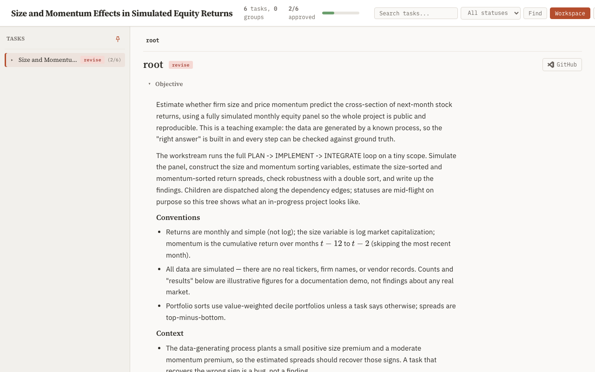
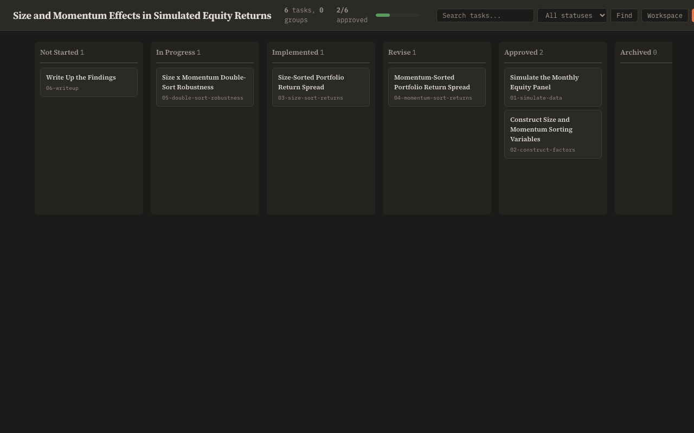
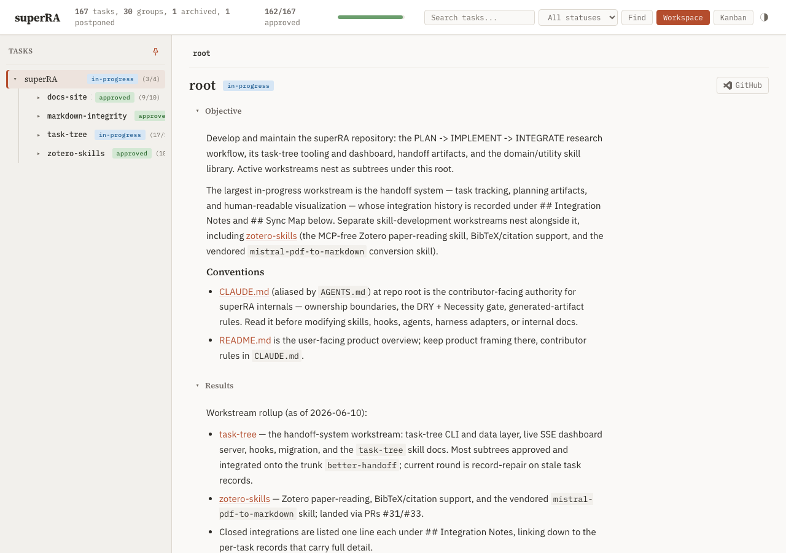

## Objective

Bring the dashboard chrome (everything outside `.rendered-md`) up to readable contrast and onto the type scale established by `01-reading-typography`, in both themes.

Deliverables:

1. **Contrast fixes.** Re-derive the failing tokens to meet WCAG AA (4.5:1 for text below ~18px) on their actual backgrounds: `--text-mute` (currently 2.72:1 light / 3.26:1 dark) and the status-badge text/background pairs (worst: `not-started` at 2.91:1). Keep the warm palette character — darken/lighten within hue, don't swap hues. Verify every consumer of a changed token still reads correctly (section previews, progress counts, dependency footers, crumb separators, kanban headers).
2. **Scale normalization.** Chrome font sizes are ~11 ad-hoc values (10, 10.5, 11, 12, 13, 14, 15, 16, 18, 22, 23 px). Map them onto the modular scale from `01-reading-typography` (small caps/badges may stay at the smallest step; don't invent new one-off sizes). Title/slug/preview relationships in the sidebar and child cards should encode hierarchy through the scale, not through near-identical sizes.
3. **Sidebar row fit.** Nav rows truncate status badges at common widths (slug + title + badge compete; badges render clipped, e.g. "appro"). Make the row layout degrade deliberately: title truncates with ellipsis, badge never clips. Check at the default sidebar width and after user resize.

Validation: contrast ratios computed for every changed token pair (record the before/after table in Results), Playwright screenshots of sidebar + header + kanban in both themes, dashboard test suite green.

## Planner Guidance

- A small Python/JS contrast checker over the token block is quick evidence — consider committing it as a throwaway check in the task Results rather than a permanent test.
- Badge palettes are six `--st-*`/`--st-*-t` pairs per theme; fix them as a family so the set stays visually coherent.

## Results

All three deliverables are implemented in [base.html](../../../../../skills/task-tree/scripts/templates/base.html). Failing contrast tokens now meet WCAG AA on every resting background; chrome font sizes are off ad-hoc px and onto a named modular scale that shares `01-reading-typography`'s content anchors; the sidebar row degrades deliberately so the status badge never clips. Verified via Playwright on the rebuilt static export (`demo-tree.html` + `superra-dev-tree.html`) in both themes; dashboard test suite stays green (678 passed, 2 skipped).

### 1. Contrast fixes

Re-derived the failing tokens within their warm hue (darken on light, lighten on dark) to clear 4.5:1. `--text-mute` is consumed on `--bg`, `--bg-alt`, and `--bg-card`, so each value is derived to clear AA against the *worst* of those three resting surfaces (light: `--bg-alt` at 4.92; dark: `--bg-card` at 4.68) and verified against all three. Badge text was fixed as the `--st-*-t` family for visual coherence (only the three light + one dark pairs that failed were moved; the rest already passed and were left exact). Ratios computed with a stdlib WCAG-2.1 relative-luminance checker (the throwaway script, kept below for reproducibility).

| Token | Theme | Before (worst bg) | After (worst resting bg) | After on bg / bg-alt / bg-card |
|---|---|---|---|---|
| `--text-mute` (#9e9890 → **#6d675e**) | light | 2.51:1 (bg-alt) FAIL | **4.92:1** (bg-alt) PASS | 5.32 / 4.92 / 5.60 |
| `--text-mute` (#706b63 → **#989389**) | dark | 2.96:1 (bg-alt) FAIL | **4.68:1** (bg-card) PASS | 5.63 / 5.13 / 4.68 |
| `--st-ns-t` (#8a857d → **#67625a**) | light | 2.91:1 FAIL | **4.81:1** PASS | on #e8e5df |
| `--st-impl-t` (#8a6d1b → **#785e18**) | light | 4.19:1 FAIL | **5.26:1** PASS | on #f5edd4 |
| `--st-arch-t` (#9e9890 → **#67625a**) | light | 2.27:1 FAIL | **4.81:1** PASS | on #e8e5df |
| `--st-arch-t` (#706b63 → **#959088**) | dark | 2.75:1 FAIL | **4.59:1** PASS | on #2a2925 |

Unchanged badge pairs were re-checked as a regression guard and all stay ≥4.5:1 (light ip 4.91 / rev 5.47 / ok 5.07 / post 5.49; dark ns 4.54 / ip 5.67 / impl 6.55 / rev 5.25 / ok 6.28 / post 5.17). One transient-state caveat: `--text-mute` on a *hover* background (`--bg-hover`) lands at 4.66 (light, still ≥AA) / **4.12 (dark, below AA)**. For button-like controls (`.hc-btn`, `.crumb`, `.pin-toggle`, …) this never bites because they brighten their text to `--text` on hover. It is not avoided, however, on the *container* hover rules — [`.task-row:hover`](../../../../../skills/task-tree/scripts/templates/base.html#L1172), [`.search-result:hover`](../../../../../skills/task-tree/scripts/templates/base.html#L441), [`.section-toggle:hover`](../../../../../skills/task-tree/scripts/templates/base.html#L1285) — whose muted children (`.task-progress`, `.search-result-path`, `.section-icon`/`.section-preview`) keep `--text-mute`, so in dark theme those secondary labels sit at 4.12:1 while hovered. Left as a known, scoped gap: it affects only secondary/muted text in a transient pointer state, the resting-surface AA requirement (the task's headline target) is fully met, and closing it would mean either lightening `--text-mute` further (regressing the deliberately-muted resting tone) or adding hover-child color overrides beyond this task's scope. Flagged for the orchestrator's discretion. Token edits: light [base.html:57](../../../../../skills/task-tree/scripts/templates/base.html#L57) (text-mute) + [base.html:66-72](../../../../../skills/task-tree/scripts/templates/base.html#L66-L72) (st-*-t family); dark [base.html:105](../../../../../skills/task-tree/scripts/templates/base.html#L105) (text-mute) + [base.html:119](../../../../../skills/task-tree/scripts/templates/base.html#L119) (st-arch-t).

### 2. Scale normalization

Added a six-step chrome type scale (modular ratio ≈1.25) as named tokens after the font roles ([base.html:39-49](../../../../../skills/task-tree/scripts/templates/base.html#L39-L49)), sharing `01-reading-typography`'s content anchors so chrome and content read as one system:

| Token | Size | Role |
|---|---:|---|
| `--fs-micro` | 10px | badges, progress counts, section icons, paths (smallest step) |
| `--fs-meta` | 12px | slugs, metadata pills, secondary chrome labels |
| `--fs-body` | 13px | chrome body + primary labels |
| `--fs-emph` | 15px | emphasis chrome (child-card title, search input) |
| `--fs-head` | 19px | header brand, section heads (= content h2) |
| `--fs-title` | 23px | active-node title (= content h1) |

Every chrome `font-size` (~34 sites including four JS-injected inline styles) was moved onto a `var(--fs-*)` step, collapsing the 11 ad-hoc values (10, 10.5, 11, 12, 13, 14, 15, 16, 18, 22, 23) onto the six scale steps. No new one-off sizes were introduced. The `.rendered-md` content surface and the `html { font-size:14px }` rem root were left untouched (owned by `01`). Hierarchy is now encoded by the scale rather than near-identical sizes:

- **Sidebar row:** title (`--fs-body` 13px, display face = primary) reads above slug (`--fs-meta` 12px mono = identifier) above badge/progress (`--fs-micro` 10px).
- **Child cards:** title (`--fs-emph` 15px) → slug (`--fs-meta` 12px) → dependency footer (`--fs-micro` 10px).
- **Kanban cards:** title (`--fs-meta` 12px) → path (`--fs-micro` 10px); column header at `--fs-body` 13px.

### 3. Sidebar row fit

`.task-row` is a flex container (toggle | slug | title | badge | progress). The clip came from `.task-title-text` having `overflow:hidden; min-width:0` but no flex basis, so the row overflowed and the trailing badge was cut ("appro"). Made the title the elastic element — `flex: 1 1 auto` with `min-width:0` and `text-overflow:ellipsis` — and pinned slug, badge, and progress to `flex-shrink:0` ([base.html:1216-1226](../../../../../skills/task-tree/scripts/templates/base.html#L1216-L1226)). The title now absorbs the squeeze and ellipsis-truncates while the badge always renders whole.

### Verification (real user path)

Rebuilt the full static export via [docs/build_site.sh](../../../../../docs/build_site.sh) (all three pages built, no error — the inlined CSS carries every change), then opened the rebuilt files in Chromium via Playwright in both themes. Computed-style probes confirm the scale tokens resolve (10/12/13/15/19/23) and every chrome element lands on its assigned step; the `--text-mute` values resolve to the new colors. Row-fit probes (badge `scrollWidth ≤ clientWidth`) show **0 badges clipped** at the default 280px sidebar width and after resize down to 190–200px, on both the demo tree (1 sibling badge) and the dev tree (5 nested rows with slug + title + badge competing). Title-text computes `flex-grow:1`, `min-width:0`, `text-overflow:ellipsis`.

Tracker chrome, light — header brand 19px display, sidebar title ellipsis-truncates ("Size and Momentu…") with the revise badge + (2/6) progress intact, breadcrumb 12px mono, active-node title 23px:



Kanban, dark — column headers (display 13px) over mono counts, card titles (display 12px) clearly above the now-legible muted paths (10px, new `--text-mute` #989389):



Dev-tree sidebar resized to 190px — nested rows keep slug (mono, intact) + ellipsis-truncated title + full status badge ("in-progress", "approved", "not-started") with no clipping:



Remaining screenshots in [attachments/](attachments/): `chrome-tracker-dark.png`, `chrome-kanban-light.png`, `chrome-sidebar-narrow-{light,dark}.png`, `chrome-sidebar-deep-light.png`.

### Throwaway contrast checker

Not committed as a permanent test (per Planner Guidance); recorded here for reproducibility. Run with `python3` (stdlib only):

```python
def _lin(c):
    c /= 255
    return c / 12.92 if c <= 0.03928 else ((c + 0.055) / 1.055) ** 2.4
def _hex(h):
    h = h.lstrip("#"); return int(h[0:2], 16), int(h[2:4], 16), int(h[4:6], 16)
def lum(rgb):
    r, g, b = (_lin(x) for x in rgb); return 0.2126*r + 0.7152*g + 0.0722*b
def ratio(fg, bg):
    l1, l2 = lum(_hex(fg)), lum(_hex(bg)); hi, lo = max(l1, l2), min(l1, l2)
    return (hi + 0.05) / (lo + 0.05)
# e.g. light --text-mute on --bg-alt:
print(round(ratio("#6d675e", "#f2f0ec"), 2))  # -> 4.92
```

### Test suite

`uv run --with pytest --with pyyaml --with fastapi --with jinja2 --with 'uvicorn[standard]' --with watchfiles --with httpx python -m pytest skills/task-tree/scripts` → **678 passed, 2 skipped** (expected fixture warnings), unchanged from the `01` baseline.
