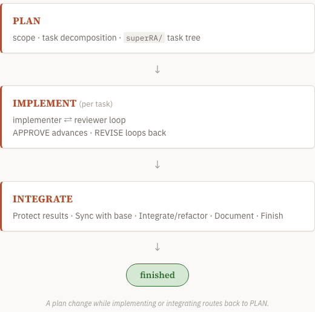
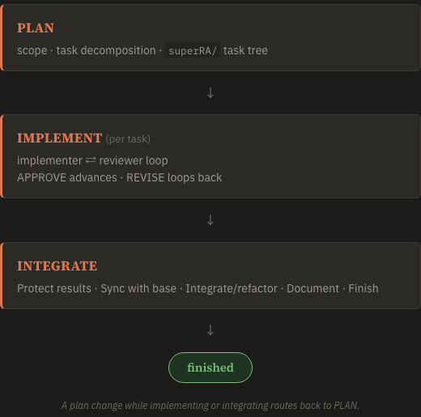

## Objective

Replace the broken mermaid block in `docs/site/01-welcome/task.md` (lines ~19–28, currently rendering as raw escaped text) with a hand-built HTML/CSS flow diagram of PLAN → IMPLEMENT → INTEGRATE → finished, written directly in the task markdown and rendered via the raw-HTML path from `02-html-in-markdown`.

Requirements:

1. Same content as the mermaid source: three stage nodes with their sub-lines (PLAN: scope · task decomposition · superRA/ task tree; IMPLEMENT: per-task implementer ⇄ reviewer loop, APPROVE advances · REVISE loops back; INTEGRATE: Protect → Sync → Integrate/refactor → Document → Finish) flowing into a "finished" terminal.
2. Themed via the dashboard's CSS custom properties (`var(--accent)`, `var(--border)`, `var(--bg-card)`, the type tokens) so it adapts to light/dark automatically — no hardcoded colors that break one theme.
3. Inline styles and/or classes only, surviving the `02-html-in-markdown` sanitizer policy; no scripts. Degrades acceptably where raw HTML is not rendered (e.g. GitHub's view of the task file): use semantic elements and readable text content so the unstyled fallback is still a legible list.
4. Sweep the docs tree for other escaped-HTML casualties (`grep` for `<br/>`, `<b>`, fenced `mermaid` blocks under `docs/site/`) and fix any found the same way.

Validation: rebuild the docs site, open the welcome page via Playwright in both themes, screenshot the diagram into Results; confirm the tracker view of the same task file also renders it.

## Planner Guidance

- A simple flex column of three styled cards with arrow separators is enough — this is the page's signature visual moment, so spend the care on spacing and the arrow treatment, not on extra decoration.
- `docs-site/03-landing-and-concepts` (approved) owns the welcome page's prose; this task touches only the diagram block, so its results remain valid.

## Results

Replaced the broken ```` ```mermaid ```` block in [docs/site/01-welcome/task.md](../../../../../docs/site/01-welcome/task.md) (the fenced flowchart was rendering as visible escaped text because `markdownit` ran with `html:false`) with a hand-built HTML/CSS flow diagram authored directly in the task markdown. It renders through the raw-HTML path landed by `02-html-in-markdown` (`html:true` + DOMPurify with `ADD_ATTR: ['style','class']`).

**Design.** A semantic `<ol>` (flex column) of three phase cards — PLAN → IMPLEMENT → INTEGRATE — with `&darr;` arrow separators flowing into a rounded "finished" terminal pill, plus an italic note that a plan change routes back to PLAN. Content matches the former mermaid source line-for-line (the three stages, their sub-lines, the implementer `⇄` reviewer loop, APPROVE/REVISE semantics, and the five INTEGRATE steps).

**Theming.** Every color is a dashboard CSS token, so light/dark adapt automatically with no hardcoded values: cards use `var(--bg-card)` / `var(--border)` with a `var(--accent)` left rule and `var(--shadow-sm)`; phase titles `var(--font-display)` in `var(--accent)`; sub-lines `var(--text-mid)`; arrows/note `var(--text-mute)`; the terminal pill reuses the success-status tokens `var(--st-ok)` / `var(--st-ok-t)`. Body face is `var(--font-text)`, the `superRA/` chip is `var(--font-mono)`.

**Sanitizer survival & fallback.** Inline `style`/`class` and standard elements only — no scripts — so DOMPurify passes it through intact. The diagram is built from `<ol>`/`<li>`/`<strong>`, so where raw HTML is not styled (e.g. GitHub's view of the task file) it degrades to a legible list with all the text content intact.

**Docs sweep.** `grep` for `<br/>`, `<b>`, and fenced `mermaid` under `docs/site/` found only this one block. (The `<branch-slug>` hit in `04-see-your-work/task.md` is inline-code placeholder prose, not HTML.) No `base.html` edits — chrome tasks 03/04 own that file.

**Verification (Playwright, rebuilt `_site/` via `docs/build_site.sh`).** Welcome page rendered at `#/01-welcome` in both themes: the diagram resolves to a single `<ol>` with PLAN and "finished" visible, and `body.innerText` contains none of ```` ```mermaid ````, `flowchart TB`, `classDef`, or `<b>` (no escaped leakage). The same task file rendered identically in **tracker mode** (non-`--doc-mode` `plan_dashboard.py generate`), confirming the diagram is mode-independent. Markdown render-integrity self-diagnose reports clean. No script/test changes, so the dashboard suite is unaffected (no test references the welcome content).

Light theme:



Dark theme:



