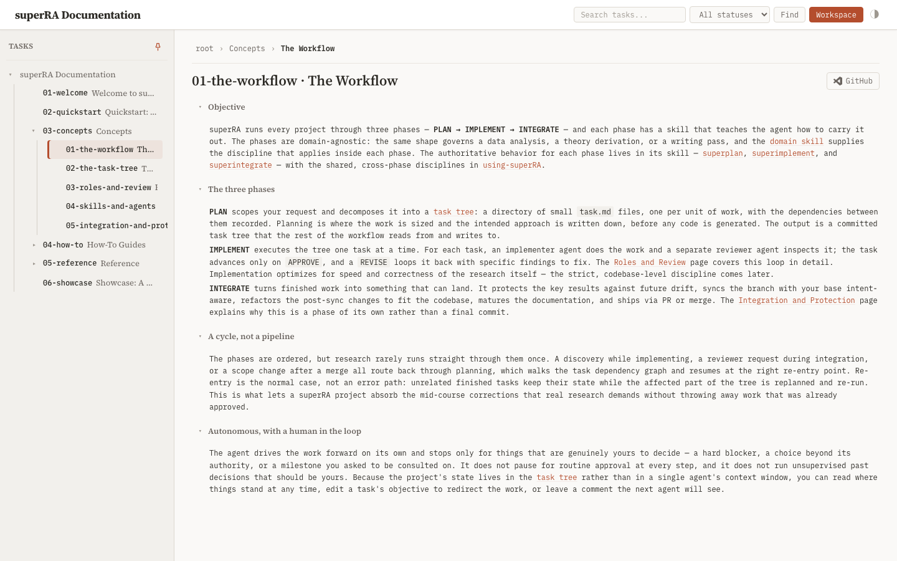
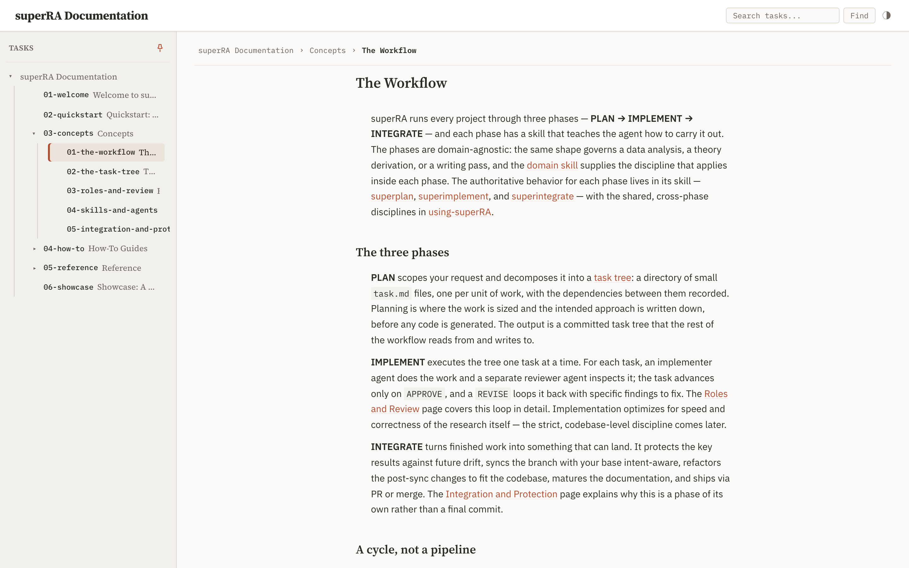
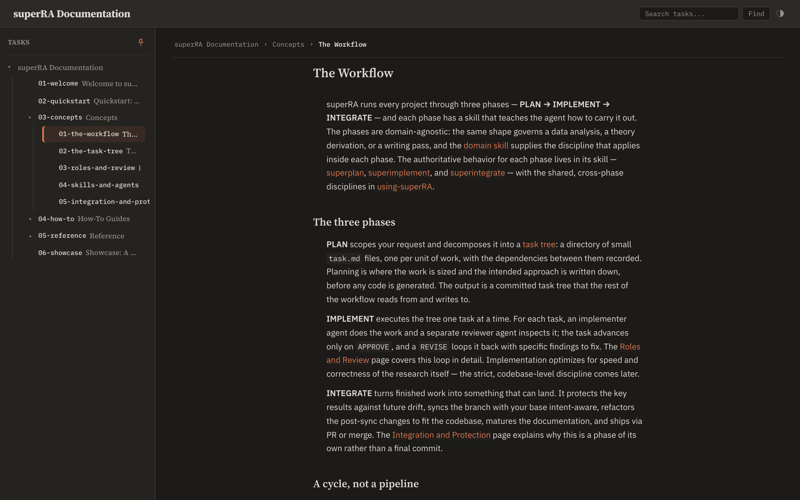
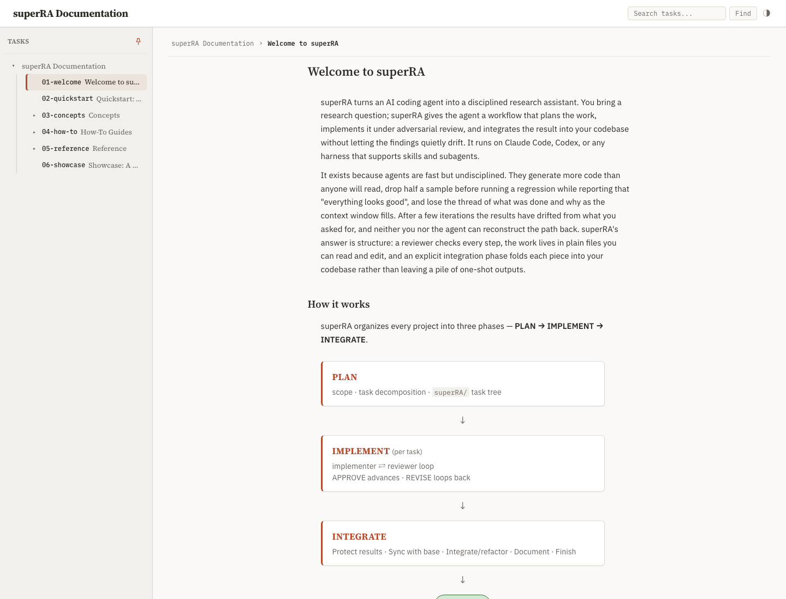
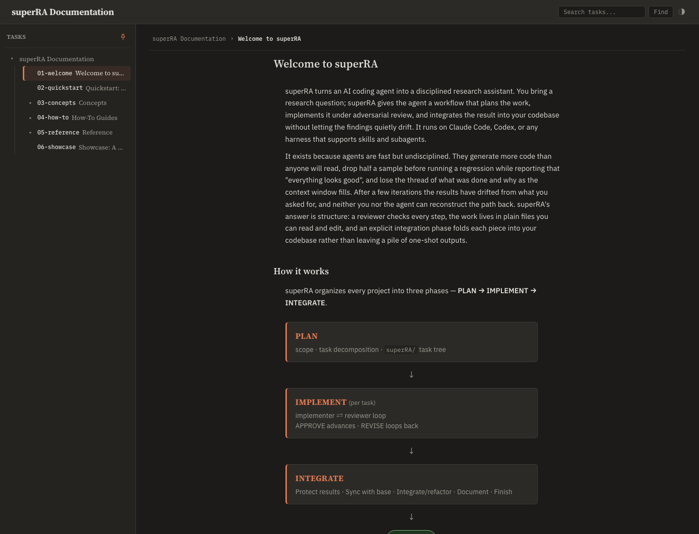
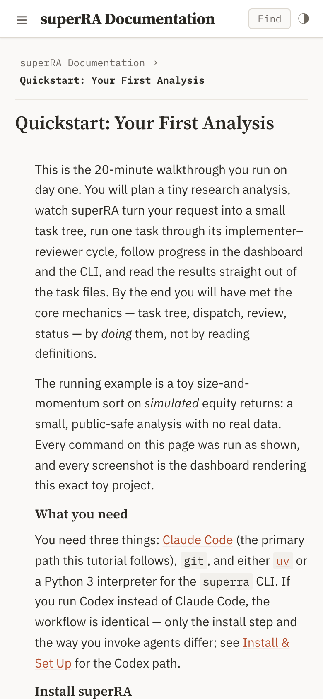
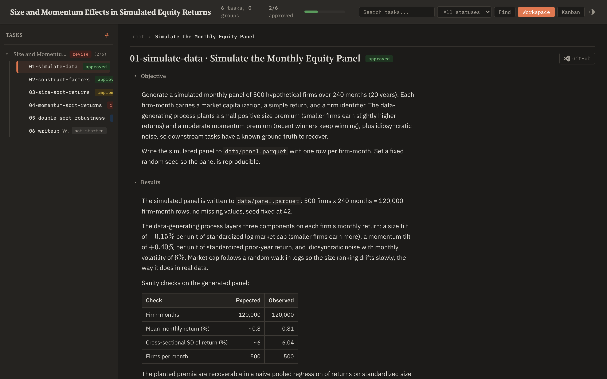
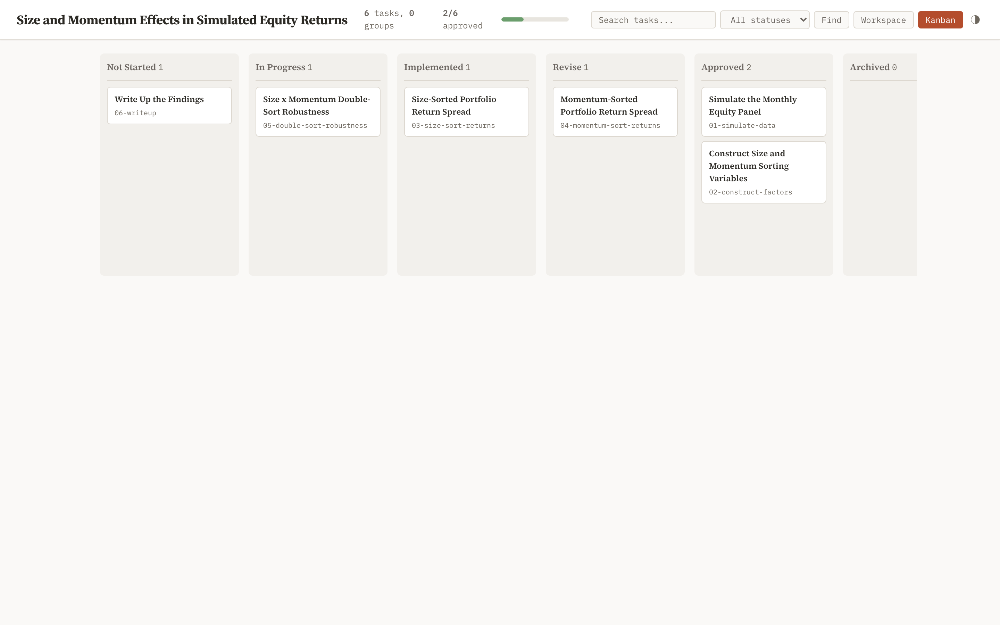

## Objective

Integrated visual verification of the whole redesign on the real user paths, then rebuild the deployable site artifacts.

1. **Sweep matrix.** Via Playwright, capture and inspect: docs site (landing, one concept page, the quickstart, one reference page, the showcase) and tracker (demo tree root + one leaf task with code/math/table content, kanban view) × light/dark × viewports 1440px / 1024px / 390px. Confirm: prose in the text face at the set measure, no clipped badges, no task chrome on doc pages, diagram rendered, code highlighted, math rendered, no horizontal overflow at 390px.
2. **Regression check.** The mobile/touch behaviors from `task-tree/dashboard/mobile-ipad-ui` (sidebar model, touch targets) and the worktree selector still work — spot-check, not re-test.
3. **Rebuild artifacts.** Regenerate the static exports the repo ships (demo tree, dev tree, docs `_site/` build per `docs-site/08-deploy`'s pipeline) so the deployed site reflects the redesign. Dashboard test suite green as the final gate.
4. **Evidence.** Before/after screenshot pairs for the key surfaces in Results; note any deferred findings as explicit follow-ups rather than leaving them implicit.

## Results

The integrated redesign (tasks 01–05, all merged at HEAD) is verified on the real user paths and the deployable site rebuilds cleanly. The documentation site — the redesign's primary readability target — passes every acceptance check in both themes at all three viewports: reading-face prose at a constrained measure, AA contrast, no task chrome, the welcome flow diagram rendered as themed HTML (not escaped), code highlighted, math rendered, and zero horizontal overflow at 390px. Tracker mode is provably unaffected (full chrome intact). The build pipeline produces all three shipped artifacts and the dashboard test suite is green.

Verification followed the real user path: Playwright (`chromium` 1.61.0) opening the **freshly rebuilt `_site/` artifacts via `file://`** in both themes across desktop (1440), tablet (1024), and mobile (390) viewports, with computed-style/DOM probes over route-level checks. Screenshots below are the evidence; the full sweep captured 46 frames, curated here to the load-bearing surfaces plus a genuine pre-redesign before/after pair.

### 1. Sweep matrix

**Typography + measure (the headline fix).** Doc-mode prose renders in **IBM Plex Sans 15px / 24.75px line-height** at a centered reading column of **~593px (≈76 characters per line)** — squarely in the 60–80ch comfort band. The pre-redesign state was **IBM Plex Mono 12px / 19.2px at the full 1100px width (≈150+ CPL)**, captured directly by building the docs site at the pre-redesign commit (`0b2ac6ec~1`):

| | Before (pre-redesign) | After (HEAD) |
|---|---|---|
| Prose face | IBM Plex Mono | IBM Plex Sans |
| Prose size / line-height | 12px / 19.2px | 15px / 24.75px |
| Content column width | 1100px (unconstrained) | ~593px (centered, `max-width: 76ch`) |
| Page title | `01-the-workflow · The Workflow` | `The Workflow` (no slug) |
| Section disclosure | visible `▸ Objective` toggle | rendered as lead prose / plain serif headings |
| "Open task.md" chrome | present | suppressed |

**Doc-mode chrome suppression (task 03).** On every doc page the `## Objective` toggle row is `display: none` (rendered as the page's lead prose), section content is forced open (`max-height: none; overflow: visible`), `#active-node` is centered (`max-width: 592.8px`, symmetric auto margins ~255px), the page title shows the title alone (no slug prefix), and the breadcrumb root reads "superRA Documentation". The `.section-toggle` DOM element still exists by design (shared `render_task_body` macro), but its row is CSS-hidden — DOM presence is not a visual leak.

**Welcome flow diagram (tasks 02 + 05).** The welcome page renders the hand-built HTML/CSS flow diagram — three accent-bordered phase cards (PLAN → IMPLEMENT → INTEGRATE) with arrows — as real DOM, not escaped text. No escaped angle-bracket markup (`&lt;div`) anywhere in the rendered body, confirming `html: true` + DOMPurify pass the diagram through. Themed correctly in both light and dark.

**Code / math / tables.** Quickstart how-to pages render highlighted code blocks (`code.hljs`, 9 highlighted blocks on the install page). The reference task-file page and the tracker leaf render markdown tables. The tracker leaf renders KaTeX math (3 instances, e.g. $-0.15\%$, $+0.40\%$). All confirmed on the rendered DOM and visually.

**Badges.** Across all docs and tracker surfaces, **zero clipped badges** (badge `scrollWidth ≤ clientWidth` on every status badge / pill).

**No horizontal overflow at 390px (docs).** Every documentation page — landing, concept, quickstart, reference, showcase — has **`scrollWidth == clientWidth` at 390px** in both themes. Mobile docs read cleanly with the sidebar collapsed to a hamburger.

**Tracker mode unaffected.** The demo-tree leaf shows full tracker chrome intact: status badges, Workspace/Kanban view toggle, status filter, GitHub button, summary bar, collapsible `## Objective` / `## Results` toggles, slug-prefixed title (`01-simulate-data · Simulate the Monthly Equity Panel`). Kanban view renders all six status columns with serif card titles and mono slug subtitles, no clipping.

### Contrast: docs site fully AA; residuals are tracker-only and pre-existing

A full-surface WCAG scan (correct alpha compositing of every background layer down to the page color; AA thresholds 4.5:1 normal / 3.0:1 large) over all eight surfaces × both themes:

- **Documentation site: passes AA on every page in both themes** — prose, links, headings, badges, sidebar, breadcrumb, the welcome-diagram text. No residual.
- **Tracker mode** carries three sub-AA items, all confirmed **pre-existing (not introduced by this redesign)** and **never present on the docs site**:
  1. **Dark muted child text on a hovered container row** (`.task-row` / `.search-result` / `.section-toggle`): `--text-mute` #989389 is **5.63:1 at rest** (passes AA) and dips to **4.12:1 only while the row is hovered** (over `--bg-hover` #353330). This is the single residual task 04 documented; this sweep confirms it is exactly as described and resting-surface AA is met. Light theme stays AA in both states (5.32 → 4.66).
  2. **Light accent file-link inside a tinted code-block / table-row background**: accent #b44d2d is **4.94:1 on the plain prose page** (passes AA) and **4.43:1 only on the tinted sub-surface** #f4ebe7. The accent color is unchanged across the redesign branch (`git show 0b2ac6ec~1` — identical), so this predates the work; tracker-content-only.
  3. **Dark active view-toggle button** (`.hc-btn.active`, "Workspace"/"Kanban"): white on accent #e07850 = **3.01:1**. Pre-existing active-button state; **`display: none` in doc-mode** (suppressed per task 03's audit), so it never reaches the docs site.

  Both residual classes share the documented hover pattern: the element passes AA on its resting/prose surface and dips slightly below on a transient or tinted sub-surface. None was introduced here; per the dispatch I confirm rather than silently fix tracker base.html outside this task's scope.

### 2. Regression check (spot-check)

- **Mobile sidebar model (`mobile-ipad-ui`)**: at 390px the tracker sidebar engages the drawer model (`position: fixed`, `transform: translateX(-280px)` off-screen) and the `.nav-hamburger` toggle is shown. Its hit area is **44×44px on a touch (coarse-pointer) device** — the real mobile user path — via the `min-width: 44px; min-height: 44px` hit-slop gated behind `@media (pointer: coarse)` ([base.html:888](../../../../../skills/task-tree/scripts/templates/base.html#L888), [base.html:920](../../../../../skills/task-tree/scripts/templates/base.html#L920)), which is where the iOS HIG touch-target minimum applies. On a fine-pointer (mouse) context the glyph stays visually compact (~29×23px, base rule at [base.html:749](../../../../../skills/task-tree/scripts/templates/base.html#L749)) by design, so a measurement without touch emulation reads the smaller box. This is not a redesign change — both the gate and the base rule predate this workstream (task 04 only bumped the glyph `font-size` 18px → `--fs-head` 19px). Working on the touch path.
- **Worktree selector**: absent in the standalone dev-tree export, which is correct — it is a live-server feature suppressed in static exports (per task 03's audit table). Not exercisable via `file://` by design.

### 3. Rebuild artifacts

`docs/build_site.sh` (the `docs-site/08-deploy` pipeline entry point) rebuilds the three shipped HTML files into `_site/` — `index.html` (docs tree, doc-mode), `demo-tree.html`, `superra-dev-tree.html` — all green, no missing-input or empty-output failures. The repo deliberately does **not** track the built `_site/` in git (no HTML export artifact is version-controlled; CI regenerates the site from this script on deploy), so there is no committable artifact path — the deliverable is a verified-clean rebuild, confirmed above on the freshly built output, not a checked-in blob.

**Dashboard test suite (final gate): 684 passed, 2 skipped** (`uv run --with pytest --with pyyaml --with fastapi --with jinja2 --with 'uvicorn[standard]' --with watchfiles --with httpx python -m pytest skills/task-tree/scripts`).

### 4. Deferred follow-ups

- **Tracker header-title overflow at narrow viewports.** The tracker `.header-title` has `white-space: nowrap` with no truncation, so a long tree root title (the demo tree's "Size and Momentum Effects in Simulated Equity Returns", 52 chars) overflows below ~488px — `scrollWidth` exceeds the 390px viewport by ~98px in tracker mode. **Pre-existing**: `white-space: nowrap` was already present pre-redesign; task 04's type-scale change (18px → `--fs-head` 19px) only marginally widened an already-overflowing element, it did not create the overflow. Docs site is unaffected (zero overflow). This belongs to the tracker chrome / `mobile-ipad-ui` surface, not this redesign; deferred as a follow-up (e.g. `text-overflow: ellipsis` or wrap on the tracker header title at narrow widths).
- **Tracker contrast residuals (items 1–3 above).** All pre-existing and tracker-only; the dark hover residual is already on task 04's record. Deferred together as a tracker-chrome contrast pass if a future task wants tracker mode to clear AA on hover/tinted sub-surfaces too.
